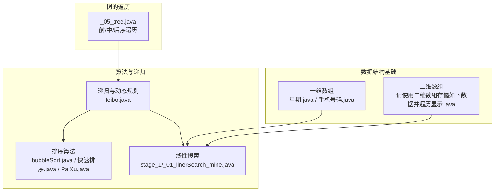
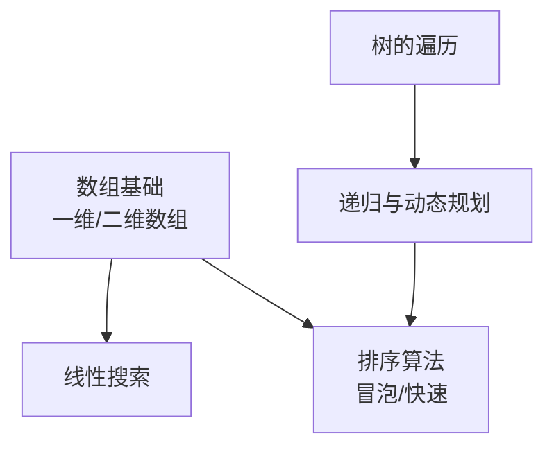
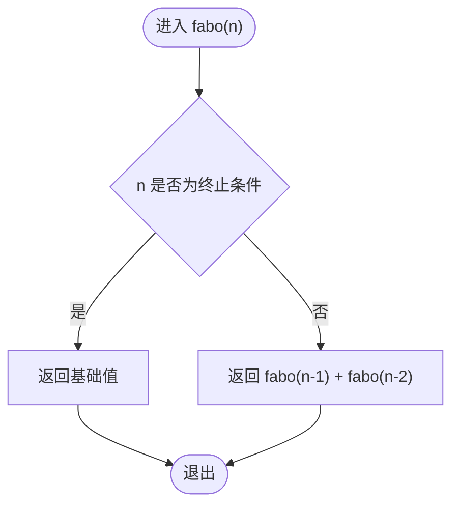
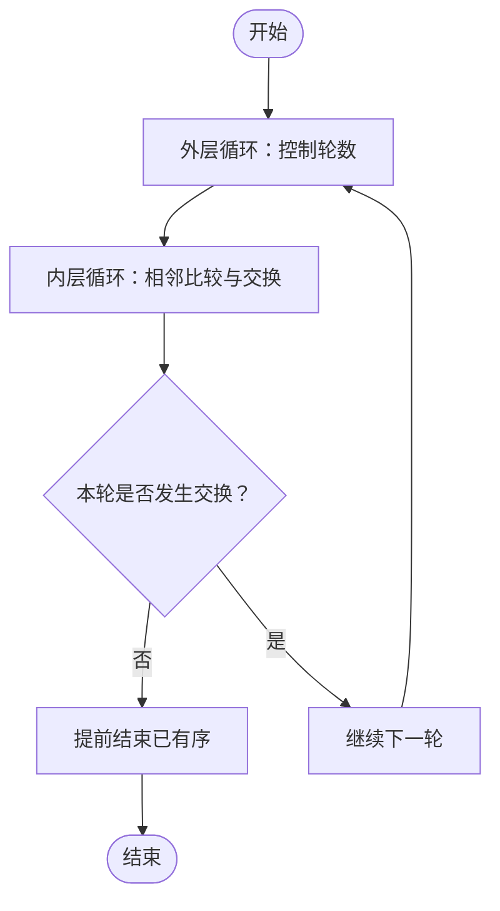
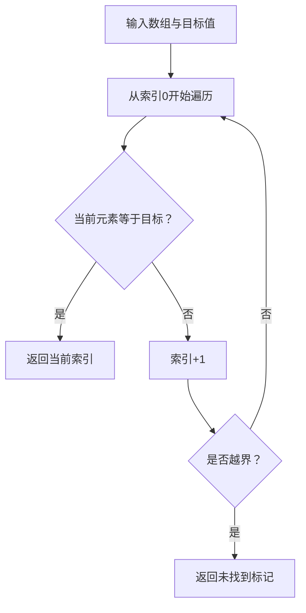
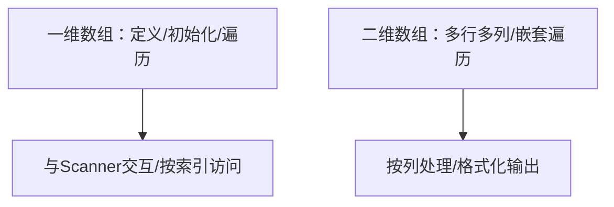
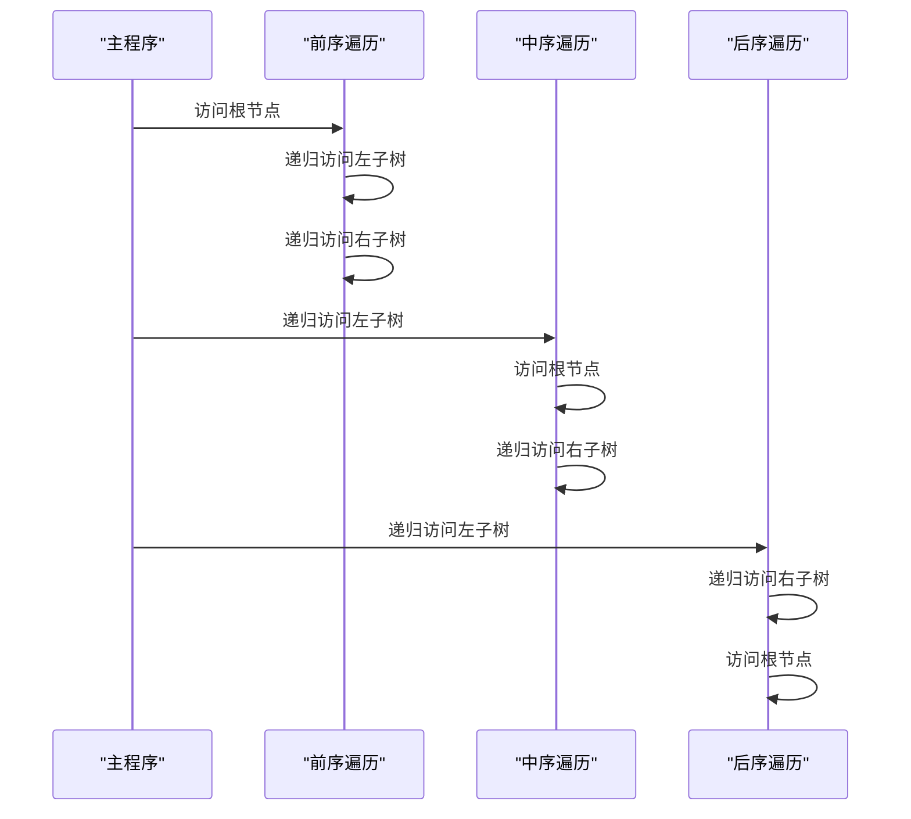
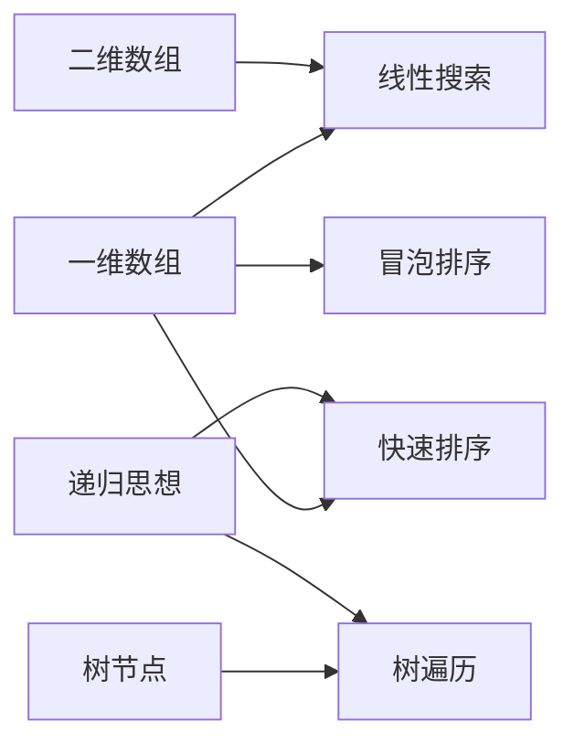

# 算法与数据结构

<cite>
**本文引用的文件**
- [_11_Algorithm/src/main/java/_11_递归/feibo.java](file://_11_Algorithm/src/main/java/_11_递归/feibo.java)
- [_11_Algorithm/src/main/java/_50_算法/_01_排序/bubbleSort.java](file://_11_Algorithm/src/main/java/_50_算法/_01_排序/bubbleSort.java)
- [_11_Algorithm/src/main/java/_50_算法/_01_排序/快速排序.java](file://_11_Algorithm/src/main/java/_50_算法/_01_排序/快速排序.java)
- [_11_Algorithm/src/main/java/_50_算法/_01_排序/PaiXu.java](file://_11_Algorithm/src/main/java/_50_算法/_01_排序/PaiXu.java)
- [_11_Algorithm/src/main/java/stage_1/_01_linerSearch_mine.java](file://_11_Algorithm/src/main/java/stage_1/_01_linerSearch_mine.java)
- [_01_javaEE/src/main/java/_04_数组/一维数组基本使用/星期.java](file://_01_javaEE/src/main/java/_04_数组/一维数组基本使用/星期.java)
- [_01_javaEE/src/main/java/_04_数组/一维数组基本使用/手机号码.java](file://_01_javaEE/src/main/java/_04_数组/一维数组基本使用/手机号码.java)
- [_01_javaEE/src/main/java/_04_数组/二维数组/请使用二维数组存储如下数据并遍历显示.java](file://_01_javaEE/src/main/java/_04_数组/二维数组/请使用二维数组存储如下数据并遍历显示.java)
- [_06_flink/src/main/java/_06_exam/_05_tree.java](file://_06_flink/src/main/java/_06_exam/_05_tree.java)
</cite>

## 目录
1. 引言
2. 项目结构
3. 核心组件
4. 架构总览
5. 组件详解
6. 依赖关系分析
7. 性能考量
8. 故障排查指南
9. 结论
10. 附录

## 引言
本学习文档围绕“算法与数据结构”主题，系统梳理常见数据结构（数组、链表思想、栈、队列、树、图）与经典算法（排序、搜索、递归），并结合仓库中的 Java 示例进行说明。文档同时提供复杂度分析、实战练习与面试要点，帮助读者建立完整的知识体系与工程实践能力。

## 项目结构
本仓库中与“算法与数据结构”相关的内容主要分布在以下路径：
- 算法与递归：_11_Algorithm/src/main/java/_11_递归、_11_Algorithm/src/main/java/_50_算法/_01_排序、_11_Algorithm/src/main/java/stage_1
- 数据结构基础（数组）：_01_javaEE/src/main/java/_04_数组
- 树的遍历示例：_06_flink/src/main/java/_06_exam/_05_tree.java

下面给出与本仓库实际文件映射的结构示意：

图表来源
- [_11_Algorithm/src/main/java/_11_递归/feibo.java](file://_11_Algorithm/src/main/java/_11_递归/feibo.java#L1-L61)
- [_11_Algorithm/src/main/java/_50_算法/_01_排序/bubbleSort.java](file://_11_Algorithm/src/main/java/_50_算法/_01_排序/bubbleSort.java#L1-L20)
- [_11_Algorithm/src/main/java/_50_算法/_01_排序/快速排序.java](file://_11_Algorithm/src/main/java/_50_算法/_01_排序/快速排序.java#L1-L11)
- [_11_Algorithm/src/main/java/_50_算法/_01_排序/PaiXu.java](file://_11_Algorithm/src/main/java/_50_算法/_01_排序/PaiXu.java#L1-L224)
- [_11_Algorithm/src/main/java/stage_1/_01_linerSearch_mine.java](file://_11_Algorithm/src/main/java/stage_1/_01_linerSearch_mine.java#L1-L22)
- [_01_javaEE/src/main/java/_04_数组/一维数组基本使用/星期.java](file://_01_javaEE/src/main/java/_04_数组/一维数组基本使用/星期.java#L1-L31)
- [_01_javaEE/src/main/java/_04_数组/一维数组基本使用/手机号码.java](file://_01_javaEE/src/main/java/_04_数组/一维数组基本使用/手机号码.java#L1-L19)
- [_01_javaEE/src/main/java/_04_数组/二维数组/请使用二维数组存储如下数据并遍历显示.java](file://_01_javaEE/src/main/java/_04_数组/二维数组/请使用二维数组存储如下数据并遍历显示.java#L1-L53)
- [_06_flink/src/main/java/_06_exam/_05_tree.java](file://_06_flink/src/main/java/_06_exam/_05_tree.java#L1-L67)

章节来源
- [feibo.java](file://_11_Algorithm/src/main/java/_11_递归/feibo.java#L1-L61)
- [bubbleSort.java](file://_11_Algorithm/src/main/java/_50_算法/_01_排序/bubbleSort.java#L1-L20)
- [快速排序.java](file://_11_Algorithm/src/main/java/_50_算法/_01_排序/快速排序.java#L1-L11)
- [PaiXu.java](file://_11_Algorithm/src/main/java/_50_算法/_01_排序/PaiXu.java#L1-L224)
- [_01_linerSearch_mine.java](file://_11_Algorithm/src/main/java/stage_1/_01_linerSearch_mine.java#L1-L22)
- [星期.java](file://_01_javaEE/src/main/java/_04_数组/一维数组基本使用/星期.java#L1-L31)
- [手机号码.java](file://_01_javaEE/src/main/java/_04_数组/一维数组基本使用/手机号码.java#L1-L19)
- [请使用二维数组存储如下数据并遍历显示.java](file://_01_javaEE/src/main/java/_04_数组/二维数组/请使用二维数组存储如下数据并遍历显示.java#L1-L53)
- [_05_tree.java](file://_06_flink/src/main/java/_06_exam/_05_tree.java#L1-L67)

## 核心组件
- 递归与动态规划：通过斐波那契数列演示递归终止条件与自调用模式，并对比数组迭代实现，便于理解时间/空间权衡。
- 排序算法：包含冒泡排序（含优化边界与提前终止）与快速排序骨架，便于扩展实现与复杂度分析。
- 线性搜索：在数组中按序查找目标值，返回索引或不存在标记，体现 O(n) 时间复杂度。
- 数组基础：一维与二维数组的创建、访问与遍历，为后续算法提供数据载体。
- 树的遍历：前序/中序/后序递归遍历，为树与图的深度优先搜索奠定基础。

章节来源
- [feibo.java](file://_11_Algorithm/src/main/java/_11_递归/feibo.java#L1-L61)
- [PaiXu.java](file://_11_Algorithm/src/main/java/_50_算法/_01_排序/PaiXu.java#L1-L224)
- [快速排序.java](file://_11_Algorithm/src/main/java/_50_算法/_01_排序/快速排序.java#L1-L11)
- [_01_linerSearch_mine.java](file://_11_Algorithm/src/main/java/stage_1/_01_linerSearch_mine.java#L1-L22)
- [星期.java](file://_01_javaEE/src/main/java/_04_数组/一维数组基本使用/星期.java#L1-L31)
- [请使用二维数组存储如下数据并遍历显示.java](file://_01_javaEE/src/main/java/_04_数组/二维数组/请使用二维数组存储如下数据并遍历显示.java#L1-L53)
- [_05_tree.java](file://_06_flink/src/main/java/_06_exam/_05_tree.java#L1-L67)

## 架构总览
下图展示从“数据结构基础”到“算法实现”的层次关系与交互路径：

图表来源
- [PaiXu.java](file://_11_Algorithm/src/main/java/_50_算法/_01_排序/PaiXu.java#L1-L224)
- [快速排序.java](file://_11_Algorithm/src/main/java/_50_算法/_01_排序/快速排序.java#L1-L11)
- [feibo.java](file://_11_Algorithm/src/main/java/_11_递归/feibo.java#L1-L61)
- [_01_linerSearch_mine.java](file://_11_Algorithm/src/main/java/stage_1/_01_linerSearch_mine.java#L1-L22)
- [星期.java](file://_01_javaEE/src/main/java/_04_数组/一维数组基本使用/星期.java#L1-L31)
- [请使用二维数组存储如下数据并遍历显示.java](file://_01_javaEE/src/main/java/_04_数组/二维数组/请使用二维数组存储如下数据并遍历显示.java#L1-L53)
- [_05_tree.java](file://_06_flink/src/main/java/_06_exam/_05_tree.java#L1-L67)

## 组件详解

### 递归与动态规划（斐波那契）
- 关键点
  - 明确递归终止条件，避免无限递归。
  - 通过自调用逐步缩小规模，最终合并子问题解。
  - 对比数组迭代实现，体会递归与迭代在时间/空间上的差异。
- 复杂度
  - 朴素递归：时间复杂度指数级，空间复杂度与递归深度相关。
  - 迭代数组实现：线性时间、常数空间。
- 实践建议
  - 先掌握递归框架，再引入记忆化或自底向上迭代优化。

图表来源
- [feibo.java](file://_11_Algorithm/src/main/java/_11_递归/feibo.java#L1-L61)

章节来源
- [feibo.java](file://_11_Algorithm/src/main/java/_11_递归/feibo.java#L1-L61)

### 排序算法
- 冒泡排序（含优化）
  - 外层控制轮数，内层比较相邻元素并交换。
  - 优化：记录是否发生交换以提前结束；维护无序边界减少比较次数。
  - 复杂度：时间 O(n^2)，空间 O(1)。
- 快速排序（实现骨架）
  - 采用分治策略，选择枢轴划分区间，递归处理左右子区间。
  - 复杂度：平均 O(n log n)，最坏 O(n^2)，空间 O(log n)。

图表来源
- [PaiXu.java](file://_11_Algorithm/src/main/java/_50_算法/_01_排序/PaiXu.java#L1-L224)

章节来源
- [PaiXu.java](file://_11_Algorithm/src/main/java/_50_算法/_01_排序/PaiXu.java#L1-L224)
- [bubbleSort.java](file://_11_Algorithm/src/main/java/_50_算法/_01_排序/bubbleSort.java#L1-L20)
- [快速排序.java](file://_11_Algorithm/src/main/java/_50_算法/_01_排序/快速排序.java#L1-L11)

### 线性搜索
- 思路：逐项扫描数组，命中即返回索引，否则返回不存在标记。
- 复杂度：时间 O(n)，空间 O(1)。
- 适用场景：无序数据、小规模数据、仅单次查询。

图表来源
- [_01_linerSearch_mine.java](file://_11_Algorithm/src/main/java/stage_1/_01_linerSearch_mine.java#L1-L22)

章节来源
- [_01_linerSearch_mine.java](file://_11_Algorithm/src/main/java/stage_1/_01_linerSearch_mine.java#L1-L22)

### 数组基础（一维/二维）
- 一维数组
  - 创建与初始化、遍历与访问、与键盘输入结合的交互示例。
- 二维数组
  - 多行多列数据存储与遍历，按列转换与格式化输出。

图表来源
- [星期.java](file://_01_javaEE/src/main/java/_04_数组/一维数组基本使用/星期.java#L1-L31)
- [手机号码.java](file://_01_javaEE/src/main/java/_04_数组/一维数组基本使用/手机号码.java#L1-L19)
- [请使用二维数组存储如下数据并遍历显示.java](file://_01_javaEE/src/main/java/_04_数组/二维数组/请使用二维数组存储如下数据并遍历显示.java#L1-L53)

章节来源
- [星期.java](file://_01_javaEE/src/main/java/_04_数组/一维数组基本使用/星期.java#L1-L31)
- [手机号码.java](file://_01_javaEE/src/main/java/_04_数组/一维数组基本使用/手机号码.java#L1-L19)
- [请使用二维数组存储如下数据并遍历显示.java](file://_01_javaEE/src/main/java/_04_数组/二维数组/请使用二维数组存储如下数据并遍历显示.java#L1-L53)

### 树的遍历（前/中/后序）
- 思路：以递归方式访问节点，按“根/左/右”等顺序输出。
- 复杂度：每个节点访问一次，时间 O(n)，空间取决于递归深度。
- 应用：二叉树遍历是图与搜索算法的基础。

图表来源
- [_05_tree.java](file://_06_flink/src/main/java/_06_exam/_05_tree.java#L1-L67)

章节来源
- [_05_tree.java](file://_06_flink/src/main/java/_06_exam/_05_tree.java#L1-L67)

## 依赖关系分析
- 数据结构依赖
  - 线性搜索依赖一维数组；二维数组用于更复杂的矩阵/表格处理。
  - 树的遍历依赖节点定义与递归。
- 算法依赖
  - 排序算法依赖数组的随机访问与交换操作。
  - 递归算法与树遍历共享“自调用/分治”的思想。

图表来源
- [_01_linerSearch_mine.java](file://_11_Algorithm/src/main/java/stage_1/_01_linerSearch_mine.java#L1-L22)
- [PaiXu.java](file://_11_Algorithm/src/main/java/_50_算法/_01_排序/PaiXu.java#L1-L224)
- [快速排序.java](file://_11_Algorithm/src/main/java/_50_算法/_01_排序/快速排序.java#L1-L11)
- [_05_tree.java](file://_06_flink/src/main/java/_06_exam/_05_tree.java#L1-L67)

章节来源
- [_01_linerSearch_mine.java](file://_11_Algorithm/src/main/java/stage_1/_01_linerSearch_mine.java#L1-L22)
- [PaiXu.java](file://_11_Algorithm/src/main/java/_50_算法/_01_排序/PaiXu.java#L1-L224)
- [快速排序.java](file://_11_Algorithm/src/main/java/_50_算法/_01_排序/快速排序.java#L1-L11)
- [_05_tree.java](file://_06_flink/src/main/java/_06_exam/_05_tree.java#L1-L67)

## 性能考量
- 时间复杂度
  - 冒泡排序：O(n^2)，适合教学与小规模数据。
  - 快速排序：平均 O(n log n)，需注意枢轴选择与递归深度。
  - 线性搜索：O(n)，简单稳定。
  - 递归（朴素）：可能指数级，应配合记忆化或自底向上优化。
- 空间复杂度
  - 原地排序：O(1) 额外空间。
  - 递归：O(h)，h 为递归深度。
- 实战建议
  - 大数据量优先考虑快速/归并/堆排序。
  - 需要稳定性的场景可选归并或计数/基数排序。
  - 递归实现优先考虑尾递归或显式栈优化。

## 故障排查指南
- 递归相关
  - 症状：栈溢出或超时。
  - 排查：检查终止条件是否可达、递归深度是否过大；必要时改为迭代或加缓存。
- 排序相关
  - 症状：排序结果异常或性能差。
  - 排查：核对比较与交换逻辑、边界条件；对冒泡排序检查是否提前终止与边界更新。
- 搜索相关
  - 症状：找不到目标或返回错误索引。
  - 排查：确认数组索引范围、目标值存在性与重复值处理。
- 数组相关
  - 症状：数组越界或输出格式错乱。
  - 排查：核对循环边界、二维数组每行长度不一致的情况。

章节来源
- [feibo.java](file://_11_Algorithm/src/main/java/_11_递归/feibo.java#L1-L61)
- [PaiXu.java](file://_11_Algorithm/src/main/java/_50_算法/_01_排序/PaiXu.java#L1-L224)
- [_01_linerSearch_mine.java](file://_11_Algorithm/src/main/java/stage_1/_01_linerSearch_mine.java#L1-L22)
- [星期.java](file://_01_javaEE/src/main/java/_04_数组/一维数组基本使用/星期.java#L1-L31)
- [请使用二维数组存储如下数据并遍历显示.java](file://_01_javaEE/src/main/java/_04_数组/二维数组/请使用二维数组存储如下数据并遍历显示.java#L1-L53)

## 结论
本仓库提供了从数组基础到递归、排序、搜索与树遍历的完整入门路径。建议读者先掌握数组与线性搜索，再过渡到排序与递归，最后结合树的遍历理解分治与深度优先思想。通过复杂度分析与工程实践，逐步提升算法设计与实现能力。

## 附录
- 练习题目（基于仓库示例思路）
  - 一维数组：根据用户输入索引输出对应元素（参考一维数组示例）。
  - 二维数组：按列处理与格式化输出（参考二维数组示例）。
  - 冒泡排序：实现升序/降序、带提前终止与边界优化（参考冒泡排序示例）。
  - 快速排序：完成分区与递归实现（参考快速排序骨架）。
  - 线性搜索：支持重复元素返回首个匹配索引（参考线性搜索示例）。
  - 递归：实现阶乘、斐波那契与回溯类问题（参考递归示例）。
  - 树遍历：前/中/后序遍历打印（参考树遍历示例）。

章节来源
- [星期.java](file://_01_javaEE/src/main/java/_04_数组/一维数组基本使用/星期.java#L1-L31)
- [请使用二维数组存储如下数据并遍历显示.java](file://_01_javaEE/src/main/java/_04_数组/二维数组/请使用二维数组存储如下数据并遍历显示.java#L1-L53)
- [PaiXu.java](file://_11_Algorithm/src/main/java/_50_算法/_01_排序/PaiXu.java#L1-L224)
- [快速排序.java](file://_11_Algorithm/src/main/java/_50_算法/_01_排序/快速排序.java#L1-L11)
- [_01_linerSearch_mine.java](file://_11_Algorithm/src/main/java/stage_1/_01_linerSearch_mine.java#L1-L22)
- [feibo.java](file://_11_Algorithm/src/main/java/_11_递归/feibo.java#L1-L61)
- [_05_tree.java](file://_06_flink/src/main/java/_06_exam/_05_tree.java#L1-L67)