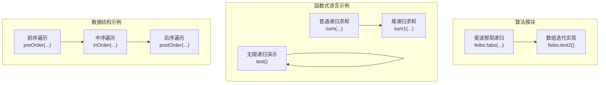
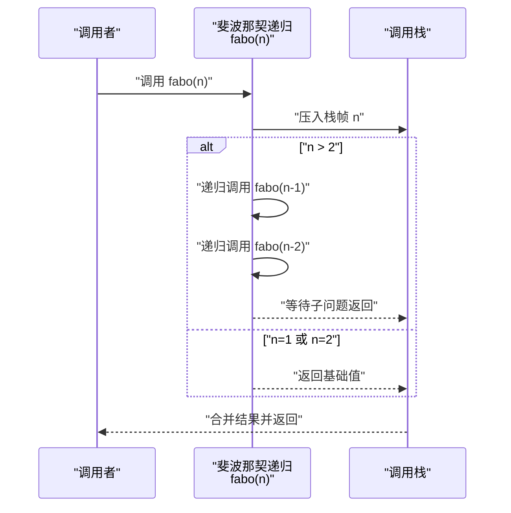
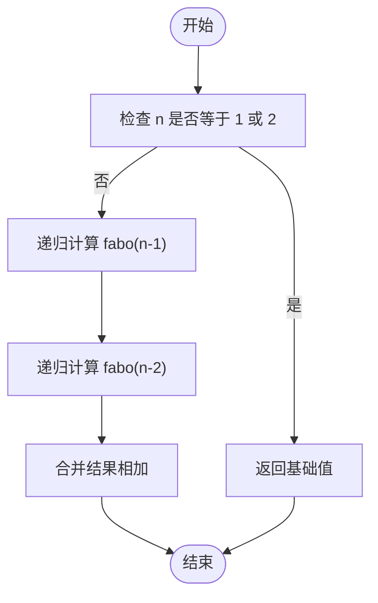
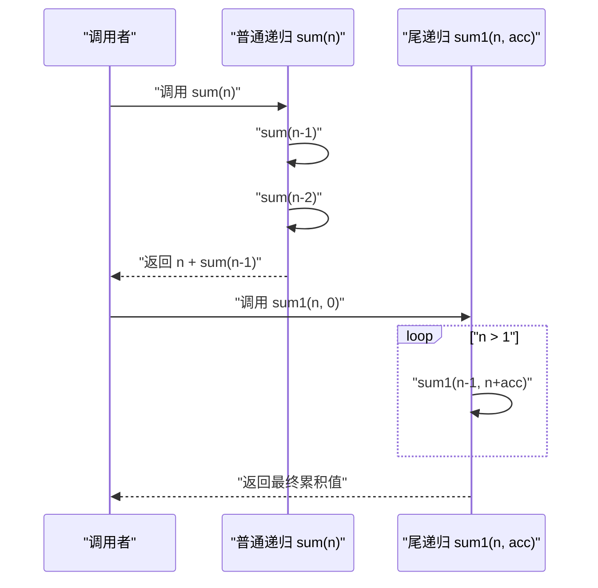
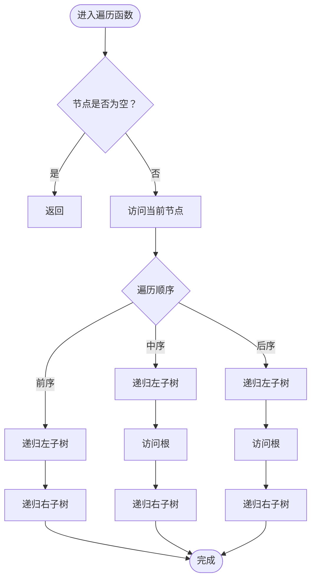
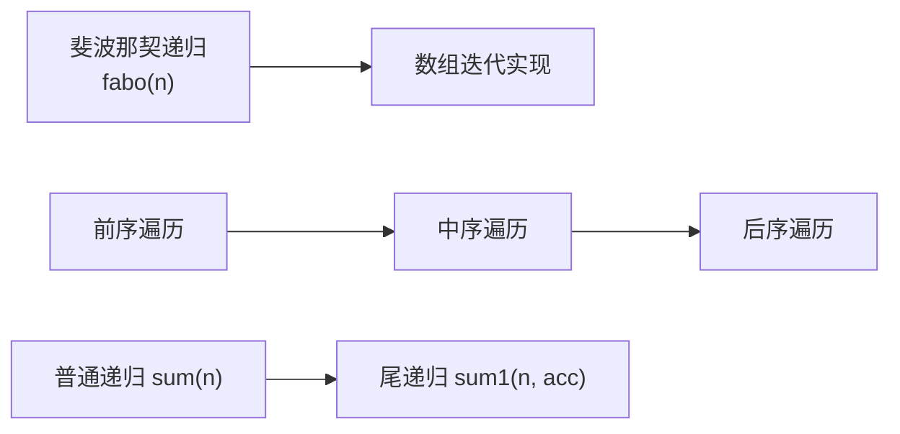

# 递归算法

<cite>
**本文引用的文件**
- [feibo.java](file://_11_Algorithm/src/main/java/_11_递归/feibo.java)
- [Scala14_function.scala](file://_04_scalaTest/src/main/scala/com/atguigu/scala/chapter05/Scala14_function.scala)
- [_05_tree.java](file://_06_flink/src/main/java/_06_exam/_05_tree.java)
</cite>

## 目录
1. [简介](#简介)
2. [项目结构](#项目结构)
3. [核心组件](#核心组件)
4. [架构总览](#架构总览)
5. [详细组件分析](#详细组件分析)
6. [依赖分析](#依赖分析)
7. [性能考量](#性能考量)
8. [故障排查指南](#故障排查指南)
9. [结论](#结论)
10. [附录](#附录)

## 简介
本文件围绕递归算法展开系统性理论与实践说明，结合仓库中的斐波那契递归实现、尾递归示例以及二叉树遍历的递归实现，阐述递归的基本概念、设计原则、执行过程与调用栈管理，并给出优化策略（如尾递归、记忆化）与递归/迭代对比，最后提供练习建议与常见问题排查思路。

## 项目结构
本仓库中与递归直接相关的内容主要分布在以下位置：
- 算法模块：斐波那契递归实现与数组迭代实现对照
- 函数式语言示例：Scala 中的普通递归与尾递归示例
- 数据结构示例：二叉树前/中/后序遍历的递归实现

**图表来源**
- [feibo.java](file://_11_Algorithm/src/main/java/_11_递归/feibo.java#L17-L27)
- [feibo.java](file://_11_Algorithm/src/main/java/_11_递归/feibo.java#L44-L58)
- [Scala14_function.scala](file://_04_scalaTest/src/main/scala/com/atguigu/scala/chapter05/Scala14_function.scala#L24-L30)
- [Scala14_function.scala](file://_04_scalaTest/src/main/scala/com/atguigu/scala/chapter05/Scala14_function.scala#L41-L49)
- [Scala14_function.scala](file://_04_scalaTest/src/main/scala/com/atguigu/scala/chapter05/Scala14_function.scala#L56-L61)
- [_05_tree.java](file://_06_flink/src/main/java/_06_exam/_05_tree.java#L31-L37)
- [_05_tree.java](file://_06_flink/src/main/java/_06_exam/_05_tree.java#L40-L46)
- [_05_tree.java](file://_06_flink/src/main/java/_06_exam/_05_tree.java#L48-L54)

**章节来源**
- [feibo.java](file://_11_Algorithm/src/main/java/_11_递归/feibo.java#L17-L27)
- [feibo.java](file://_11_Algorithm/src/main/java/_11_递归/feibo.java#L44-L58)
- [Scala14_function.scala](file://_04_scalaTest/src/main/scala/com/atguigu/scala/chapter05/Scala14_function.scala#L24-L30)
- [Scala14_function.scala](file://_04_scalaTest/src/main/scala/com/atguigu/scala/chapter05/Scala14_function.scala#L41-L49)
- [Scala14_function.scala](file://_04_scalaTest/src/main/scala/com/atguigu/scala/chapter05/Scala14_function.scala#L56-L61)
- [_05_tree.java](file://_06_flink/src/main/java/_06_exam/_05_tree.java#L31-L37)
- [_05_tree.java](file://_06_flink/src/main/java/_06_exam/_05_tree.java#L40-L46)
- [_05_tree.java](file://_06_flink/src/main/java/_06_exam/_05_tree.java#L48-L54)

## 核心组件
- 斐波那契递归实现：展示递归三要素（问题分解、递归关系、终止条件），并提供数组迭代实现作为对比。
- 普通递归与尾递归：通过累加和示例说明普通递归与尾递归在调用栈上的差异，以及尾递归深度优势。
- 二叉树遍历：前/中/后序遍历均采用递归实现，体现“分而治之”的递归思想。

**章节来源**
- [feibo.java](file://_11_Algorithm/src/main/java/_11_递归/feibo.java#L17-L27)
- [feibo.java](file://_11_Algorithm/src/main/java/_11_递归/feibo.java#L44-L58)
- [Scala14_function.scala](file://_04_scalaTest/src/main/scala/com/atguigu/scala/chapter05/Scala14_function.scala#L24-L30)
- [Scala14_function.scala](file://_04_scalaTest/src/main/scala/com/atguigu/scala/chapter05/Scala14_function.scala#L41-L49)
- [_05_tree.java](file://_06_flink/src/main/java/_06_exam/_05_tree.java#L31-L37)
- [_05_tree.java](file://_06_flink/src/main/java/_06_exam/_05_tree.java#L40-L46)
- [_05_tree.java](file://_06_flink/src/main/java/_06_exam/_05_tree.java#L48-L54)

## 架构总览
从系统视角看，递归算法由“问题建模—递归关系—终止条件—结果合并”构成闭环；在执行层面，每次递归调用都会在调用栈上创建新的栈帧，直到达到终止条件后逐层返回并合并结果。

**图表来源**
- [feibo.java](file://_11_Algorithm/src/main/java/_11_递归/feibo.java#L17-L27)

## 详细组件分析

### 组件A：斐波那契递归与数组迭代
- 设计要点
  - 递归关系：当前项由前两项之和组成
  - 终止条件：n=1 与 n=2 时返回基础值
  - 对比实现：数组迭代版本用于性能与边界处理的直观对比
- 复杂度与优化
  - 原始递归：指数时间复杂度，存在大量重复子问题
  - 优化方向：记忆化递归、自底向上动态规划、矩阵快速幂等
- 调用栈与终止条件
  - 终止条件缺失或不当会导致栈溢出
  - 合理的边界检查与输入验证可避免异常路径

**图表来源**
- [feibo.java](file://_11_Algorithm/src/main/java/_11_递归/feibo.java#L17-L27)

**章节来源**
- [feibo.java](file://_11_Algorithm/src/main/java/_11_递归/feibo.java#L17-L27)
- [feibo.java](file://_11_Algorithm/src/main/java/_11_递归/feibo.java#L44-L58)

### 组件B：普通递归与尾递归（以累加和为例）
- 普通递归
  - 通过层层嵌套的加法表达式形成调用链，返回时才进行合并
  - 优点：代码简洁、易理解
  - 缺点：深度较大时可能导致栈溢出或性能下降
- 尾递归
  - 通过辅助参数将中间结果累积到尾部，满足编译器优化条件
  - 在支持尾调用优化的语言/运行时中，可将尾递归转换为循环，降低空间开销
- 无限递归演示
  - 展示缺乏终止条件的危险性，强调终止条件的重要性

**图表来源**
- [Scala14_function.scala](file://_04_scalaTest/src/main/scala/com/atguigu/scala/chapter05/Scala14_function.scala#L24-L30)
- [Scala14_function.scala](file://_04_scalaTest/src/main/scala/com/atguigu/scala/chapter05/Scala14_function.scala#L41-L49)
- [Scala14_function.scala](file://_04_scalaTest/src/main/scala/com/atguigu/scala/chapter05/Scala14_function.scala#L56-L61)

**章节来源**
- [Scala14_function.scala](file://_04_scalaTest/src/main/scala/com/atguigu/scala/chapter05/Scala14_function.scala#L24-L30)
- [Scala14_function.scala](file://_04_scalaTest/src/main/scala/com/atguigu/scala/chapter05/Scala14_function.scala#L41-L49)
- [Scala14_function.scala](file://_04_scalaTest/src/main/scala/com/atguigu/scala/chapter05/Scala14_function.scala#L56-L61)

### 组件C：二叉树遍历（递归）
- 思路
  - 前序：根 → 左 → 右
  - 中序：左 → 根 → 右
  - 后序：左 → 右 → 根
- 递归实现
  - 每次访问节点后，递归处理左右子树
  - 终止条件：节点为空时返回
- 适用场景
  - 需要按特定顺序访问树中所有节点的场景

**图表来源**
- [_05_tree.java](file://_06_flink/src/main/java/_06_exam/_05_tree.java#L31-L37)
- [_05_tree.java](file://_06_flink/src/main/java/_06_exam/_05_tree.java#L40-L46)
- [_05_tree.java](file://_06_flink/src/main/java/_06_exam/_05_tree.java#L48-L54)

**章节来源**
- [_05_tree.java](file://_06_flink/src/main/java/_06_exam/_05_tree.java#L31-L37)
- [_05_tree.java](file://_06_flink/src/main/java/_06_exam/_05_tree.java#L40-L46)
- [_05_tree.java](file://_06_flink/src/main/java/_06_exam/_05_tree.java#L48-L54)

## 依赖分析
- 模块内依赖
  - 斐波那契递归与数组迭代实现相互对照，便于理解不同实现的性能差异
  - 二叉树遍历三个递归函数之间无直接耦合，但共享相同的“空节点终止”模式
- 外部依赖
  - 递归实现不依赖外部库，仅使用语言内置机制（如调用栈）

**图表来源**
- [feibo.java](file://_11_Algorithm/src/main/java/_11_递归/feibo.java#L17-L27)
- [feibo.java](file://_11_Algorithm/src/main/java/_11_递归/feibo.java#L44-L58)
- [_05_tree.java](file://_06_flink/src/main/java/_06_exam/_05_tree.java#L31-L37)
- [_05_tree.java](file://_06_flink/src/main/java/_06_exam/_05_tree.java#L40-L46)
- [_05_tree.java](file://_06_flink/src/main/java/_06_exam/_05_tree.java#L48-L54)
- [Scala14_function.scala](file://_04_scalaTest/src/main/scala/com/atguigu/scala/chapter05/Scala14_function.scala#L24-L30)
- [Scala14_function.scala](file://_04_scalaTest/src/main/scala/com/atguigu/scala/chapter05/Scala14_function.scala#L41-L49)

**章节来源**
- [feibo.java](file://_11_Algorithm/src/main/java/_11_递归/feibo.java#L17-L27)
- [feibo.java](file://_11_Algorithm/src/main/java/_11_递归/feibo.java#L44-L58)
- [_05_tree.java](file://_06_flink/src/main/java/_06_exam/_05_tree.java#L31-L37)
- [_05_tree.java](file://_06_flink/src/main/java/_06_exam/_05_tree.java#L40-L46)
- [_05_tree.java](file://_06_flink/src/main/java/_06_exam/_05_tree.java#L48-L54)
- [Scala14_function.scala](file://_04_scalaTest/src/main/scala/com/atguigu/scala/chapter05/Scala14_function.scala#L24-L30)
- [Scala14_function.scala](file://_04_scalaTest/src/main/scala/com/atguigu/scala/chapter05/Scala14_function.scala#L41-L49)

## 性能考量
- 时间复杂度
  - 原始斐波那契递归为指数级；可通过记忆化或自底向上 DP 降为线性
  - 树遍历为 O(n)，每个节点访问一次
- 空间复杂度
  - 普通递归受调用栈深度限制；尾递归在支持优化的语言中可显著降低栈占用
  - 树遍历的递归实现空间复杂度与树高相关
- 优化策略
  - 记忆化：缓存已计算子问题结果
  - 尾递归：将中间结果累积到尾部，便于优化
  - 迭代替代：对深度较大的递归，优先考虑显式栈或迭代实现

[本节为通用性能讨论，无需引用具体文件]

## 故障排查指南
- 常见问题
  - 无终止条件或终止条件错误：导致无限递归与栈溢出
  - 输入非法：未对负数或过大数值进行校验
  - 边界处理：数组实现需注意下标越界
- 排查步骤
  - 打印关键变量与调用层级，确认终止条件是否可达
  - 对大输入进行压力测试，观察栈深度与耗时
  - 使用单元测试覆盖边界用例（n=1、n=2、n=0 等）

**章节来源**
- [feibo.java](file://_11_Algorithm/src/main/java/_11_递归/feibo.java#L17-L27)
- [feibo.java](file://_11_Algorithm/src/main/java/_11_递归/feibo.java#L44-L58)
- [Scala14_function.scala](file://_04_scalaTest/src/main/scala/com/atguigu/scala/chapter05/Scala14_function.scala#L56-L61)

## 结论
递归是“分而治之”的重要工具，掌握终止条件、递归关系与结果合并是编写正确递归的核心。在工程实践中，应结合性能需求选择合适的实现方式（普通递归、尾递归、迭代），并对边界与异常进行充分验证。通过本仓库中的斐波那契、累加和与树遍历示例，可以系统地理解递归的理论与实践。

[本节为总结性内容，无需引用具体文件]

## 附录
- 练习建议
  - 实现阶乘、汉诺塔、全排列等经典递归问题
  - 将斐波那契递归改写为记忆化与自底向上 DP 版本，并对比性能
  - 尝试将树的前/中/后序遍历改为迭代实现
- 参考路径
  - 斐波那契递归实现：[feibo.fabo(...)](file://_11_Algorithm/src/main/java/_11_递归/feibo.java#L17-L27)
  - 数组迭代实现：[feibo.test2()](file://_11_Algorithm/src/main/java/_11_递归/feibo.java#L44-L58)
  - 普通递归累加和：[sum(...)](file://_04_scalaTest/src/main/scala/com/atguigu/scala/chapter05/Scala14_function.scala#L24-L30)
  - 尾递归累加和：[sum1(...)](file://_04_scalaTest/src/main/scala/com/atguigu/scala/chapter05/Scala14_function.scala#L41-L49)
  - 二叉树遍历：[preOrder(...)](file://_06_flink/src/main/java/_06_exam/_05_tree.java#L31-L37)、[inOrder(...)](file://_06_flink/src/main/java/_06_exam/_05_tree.java#L40-L46)、[postOrder(...)](file://_06_flink/src/main/java/_06_exam/_05_tree.java#L48-L54)