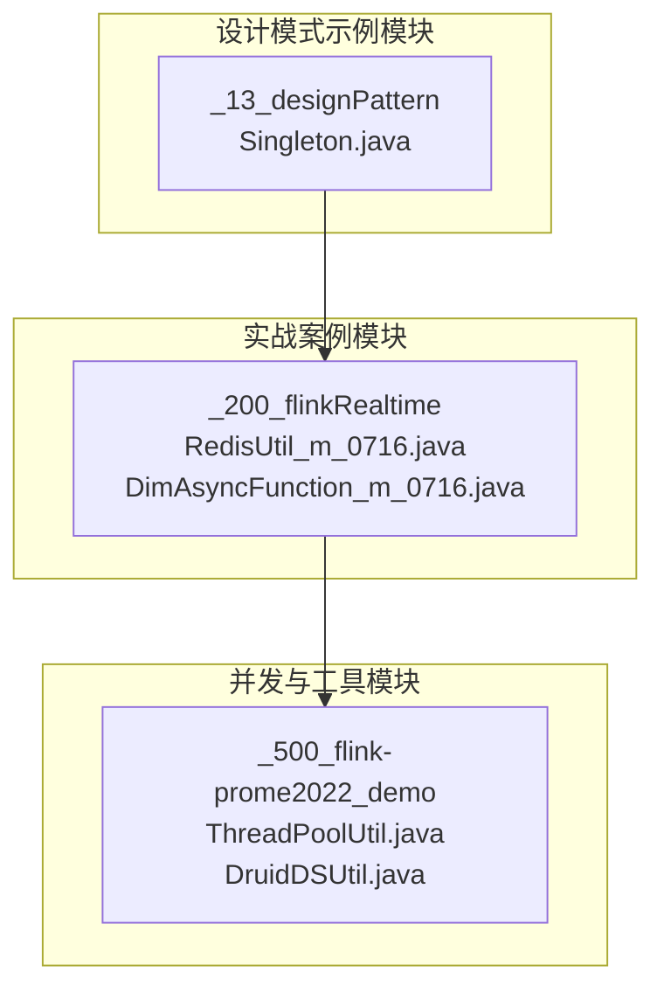
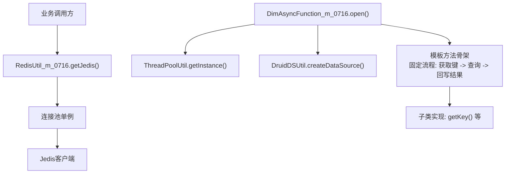
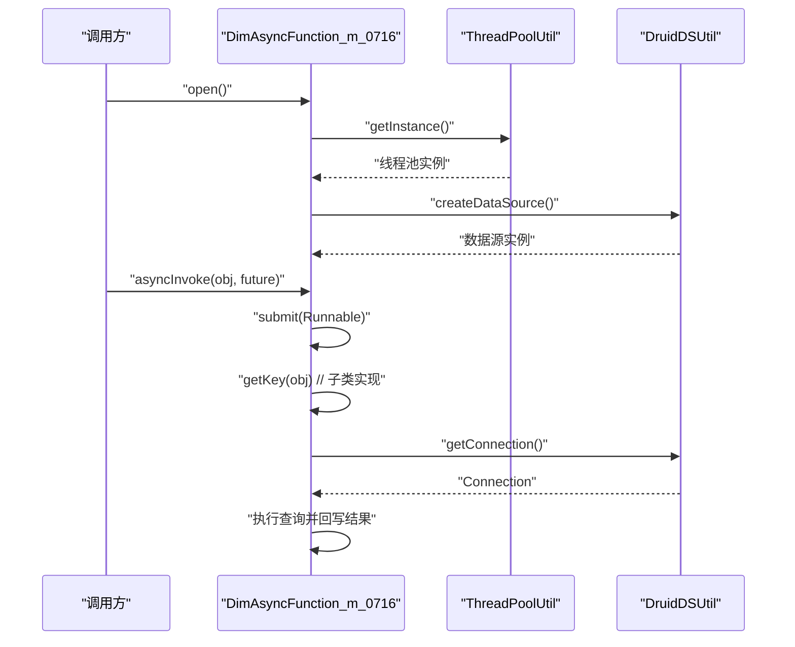
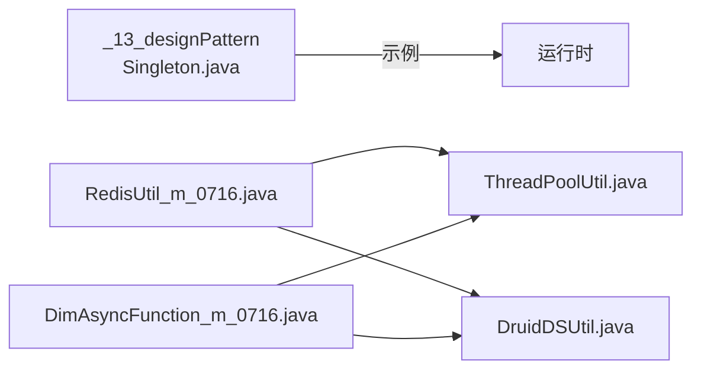

# 设计模式

<cite>
**本文引用的文件**
- [Singleton.java](file://_13_designPattern/src/main/java/Singleton.java)
- [pom.xml](file://_13_designPattern/pom.xml)
- [RedisUtil_m_0716.java](file://_200_flinkRealtime/src/main/java/com/atguigu/gmall/realtime/util/RedisUtil_m_0716.java)
- [DimAsyncFunction_m_0716.java](file://_200_flinkRealtime/src/main/java/com/atguigu/gmall/realtime/app/func/DimAsyncFunction_m_0716.java)
- [ThreadPoolUtil.java](file://_500_flink-prome2022_demo/src/main/java/com/atguigu/prome/util/ThreadPoolUtil.java)
- [DruidDSUtil.java](file://_500_flink-prome2022_demo/src/main/java/com/atguigu/prome/util/DruidDSUtil.java)
</cite>

## 目录
1. [引言](#引言)
2. [项目结构](#项目结构)
3. [核心组件](#核心组件)
4. [架构总览](#架构总览)
5. [详细组件分析](#详细组件分析)
6. [依赖分析](#依赖分析)
7. [性能考虑](#性能考虑)
8. [故障排查指南](#故障排查指南)
9. [结论](#结论)
10. [附录](#附录)

## 引言
本学习文档围绕“设计模式”主题，系统梳理创建型、结构型与行为型三类经典设计模式在Java项目中的应用。通过对仓库中现有代码片段的深入分析，结合可复用的工程实践，帮助读者理解并掌握如何在实际开发中运用设计模式提升代码质量、可维护性与可扩展性，为成长为优秀的软件架构师打下坚实基础。

## 项目结构
本次文档聚焦于以下与设计模式密切相关的模块与文件：
- 设计模式示例模块：_13_designPattern（当前仅包含单例示例）
- 实战案例模块：_200_flinkRealtime（包含单例与模板方法的典型实现）
- 并发与工具模块：_500_flink-prome2022_demo（线程池与数据源工具）

图表来源
- [Singleton.java](file://_13_designPattern/src/main/java/Singleton.java#L1-L10)
- [RedisUtil_m_0716.java](file://_200_flinkRealtime/src/main/java/com/atguigu/gmall/realtime/util/RedisUtil_m_0716.java#L43-L63)
- [DimAsyncFunction_m_0716.java](file://_200_flinkRealtime/src/main/java/com/atguigu/gmall/realtime/app/func/DimAsyncFunction_m_0716.java#L33-L62)
- [ThreadPoolUtil.java](file://_500_flink-prome2022_demo/src/main/java/com/atguigu/prome/util/ThreadPoolUtil.java)
- [DruidDSUtil.java](file://_500_flink-prome2022_demo/src/main/java/com/atguigu/prome/util/DruidDSUtil.java)

章节来源
- [pom.xml](file://_13_designPattern/pom.xml#L1-L38)

## 核心组件
- 单例模式示例：位于设计模式示例模块，作为入门范式，演示“唯一实例”的获取与使用路径。
- 线程池与数据源工具：在实时计算模块中，通过工具类实现资源的统一管理与复用，体现“工具类+单例”的组合使用。
- 异步处理与模板方法：在维度表异步查询函数中，通过“模板方法”固定流程骨架，并将可变部分延迟至子类实现，体现“面向抽象编程”。

章节来源
- [Singleton.java](file://_13_designPattern/src/main/java/Singleton.java#L1-L10)
- [RedisUtil_m_0716.java](file://_200_flinkRealtime/src/main/java/com/atguigu/gmall/realtime/util/RedisUtil_m_0716.java#L43-L63)
- [DimAsyncFunction_m_0716.java](file://_200_flinkRealtime/src/main/java/com/atguigu/gmall/realtime/app/func/DimAsyncFunction_m_0716.java#L33-L62)
- [ThreadPoolUtil.java](file://_500_flink-prome2022_demo/src/main/java/com/atguigu/prome/util/ThreadPoolUtil.java)
- [DruidDSUtil.java](file://_500_flink-prome2022_demo/src/main/java/com/atguigu/prome/util/DruidDSUtil.java)

## 架构总览
从整体上看，仓库中的设计模式实践主要体现在两类场景：
- 资源管理与复用：通过单例化的线程池与数据源工具，集中管理昂贵资源，降低重复创建成本。
- 流程稳定与扩展：通过模板方法模式固定异步处理流程骨架，将“取键”“查询”等步骤延迟到子类实现，便于扩展与维护。

图表来源
- [RedisUtil_m_0716.java](file://_200_flinkRealtime/src/main/java/com/atguigu/gmall/realtime/util/RedisUtil_m_0716.java#L43-L63)
- [DimAsyncFunction_m_0716.java](file://_200_flinkRealtime/src/main/java/com/atguigu/gmall/realtime/app/func/DimAsyncFunction_m_0716.java#L33-L62)
- [ThreadPoolUtil.java](file://_500_flink-prome2022_demo/src/main/java/com/atguigu/prome/util/ThreadPoolUtil.java)
- [DruidDSUtil.java](file://_500_flink-prome2022_demo/src/main/java/com/atguigu/prome/util/DruidDSUtil.java)

## 详细组件分析

### 单例模式（入门示例）
- 场景：确保某类仅有唯一实例，常用于配置中心、连接池、线程池等资源管理。
- 优点：减少内存占用、避免资源竞争、统一入口管理。
- 缺点：全局状态带来耦合风险；并发安全需谨慎处理。
- 实现要点：构造私有化、静态实例、静态获取方法；必要时引入同步机制。
- 仓库参考：设计模式示例模块中的单例入口文件，便于初学者理解“唯一实例”的获取与使用路径。

章节来源
- [Singleton.java](file://_13_designPattern/src/main/java/Singleton.java#L1-L10)

### 线程池与数据源工具（单例+工具类）
- 场景：在高并发实时计算中，统一管理线程池与数据库连接池，避免重复创建带来的性能损耗。
- 优点：资源复用、可控的并发度、统一异常处理入口。
- 缺点：过度依赖全局状态；需注意生命周期与关闭时机。
- 实现要点：工具类提供静态方法获取单例实例；对外暴露统一接口，内部封装初始化逻辑。
- 仓库参考：
  - RedisUtil_m_0716.java 中的 getJedis() 方法体现了“按需初始化”的懒汉式单例思想。
  - ThreadPoolUtil.java 与 DruidDSUtil.java 提供线程池与数据源的单例获取，支撑异步查询流程。

章节来源
- [RedisUtil_m_0716.java](file://_200_flinkRealtime/src/main/java/com/atguigu/gmall/realtime/util/RedisUtil_m_0716.java#L43-L63)
- [ThreadPoolUtil.java](file://_500_flink-prome2022_demo/src/main/java/com/atguigu/prome/util/ThreadPoolUtil.java)
- [DruidDSUtil.java](file://_500_flink-prome2022_demo/src/main/java/com/atguigu/prome/util/DruidDSUtil.java)

### 模板方法模式（异步查询流程）
- 场景：在维度表异步查询中，固定“获取键 -> 建立连接 -> 查询 -> 回写结果”的流程骨架，将“获取键”等步骤延迟到子类实现。
- 优点：流程稳定、易于扩展、符合开闭原则。
- 缺点：子类过多可能导致类爆炸；对模板骨架设计要求较高。
- 实现要点：父类定义流程骨架与抽象步骤；子类实现可变步骤；通过“面向抽象编程”解耦。
- 仓库参考：DimAsyncFunction_m_0716.java 的 open() 与 asyncInvoke() 展示了模板方法的典型用法，注释中明确指出“多态、运行时看子类、模板方法设计模式”。

图表来源
- [DimAsyncFunction_m_0716.java](file://_200_flinkRealtime/src/main/java/com/atguigu/gmall/realtime/app/func/DimAsyncFunction_m_0716.java#L33-L62)
- [ThreadPoolUtil.java](file://_500_flink-prome2022_demo/src/main/java/com/atguigu/prome/util/ThreadPoolUtil.java)
- [DruidDSUtil.java](file://_500_flink-prome2022_demo/src/main/java/com/atguigu/prome/util/DruidDSUtil.java)

章节来源
- [DimAsyncFunction_m_0716.java](file://_200_flinkRealtime/src/main/java/com/atguigu/gmall/realtime/app/func/DimAsyncFunction_m_0716.java#L33-L62)

### 适配器/装饰器/代理模式（概念性说明）
- 适配器模式：在不改变原有接口的前提下，将一个接口转换为目标接口，常见于第三方库对接与兼容层。
- 装饰器模式：在不修改对象结构的情况下，动态地给对象添加职责，适用于横切关注点（如日志、缓存、限流）。
- 代理模式：通过引入代理对象控制对真实对象的访问，支持远程代理、虚拟代理、保护代理等。
- 适用建议：优先选择“面向抽象编程”，通过接口或抽象类隔离变化；在需要增强功能时优先考虑装饰器；在需要统一入口或控制访问时考虑代理。

（本节为概念性内容，未直接分析具体文件，故无章节来源）

## 依赖分析
- 组件内聚与耦合：
  - RedisUtil_m_0716 与 ThreadPoolUtil/DruidDSUtil 存在直接依赖关系，体现“工具类单例”的协作模式。
  - DimAsyncFunction_m_0716 依赖线程池与数据源工具，形成稳定的异步查询通道。
- 外部依赖：
  - 设计模式示例模块的pom.xml声明了测试依赖，便于编写单元测试验证单例等行为。

图表来源
- [pom.xml](file://_13_designPattern/pom.xml#L1-L38)
- [RedisUtil_m_0716.java](file://_200_flinkRealtime/src/main/java/com/atguigu/gmall/realtime/util/RedisUtil_m_0716.java#L43-L63)
- [DimAsyncFunction_m_0716.java](file://_200_flinkRealtime/src/main/java/com/atguigu/gmall/realtime/app/func/DimAsyncFunction_m_0716.java#L33-L62)
- [ThreadPoolUtil.java](file://_500_flink-prome2022_demo/src/main/java/com/atguigu/prome/util/ThreadPoolUtil.java)
- [DruidDSUtil.java](file://_500_flink-prome2022_demo/src/main/java/com/atguigu/prome/util/DruidDSUtil.java)

章节来源
- [pom.xml](file://_13_designPattern/pom.xml#L1-L38)

## 性能考虑
- 资源复用优先：通过单例化线程池与数据源，避免频繁创建销毁带来的CPU与内存压力。
- 异步非阻塞：在高并发场景采用异步查询与回调机制，减少主线程等待时间。
- 扩展性与稳定性：模板方法固定流程骨架，子类实现可插拔，既保证稳定性又便于扩展。

（本节提供一般性指导，未直接分析具体文件，故无章节来源）

## 故障排查指南
- 单例未生效：
  - 检查是否遵循“构造私有化 + 静态实例 + 静态获取方法”的规范；在多线程环境下确认同步机制。
  - 参考：仓库中 RedisUtil_m_0716 的懒汉式获取逻辑，注意“按需初始化”的边界条件。
- 线程池/连接池泄漏：
  - 确认工具类的生命周期管理与关闭流程；避免持有过期引用导致GC无法回收。
  - 参考：ThreadPoolUtil/DruidDSUtil 的单例获取方式，确保统一入口管理。
- 异步查询失败：
  - 核查模板方法中“获取键”“建立连接”“查询执行”各环节的日志与异常处理。
  - 参考：DimAsyncFunction_m_0716 的 open()/asyncInvoke() 流程，定位子类实现与资源准备阶段的问题。

章节来源
- [RedisUtil_m_0716.java](file://_200_flinkRealtime/src/main/java/com/atguigu/gmall/realtime/util/RedisUtil_m_0716.java#L43-L63)
- [DimAsyncFunction_m_0716.java](file://_200_flinkRealtime/src/main/java/com/atguigu/gmall/realtime/app/func/DimAsyncFunction_m_0716.java#L33-L62)
- [ThreadPoolUtil.java](file://_500_flink-prome2022_demo/src/main/java/com/atguigu/prome/util/ThreadPoolUtil.java)
- [DruidDSUtil.java](file://_500_flink-prome2022_demo/src/main/java/com/atguigu/prome/util/DruidDSUtil.java)

## 结论
通过仓库中的单例示例与实时计算模块实践，可以清晰看到设计模式在资源管理、流程稳定与扩展性方面的价值。建议在团队中推广“工具类单例 + 模板方法”的组合模式，配合严格的生命周期管理与可观测性，持续提升系统的可靠性与演进能力。

（本节为总结性内容，未直接分析具体文件，故无章节来源）

## 附录
- 创建型模式（概念性说明）：
  - 单例：确保唯一实例，适合资源管理与配置中心。
  - 工厂：将对象创建延迟到子类，便于替换与扩展。
  - 建造者：分步构建复杂对象，提升可读性与可维护性。
- 结构型模式（概念性说明）：
  - 适配器：统一接口，兼容第三方组件。
  - 装饰器：动态增强功能，适合横切关注点。
  - 代理：统一入口与访问控制，支持远程、虚拟、保护等场景。
- 行为型模式（概念性说明）：
  - 观察者：事件驱动与解耦通知。
  - 策略：运行时切换算法或行为。
  - 命令：将请求封装为对象，支持撤销、队列与日志。

（本节为概念性内容，未直接分析具体文件，故无章节来源）