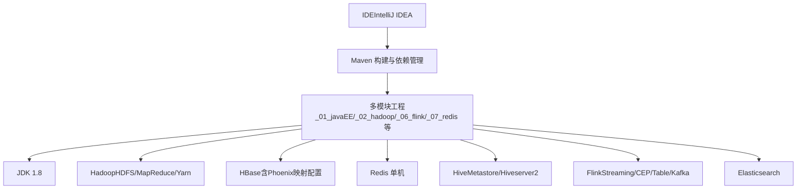
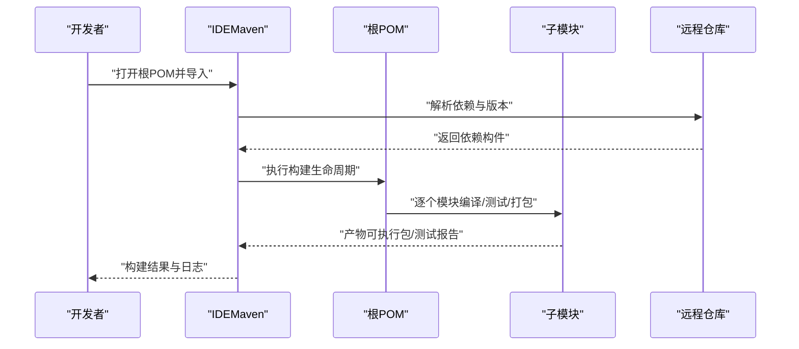
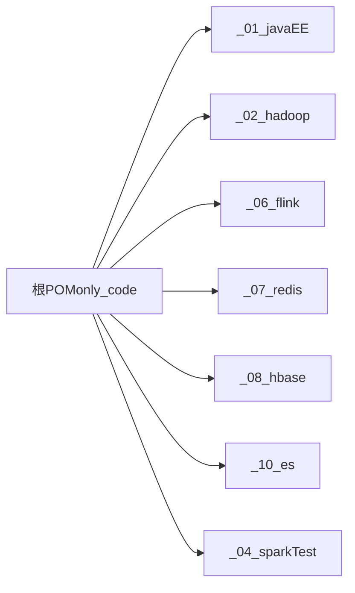

# 开发环境搭建

<cite>
**本文引用的文件**
- [根POM（pom.xml）](file://pom.xml)
- [Java基础模块POM（_01_javaEE/pom.xml）](file://_01_javaEE/pom.xml)
- [Hadoop模块POM（_02_hadoop/pom.xml）](file://_02_hadoop/pom.xml)
- [HDFS客户端子模块POM（_02_hadoop/HDFSClient/pom.xml）](file://_02_hadoop/HDFSClient/pom.xml)
- [Hive模块POM（_02_hive/pom.xml）](file://_02_hive/pom.xml)
- [Flume模块POM（_03_flume/pom.xml）](file://_03_flume/pom.xml)
- [Spark模块POM（_04_spark/pom.xml）](file://_04_spark/pom.xml)
- [Spark测试模块POM（_04_sparkTest/pom.xml）](file://_04_sparkTest/pom.xml)
- [Spark测试模块资源（_04_sparkTest/src/main/resources/hive-site.xml）](file://_04_sparkTest/src/main/resources/hive-site.xml)
- [Scala测试模块POM（_04_scalaTest/pom.xml）](file://_04_scalaTest/pom.xml)
- [Flink模块POM（_06_flink/pom.xml）](file://_06_flink/pom.xml)
- [Flink Wu模块POM（_06_flink_wu/pom.xml）](file://_06_flink_wu/pom.xml)
- [Flink Wu My模块POM（_06_flink_wu_my/pom.xml）](file://_06_flink_wu_my/pom.xml)
- [Flink Tuning模块POM（_06_flink_tuning/pom.xml）](file://_06_flink_tuning/pom.xml)
- [Flink Chen模块POM（_06_flink_chen/pom.xml）](file://_06_flink_chen/pom.xml)
- [Redis模块POM（_07_redis/pom.xml）](file://_07_redis/pom.xml)
- [Redis示例（_07_redis/src/main/java/MyJedisPool.java）](file://_07_redis/src/main/java/MyJedisPool.java)
- [Redis示例（_07_redis/src/main/java/testPool2.java）](file://_07_redis/src/main/java/testPool2.java)
- [HBase模块POM（_08_hbase/pom.xml）](file://_08_hbase/pom.xml)
- [Phoenix Thin模块POM（_09_phoenix_thin/pom.xml）](file://_09_phoenix_thin/pom.xml)
- [Phoenix Thick模块POM（_09_phonix_thick/pom.xml）](file://_09_phonix_thick/pom.xml)
- [Elasticsearch模块POM（_10_es/pom.xml）](file://_10_es/pom.xml)
- [算法模块POM（_11_Algorithm/pom.xml）](file://_11_Algorithm/pom.xml)
- [设计模式模块POM（_13_designPattern/pom.xml）](file://_13_designPattern/pom.xml)
- [Flink实时项目POM（_200_flinkRealtime/pom.xml）](file://_200_flinkRealtime/pom.xml)
- [Flink实时项目0106POM（_200_flinkRealtime0106/pom.xml）](file://_200_flinkRealtime0106/pom.xml)
- [Flink实时展示项目POM（_250_flinkRealtime_show/pom.xml）](file://_250_flinkRealtime_show/pom.xml)
- [总手册模块POM（_400_totalManual/pom.xml）](file://_400_totalManual/pom.xml)
- [Flink Prometheus演示POM（_500_flink-prome2022_demo/pom.xml）](file://_500_flink-prome2022_demo/pom.xml)
- [Flink Prometheus演示资源（_500_flink-prome2022_demo/src/main/resources/flink-conf.yaml）](file://_500_flink-prome2022_demo/src/main/resources/flink-conf.yaml)
- [HDFS配置（_02_hadoop/HDFSClient/src/main/resources/hdfs-site.xml）](file://_02_hadoop/HDFSClient/src/main/resources/hdfs-site.xml)
- [HBase配置（_300_eduRealtime/src/main/resources/hbase-site.xml）](file://_300_eduRealtime/src/main/resources/hbase-site.xml)
- [HBase配置（_200_flinkRealtime0106/src/main/resources/hbase-site.xml）](file://_200_flinkRealtime0106/src/main/resources/hbase-site.xml)
- [HBase日志（_08_hbase/src/main/resources/log4j.properties）](file://_08_hbase/src/main/resources/log4j.properties)
- [Hadoop日志（_02_hadoop/src/main/resources/log4j.properties）](file://_02_hadoop/src/main/resources/log4j.properties)
- [Flink实时项目工具（_200_flinkRealtime/src/main/java/com/atguigu/gmall/realtime/util/RedisUtil_m_0716.java）](file://_200_flinkRealtime/src/main/java/com/atguigu/gmall/realtime/util/RedisUtil_m_0716.java)
- [Flink Sink到Redis示例（_06_flink_wu/src/main/java/com/atguigu/chapter05/SinkToRedisTest.java）](file://_06_flink_wu/src/main/java/com/atguigu/chapter05/SinkToRedisTest.java)
- [Flink实时项目资源（_200_flinkRealtime/src/main/resources/hbase-site.xml）](file://_200_flinkRealtime/src/main/resources/hbase-site.xml)
- [README（readMe.md）](file://readMe.md)
</cite>

## 目录
1. [引言](#引言)
2. [项目结构](#项目结构)
3. [核心组件](#核心组件)
4. [架构总览](#架构总览)
5. [详细组件分析](#详细组件分析)
6. [依赖分析](#依赖分析)
7. [性能考虑](#性能考虑)
8. [故障排查指南](#故障排查指南)
9. [结论](#结论)
10. [附录](#附录)

## 引言
本指南面向初学者与团队成员，提供从零开始搭建完整开发环境的系统性步骤，涵盖：
- Java开发环境配置（JDK版本、Maven、IDE）
- 大数据组件本地开发环境（Hadoop伪分布式、HBase本地模式、Redis单机）
- Maven多模块项目的导入与构建流程（依赖管理、编译打包）
- 开发工具配置建议（IntelliJ IDEA插件、代码格式化、调试配置）

目标是确保你能顺利运行仓库中的各类示例代码与模块。

## 项目结构
该仓库是一个多模块Maven工程，顶层POM统一管理版本与插件，各功能域按模块组织，便于分层开发与维护。

```mermaid
graph TB
Root["根POM<br/>only_code"] --> JavaEE["_01_javaEE<br/>Java基础与框架"]
Root --> Hadoop["_02_hadoop<br/>HDFS/MapReduce/Yarn"]
Root --> Hive["_02_hive<br/>Hive"]
Root --> Flume["_03_flume<br/>Flume"]
Root --> Spark["_04_spark<br/>Spark"]
Root --> SparkTest["_04_sparkTest<br/>Spark测试与配置"]
Root --> ScalaTest["_04_scalaTest<br/>Scala练习"]
Root --> Flink["_06_flink<br/>Flink基础"]
Root --> FlinkWu["_06_flink_wu<br/>Flink实战Wu"]
Root --> FlinkMy["_06_flink_my<br/>Flink实战My"]
Root --> FlinkWuMy["_06_flink_wu_my<br/>Flink实战Wu My"]
Root --> FlinkTuning["_06_flink_tuning<br/>Flink调优"]
Root --> FlinkChen["_06_flink_chen<br/>Flink练习"]
Root --> Redis["_07_redis<br/>Redis集成"]
Root --> HBase["_08_hbase<br/>HBase集成"]
Root --> PhoenixThin["_09_phoenix_thin<br/>Phoenix Thin"]
Root --> PhoenixThick["_09_phonix_thick<br/>Phoenix Thick"]
Root --> ES["_10_es<br/>Elasticsearch"]
Root --> Algorithm["_11_Algorithm<br/>算法练习"]
Root --> DesignPattern["_13_designPattern<br/>设计模式"]
Root --> Realtime200["_200_flinkRealtime<br/>Flink实时项目"]
Root --> Realtime200_0106["_200_flinkRealtime0106<br/>Flink实时项目0106"]
Root --> RealtimeShow["_250_flinkRealtime_show<br/>Flink实时展示"]
Root --> TotalManual["_400_totalManual<br/>总手册"]
Root --> FlinkProme["_500_flink-prome2022_demo<br/>Flink Prometheus演示"]
```

图表来源
- [根POM（pom.xml）](file://pom.xml#L1-L143)

章节来源
- [根POM（pom.xml）](file://pom.xml#L1-L143)

## 核心组件
- Java与Maven
  - JDK：顶层POM统一指定源与目标版本为1.8；部分子模块显式声明源/目标为8。
  - Maven：统一插件管理（编译、资源处理），依赖版本集中管理（JUnit、SLF4J、Logback、Flink、Hadoop、Spark、Redis、ES等）。
- 大数据组件
  - Hadoop：提供HDFS客户端与MapReduce示例，包含HDFS配置文件。
  - Hive：通过Spark测试模块的资源文件展示元数据与服务端配置。
  - HBase：提供客户端与服务端依赖，包含Phoenix命名空间映射配置。
  - Redis：提供Jedis依赖与连接池示例。
  - Flink：多模块覆盖基础、实战、调优与实时项目。
  - Elasticsearch：提供基础依赖与示例入口。
- 多模块构建
  - 使用Maven聚合管理，子模块按功能域拆分，便于独立开发与测试。

章节来源
- [根POM（pom.xml）](file://pom.xml#L52-L141)
- [Java基础模块POM（_01_javaEE/pom.xml）](file://_01_javaEE/pom.xml#L14-L35)
- [Hadoop模块POM（_02_hadoop/pom.xml）](file://_02_hadoop/pom.xml#L12-L47)
- [HDFS客户端子模块POM（_02_hadoop/HDFSClient/pom.xml）](file://_02_hadoop/HDFSClient/pom.xml#L16-L33)
- [Hive模块POM（_02_hive/pom.xml）](file://_02_hive/pom.xml#L1-L200)
- [Spark模块POM（_04_spark/pom.xml）](file://_04_spark/pom.xml#L1-L29)
- [Spark测试模块POM（_04_sparkTest/pom.xml）](file://_04_sparkTest/pom.xml#L1-L200)
- [Spark测试模块资源（_04_sparkTest/src/main/resources/hive-site.xml）](file://_04_sparkTest/src/main/resources/hive-site.xml#L1-L96)
- [Flink模块POM（_06_flink/pom.xml）](file://_06_flink/pom.xml#L1-L175)
- [Redis模块POM（_07_redis/pom.xml）](file://_07_redis/pom.xml#L1-L56)
- [HBase模块POM（_08_hbase/pom.xml）](file://_08_hbase/pom.xml#L1-L45)

## 架构总览
下图展示了典型本地开发环境的组件关系与交互路径，帮助你理解从IDE到各组件的连接方式。

图表来源
- [根POM（pom.xml）](file://pom.xml#L1-L143)
- [HDFS配置（_02_hadoop/HDFSClient/src/main/resources/hdfs-site.xml）](file://_02_hadoop/HDFSClient/src/main/resources/hdfs-site.xml#L1-L10)
- [HBase配置（_300_eduRealtime/src/main/resources/hbase-site.xml）](file://_300_eduRealtime/src/main/resources/hbase-site.xml#L1-L12)
- [HBase配置（_200_flinkRealtime0106/src/main/resources/hbase-site.xml）](file://_200_flinkRealtime0106/src/main/resources/hbase-site.xml#L1-L12)
- [Spark测试模块资源（_04_sparkTest/src/main/resources/hive-site.xml）](file://_04_sparkTest/src/main/resources/hive-site.xml#L1-L96)

## 详细组件分析

### Java与Maven环境准备
- JDK版本
  - 顶层POM统一设置源/目标为1.8；部分子模块也显式声明为8。
- Maven配置
  - 统一插件管理：编译插件与资源插件编码UTF-8。
  - 依赖版本集中管理：JUnit、SLF4J、Logback、Flink、Hadoop、Spark、Redis、ES等。
- 依赖范围
  - 测试依赖（如Junit）与日志实现（SLF4J+Logback）在顶层统一管理，子模块可直接复用。

章节来源
- [根POM（pom.xml）](file://pom.xml#L52-L141)
- [Java基础模块POM（_01_javaEE/pom.xml）](file://_01_javaEE/pom.xml#L14-L35)

### Hadoop本地开发环境（伪分布式）
- HDFS配置
  - 提供HDFS副本数配置文件，便于本地单节点最小化部署。
- MapReduce与Yarn示例
  - 提供MapReduce与Yarn示例模块，便于验证本地MR任务与Yarn调度。
- 日志配置
  - 各模块提供log4j配置，建议在本地开发时保持INFO级别以便观察。

章节来源
- [HDFS配置（_02_hadoop/HDFSClient/src/main/resources/hdfs-site.xml）](file://_02_hadoop/HDFSClient/src/main/resources/hdfs-site.xml#L1-L10)
- [Hadoop模块POM（_02_hadoop/pom.xml）](file://_02_hadoop/pom.xml#L12-L47)
- [Hadoop日志（_02_hadoop/src/main/resources/log4j.properties）](file://_02_hadoop/src/main/resources/log4j.properties#L1-L9)

### HBase本地模式与Phoenix映射
- HBase依赖
  - 提供HBase客户端与服务端依赖，支持本地模式开发与测试。
- Phoenix映射配置
  - 提供Phoenix命名空间映射与系统表映射配置，便于在本地启用命名空间与Schema映射。
- 日志级别
  - HBase模块提供日志配置，建议在本地开发时降低日志级别以提升可观测性。

章节来源
- [HBase模块POM（_08_hbase/pom.xml）](file://_08_hbase/pom.xml#L1-L45)
- [HBase配置（_300_eduRealtime/src/main/resources/hbase-site.xml）](file://_300_eduRealtime/src/main/resources/hbase-site.xml#L1-L12)
- [HBase配置（_200_flinkRealtime0106/src/main/resources/hbase-site.xml）](file://_200_flinkRealtime0106/src/main/resources/hbase-site.xml#L1-L12)
- [HBase日志（_08_hbase/src/main/resources/log4j.properties）](file://_08_hbase/src/main/resources/log4j.properties#L1-L23)

### Redis单机部署与连接池
- 依赖
  - 提供Jedis依赖，便于在本地或单机环境下进行缓存操作。
- 连接池示例
  - 提供JedisPool配置与使用示例，包括懒汉式初始化、参数配置与资源获取。
- 调试建议
  - 在IDE中运行连接池示例，观察哈希键值的变化，验证连接可用性。

章节来源
- [Redis模块POM（_07_redis/pom.xml）](file://_07_redis/pom.xml#L1-L56)
- [Redis示例（_07_redis/src/main/java/MyJedisPool.java）](file://_07_redis/src/main/java/MyJedisPool.java#L1-L26)
- [Redis示例（_07_redis/src/main/java/testPool2.java）](file://_07_redis/src/main/java/testPool2.java#L1-L17)

### Hive本地模式与Hiveserver2
- 元数据与服务端配置
  - 通过Spark测试模块的资源文件展示元数据库连接、Hiveserver2绑定主机与端口、CLI打印配置与本地模式开关。
- 本地模式
  - 可在本地小数据量场景下启用本地MR模式，便于快速验证SQL与ETL逻辑。

章节来源
- [Spark测试模块资源（_04_sparkTest/src/main/resources/hive-site.xml）](file://_04_sparkTest/src/main/resources/hive-site.xml#L1-L96)

### Flink本地开发与集群
- 依赖与桥接
  - 提供Flink核心、Streaming、Table API、Kafka Connector、CSV等依赖，便于本地编写与调试。
- 本地Mini集群
  - 在IDE中执行时，需引入客户端依赖以提交作业至本地Mini集群。
- 调优与实战
  - 提供调优模块与多个实战模块，覆盖窗口、Watermark、CEP、状态与Checkpoint等主题。
- Prometheus演示
  - 提供Flink配置文件示例，便于集成监控与观测。

章节来源
- [Flink模块POM（_06_flink/pom.xml）](file://_06_flink/pom.xml#L1-L175)
- [Flink实时项目工具（_200_flinkRealtime/src/main/java/com/atguigu/gmall/realtime/util/RedisUtil_m_0716.java）](file://_200_flinkRealtime/src/main/java/com/atguigu/gmall/realtime/util/RedisUtil_m_0716.java#L1-L46)
- [Flink Sink到Redis示例（_06_flink_wu/src/main/java/com/atguigu/chapter05/SinkToRedisTest.java）](file://_06_flink_wu/src/main/java/com/atguigu/chapter05/SinkToRedisTest.java#L32-L52)
- [Flink Prometheus演示资源（_500_flink-prome2022_demo/src/main/resources/flink-conf.yaml）](file://_500_flink-prome2022_demo/src/main/resources/flink-conf.yaml#L1-L200)

### Elasticsearch集成
- 依赖
  - 提供Elasticsearch相关依赖与示例入口，便于在本地进行索引与查询验证。

章节来源
- [Elasticsearch模块POM（_10_es/pom.xml）](file://_10_es/pom.xml#L1-L200)

### 项目导入与构建流程（Maven多模块）
- 导入步骤
  - 在IDE中打开根POM，选择“Use plugin registry”或“Import project from external model -> Maven”，确保勾选“Import projects recursively”。
  - 等待索引与依赖解析完成，确认所有模块可见。
- 构建流程
  - 在根目录执行构建，统一管理版本与插件；也可针对特定模块执行编译/打包。
  - 部分模块使用Assembly插件生成带依赖的可执行包，便于提交到集群或分发。

图表来源
- [根POM（pom.xml）](file://pom.xml#L1-L143)
- [Hadoop模块POM（_02_hadoop/pom.xml）](file://_02_hadoop/pom.xml#L60-L84)
- [Flink模块POM（_06_flink/pom.xml）](file://_06_flink/pom.xml#L140-L171)

章节来源
- [根POM（pom.xml）](file://pom.xml#L1-L143)
- [Hadoop模块POM（_02_hadoop/pom.xml）](file://_02_hadoop/pom.xml#L60-L84)
- [Flink模块POM（_06_flink/pom.xml）](file://_06_flink/pom.xml#L140-L171)

### 开发工具配置建议（IntelliJ IDEA）
- 插件推荐
  - Lombok（简化实体类与Builder）
  - Rainbow Brackets（括号配色）
  - Save Actions（自动格式化/优化导入）
  - String Manipulation（字符串处理）
  - Maven Helper（依赖分析）
- 代码格式化
  - 使用EditorConfig或IDE内置风格，统一缩进、换行与空行。
  - 配置“Optimize imports”与“Reformat code”快捷键，提升一致性。
- 调试配置
  - 为每个示例类创建Run/Debug配置，设置VM选项（如Flink本地Mini集群内存）。
  - 对Redis/HBase/Hive等外部组件，先启动对应服务再运行示例。

[本节为通用实践建议，不直接分析具体文件，故无章节来源]

## 依赖分析
- 版本集中管理
  - 顶层POM集中声明Junit、SLF4J、Logback、Flink、Hadoop、Hive、Spark、MySQL、Redis、ES等版本，避免冲突。
- 依赖传递
  - 子模块继承父POM，自动获得公共依赖；如需覆盖，可在子模块中声明具体版本。
- 资源与日志
  - 各模块提供log4j配置，建议在本地开发时统一调整日志级别，便于问题定位。

图表来源
- [根POM（pom.xml）](file://pom.xml#L1-L143)

章节来源
- [根POM（pom.xml）](file://pom.xml#L52-L141)

## 性能考虑
- 本地开发优先使用小数据集与本地模式（如Hive Local Mode），减少资源消耗。
- Flink本地调试时合理设置并行度与状态后端，避免过度占用内存。
- Redis连接池参数应结合实际QPS调优，避免频繁创建/销毁连接。
- HBase/Hive日志级别建议在本地开发阶段适度降低，提高可观测性同时减少I/O。

[本节提供一般性建议，不直接分析具体文件，故无章节来源]

## 故障排查指南
- 依赖冲突
  - 使用Maven命令查看依赖树，定位冲突版本并统一到父POM版本。
- 日志级别
  - 若日志过多或过少，检查各模块log4j配置文件，调整rootLogger级别。
- 外部组件不可达
  - 确认Redis/HBase/Hive/HDFS服务已启动且端口开放；核对配置文件中的主机名与端口。
- 编译错误
  - 确认JDK版本与Maven源/目标版本一致；清理并重新导入项目。

章节来源
- [Hadoop日志（_02_hadoop/src/main/resources/log4j.properties）](file://_02_hadoop/src/main/resources/log4j.properties#L1-L9)
- [HBase日志（_08_hbase/src/main/resources/log4j.properties）](file://_08_hbase/src/main/resources/log4j.properties#L1-L23)

## 结论
通过本指南，你可以基于Maven多模块工程快速搭建Java与大数据组件的本地开发环境。建议先完成JDK与Maven配置，再依次启动Redis/HBase/Hive/HDFS等组件，最后在IDE中导入项目并运行示例。遇到问题时，优先检查依赖版本、日志级别与外部组件可达性。

[本节为总结性内容，不直接分析具体文件，故无章节来源]

## 附录

### 附录A：从零开始的完整步骤清单
- 安装JDK 1.8与Maven
- 配置IDE（推荐IntelliJ IDEA），安装必要插件
- 启动Redis/HBase/Hive/HDFS服务（按需）
- 在IDE中打开根POM并导入多模块
- 执行构建，修复依赖冲突
- 运行示例（如Redis连接池、HBase DDL、Flink作业等）

[本节为流程性说明，不直接分析具体文件，故无章节来源]

### 附录B：关键配置文件位置
- HDFS配置：_02_hadoop/HDFSClient/src/main/resources/hdfs-site.xml
- HBase配置：_300_eduRealtime/src/main/resources/hbase-site.xml
- Hive配置：_04_sparkTest/src/main/resources/hive-site.xml
- Flink配置：_500_flink-prome2022_demo/src/main/resources/flink-conf.yaml
- 日志配置：_02_hadoop/src/main/resources/log4j.properties、_08_hbase/src/main/resources/log4j.properties

章节来源
- [HDFS配置（_02_hadoop/HDFSClient/src/main/resources/hdfs-site.xml）](file://_02_hadoop/HDFSClient/src/main/resources/hdfs-site.xml#L1-L10)
- [HBase配置（_300_eduRealtime/src/main/resources/hbase-site.xml）](file://_300_eduRealtime/src/main/resources/hbase-site.xml#L1-L12)
- [Spark测试模块资源（_04_sparkTest/src/main/resources/hive-site.xml）](file://_04_sparkTest/src/main/resources/hive-site.xml#L1-L96)
- [Flink Prometheus演示资源（_500_flink-prome2022_demo/src/main/resources/flink-conf.yaml）](file://_500_flink-prome2022_demo/src/main/resources/flink-conf.yaml#L1-L200)
- [Hadoop日志（_02_hadoop/src/main/resources/log4j.properties）](file://_02_hadoop/src/main/resources/log4j.properties#L1-L9)
- [HBase日志（_08_hbase/src/main/resources/log4j.properties）](file://_08_hbase/src/main/resources/log4j.properties#L1-L23)