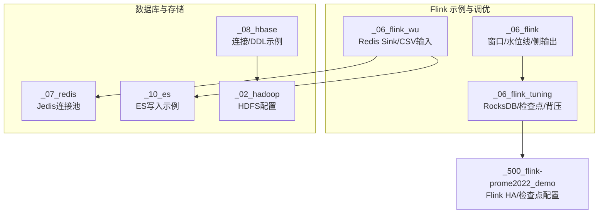
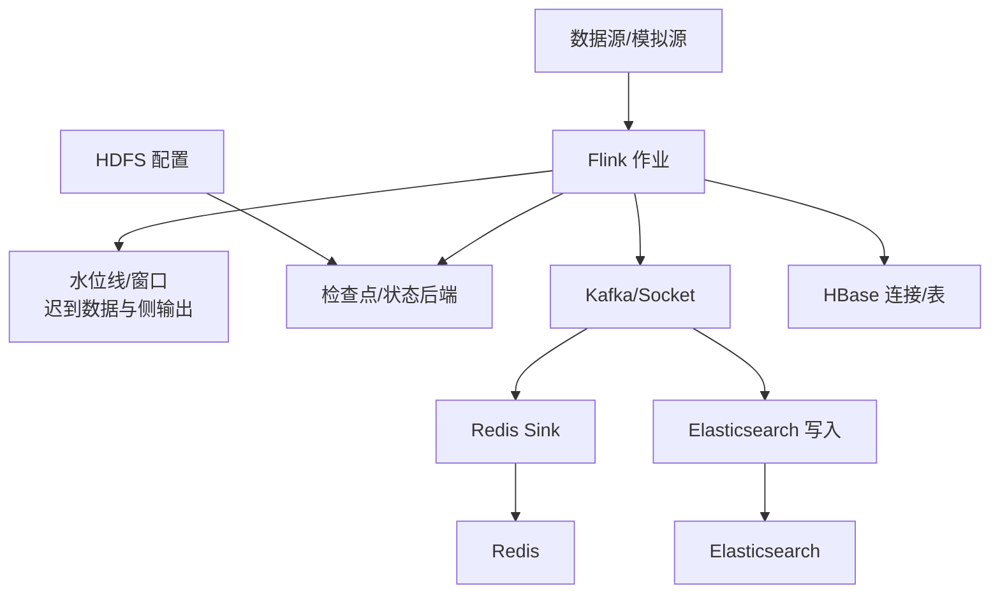
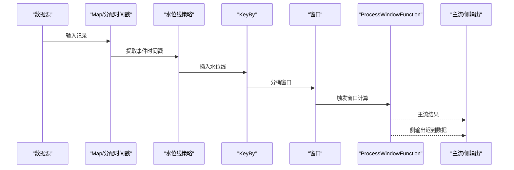
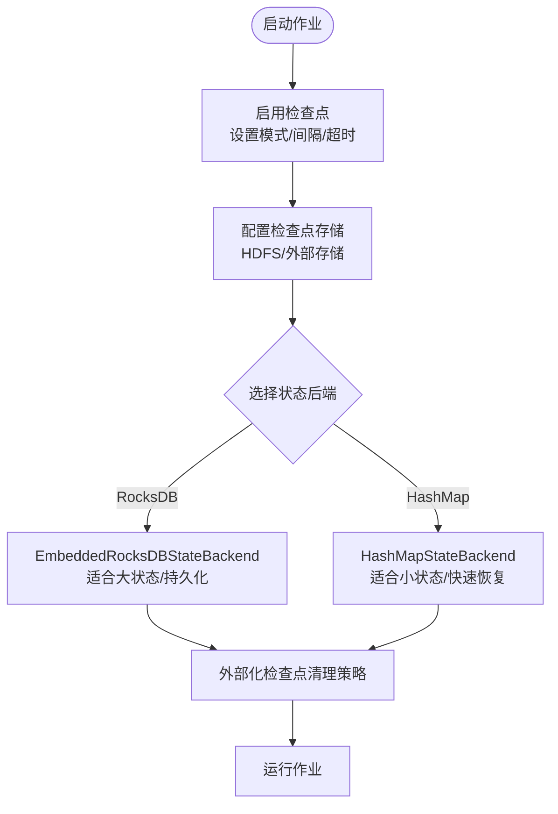
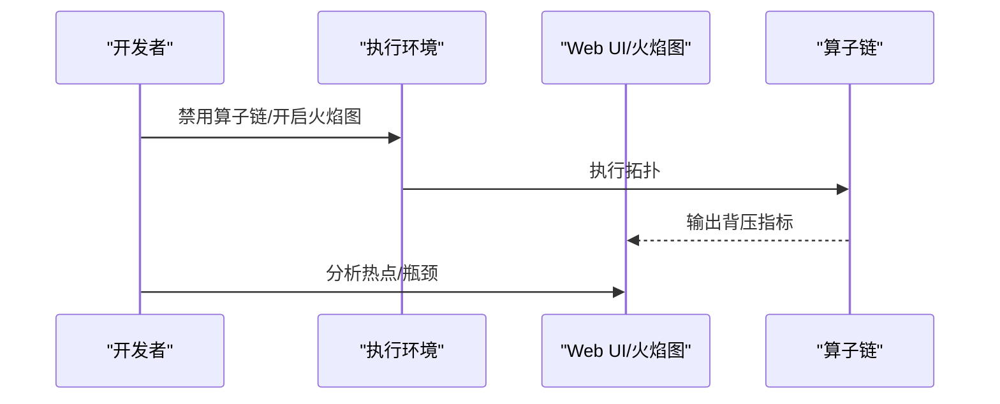
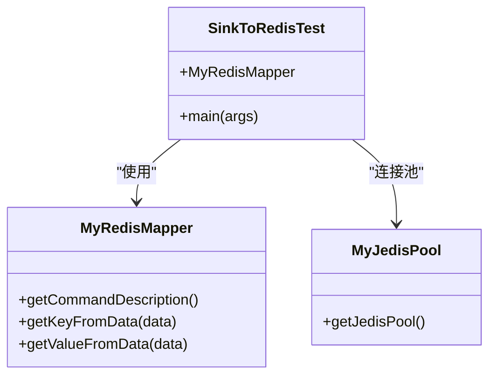
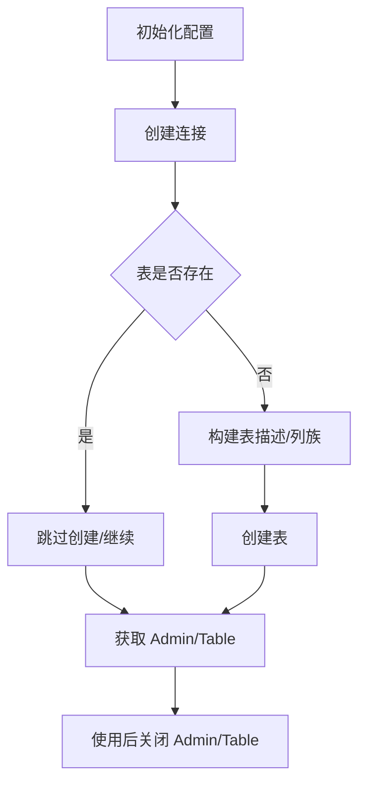
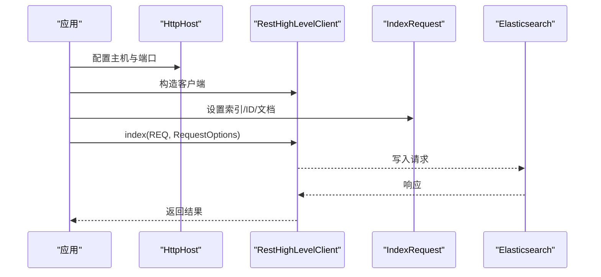
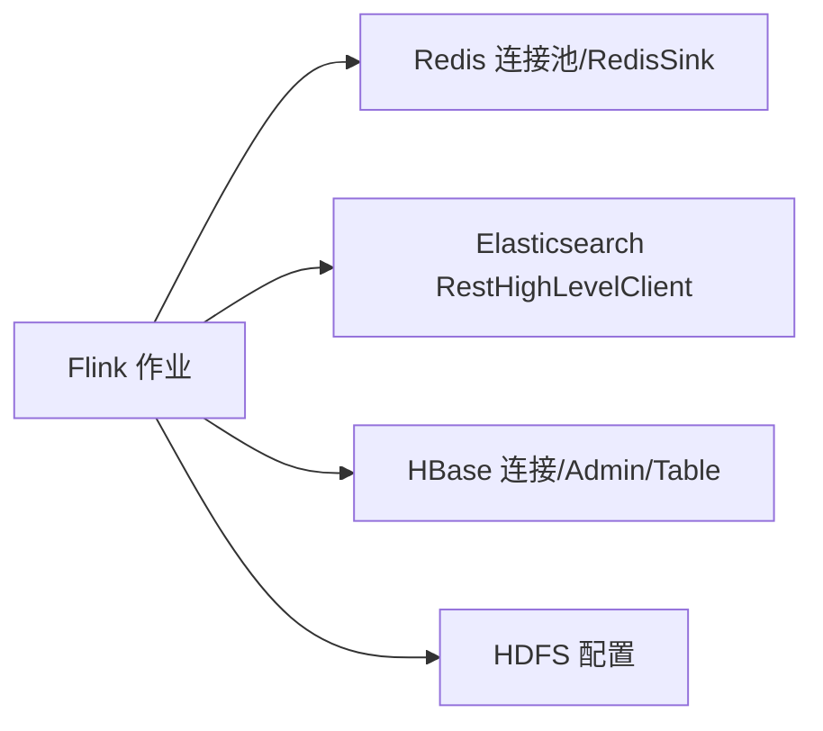

# 故障排查与常见问题

<cite>
**本文引用的文件**
- [flink调优.md](file://_06_flink_tuning/flink调优.md)
- [_04_WindowState.java](file://_06_flink/src/main/java/_17_UV/_04_WindowState.java)
- [RocksdbTuning.java](file://_06_flink_tuning/src/main/java/com/atguigu/flink/tuning/RocksdbTuning.java)
- [SlideWindowDemo.java](file://_06_flink_tuning/src/main/java/com/atguigu/flink/tuning/SlideWindowDemo.java)
- [BackpressureDemo.java](file://_06_flink_tuning/src/main/java/com/atguigu/flink/tuning/BackpressureDemo.java)
- [SinkToRedisTest.java](file://_06_flink_wu/src/main/java/com/atguigu/chapter05/SinkToRedisTest.java)
- [MyJedisPool.java](file://_07_redis/src/main/java/MyJedisPool.java)
- [_1_Connection.java](file://_08_hbase/src/main/java/_1_Connection.java)
- [_10_OfficialExamples.java](file://_08_hbase/src/main/java/_10_OfficialExamples.java)
- [_01_EsDemo.java](file://_10_es/src/main/java/_01_EsDemo.java)
- [flink-conf.yaml](file://_500_flink-prome2022_demo/src/main/resources/flink-conf.yaml)
- [hdfs-site.xml](file://_02_hadoop/HDFSClient/src/main/resources/hdfs-site.xml)
- [clicks.csv](file://_06_flink_wu/input/clicks.csv)
</cite>

## 目录
1. 引言
2. 项目结构
3. 核心组件
4. 架构总览
5. 详细组件分析
6. 依赖分析
7. 性能考虑
8. 故障排查指南
9. 结论
10. 附录

## 引言
本指南聚焦于流处理与大数据生态中的常见故障与排错实践，覆盖 Flink 作业运行异常、状态与窗口问题、Hadoop 集群故障（NameNode/DataNode/权限）、Redis 连接池问题、HBase 表与连接问题、Elasticsearch 写入异常，以及性能诊断（内存、CPU、背压、网络）等主题。文档以仓库中的示例代码为依据，给出可操作的定位思路、检查清单与修复建议，并通过图示帮助快速理解关键流程。

## 项目结构
该仓库包含多个模块，涵盖 Flink 流处理示例、Hadoop/HBase/ES/Redis 等组件集成与调优演示。与故障排查直接相关的关键路径如下：
- Flink 示例与调优：_06_flink、_06_flink_tuning、_06_flink_wu
- Hadoop/HBase/ES/Redis：_02_hadoop、_08_hbase、_10_es、_07_redis
- Prometheus/Flink 配置：_500_flink-prome2022_demo

**章节来源**
- file://_06_flink/src/main/java/_17_UV/_04_WindowState.java#L1-L99
- file://_06_flink_tuning/src/main/java/com/atguigu/flink/tuning/RocksdbTuning.java#L1-L76
- file://_06_flink_tuning/src/main/java/com/atguigu/flink/tuning/SlideWindowDemo.java#L24-L50
- file://_06_flink_tuning/src/main/java/com/atguigu/flink/tuning/BackpressureDemo.java#L1-L35
- file://_06_flink_wu/src/main/java/com/atguigu/chapter05/SinkToRedisTest.java#L1-L53
- file://_07_redis/src/main/java/MyJedisPool.java#L1-L27
- file://_08_hbase/src/main/java/_1_Connection.java#L1-L82
- file://_08_hbase/src/main/java/_10_OfficialExamples.java#L28-L51
- file://_10_es/src/main/java/_01_EsDemo.java#L1-L45
- file://_500_flink-prome2022_demo/src/main/resources/flink-conf.yaml#L91-L160
- file://_02_hadoop/HDFSClient/src/main/resources/hdfs-site.xml#L1-L9

## 核心组件
- Flink 窗口与水位线：基于事件时间的滚动窗口、迟到数据与侧输出流处理，用于定位乱序与延迟问题。
- Flink 检查点与状态后端：RocksDB 后端、HashMap 后端、外部存储、超时与容忍失败次数配置，用于定位状态异常与恢复问题。
- Flink 背压检测：通过禁用链式算子与本地 Web UI 开启火焰图，用于定位背压瓶颈。
- Redis Sink：基于连接池的 HSET 写入，用于定位连接与序列化问题。
- HBase 连接与 DDL：连接复用、表创建与关闭规范，用于定位连接泄漏与表损坏问题。
- Elasticsearch 写入：RestHighLevelClient 写入请求，用于定位网络与索引异常。
- Hadoop HDFS 配置：副本数等参数，用于定位存储层问题。

**章节来源**
- file://_06_flink/src/main/java/_17_UV/_04_WindowState.java#L1-L99
- file://_06_flink_tuning/src/main/java/com/atguigu/flink/tuning/RocksdbTuning.java#L1-L76
- file://_06_flink_tuning/src/main/java/com/atguigu/flink/tuning/SlideWindowDemo.java#L24-L50
- file://_06_flink_tuning/src/main/java/com/atguigu/flink/tuning/BackpressureDemo.java#L1-L35
- file://_06_flink_wu/src/main/java/com/atguigu/chapter05/SinkToRedisTest.java#L1-L53
- file://_07_redis/src/main/java/MyJedisPool.java#L1-L27
- file://_08_hbase/src/main/java/_1_Connection.java#L1-L82
- file://_08_hbase/src/main/java/_10_OfficialExamples.java#L28-L51
- file://_10_es/src/main/java/_01_EsDemo.java#L1-L45
- file://_02_hadoop/HDFSClient/src/main/resources/hdfs-site.xml#L1-L9

## 架构总览
下图展示从数据源到下游存储的整体链路，以及常见故障点：

**图表来源**
- [SinkToRedisTest.java](file://_06_flink_wu/src/main/java/com/atguigu/chapter05/SinkToRedisTest.java#L1-L53)
- [_04_WindowState.java](file://_06_flink/src/main/java/_17_UV/_04_WindowState.java#L1-L99)
- [RocksdbTuning.java](file://_06_flink_tuning/src/main/java/com/atguigu/flink/tuning/RocksdbTuning.java#L1-L76)
- [_01_EsDemo.java](file://_10_es/src/main/java/_01_EsDemo.java#L1-L45)
- [_1_Connection.java](file://_08_hbase/src/main/java/_1_Connection.java#L1-L82)
- [hdfs-site.xml](file://_02_hadoop/HDFSClient/src/main/resources/hdfs-site.xml#L1-L9)

## 详细组件分析

### Flink 窗口与水位线（迟到数据与侧输出）
- 关键点：事件时间窗口、允许延迟、侧输出流收集迟到数据。
- 排查要点：
  - 水位线推进是否正常，最大无序程度是否合理。
  - allowedLateness 是否过小导致大量迟到被丢弃。
  - 侧输出标签是否一致，下游是否正确消费。
- 可参考实现路径：
  - [窗口与侧输出实现](file://_06_flink/src/main/java/_17_UV/_04_WindowState.java#L1-L99)

**图表来源**
- [_04_WindowState.java](file://_06_flink/src/main/java/_17_UV/_04_WindowState.java#L1-L99)

**章节来源**
- file://_06_flink/src/main/java/_17_UV/_04_WindowState.java#L1-L99

### Flink 检查点与状态后端（RocksDB/HashMap）
- 关键点：启用检查点、设置存储目录、超时与容忍失败次数、外部化检查点清理策略。
- 排查要点：
  - 检查点间隔是否过短导致频繁 IO。
  - 存储路径可达性与权限。
  - RocksDB 与 HashMap 的适用场景差异。
- 可参考实现路径：
  - [RocksDB 调优与检查点配置](file://_06_flink_tuning/src/main/java/com/atguigu/flink/tuning/RocksdbTuning.java#L1-L76)
  - [滑动窗口与检查点配置](file://_06_flink_tuning/src/main/java/com/atguigu/flink/tuning/SlideWindowDemo.java#L24-L50)
  - [Flink HA/检查点配置样例](file://_500_flink-prome2022_demo/src/main/resources/flink-conf.yaml#L91-L160)

**图表来源**
- [RocksdbTuning.java](file://_06_flink_tuning/src/main/java/com/atguigu/flink/tuning/RocksdbTuning.java#L1-L76)
- [SlideWindowDemo.java](file://_06_flink_tuning/src/main/java/com/atguigu/flink/tuning/SlideWindowDemo.java#L24-L50)
- [flink-conf.yaml](file://_500_flink-prome2022_demo/src/main/resources/flink-conf.yaml#L91-L160)

**章节来源**
- file://_06_flink_tuning/src/main/java/com/atguigu/flink/tuning/RocksdbTuning.java#L1-L76
- file://_06_flink_tuning/src/main/java/com/atguigu/flink/tuning/SlideWindowDemo.java#L24-L50
- file://_500_flink-prome2022_demo/src/main/resources/flink-conf.yaml#L91-L160

### Flink 背压检测（火焰图与链式算子）
- 关键点：禁用算子链、开启 Web UI 火焰图，定位背压瓶颈。
- 排查要点：
  - 是否因链式算子导致背压放大。
  - 火焰图热点函数与下游吞吐瓶颈。
- 可参考实现路径：
  - [背压检测示例](file://_06_flink_tuning/src/main/java/com/atguigu/flink/tuning/BackpressureDemo.java#L1-L35)

**图表来源**
- [BackpressureDemo.java](file://_06_flink_tuning/src/main/java/com/atguigu/flink/tuning/BackpressureDemo.java#L1-L35)

**章节来源**
- file://_06_flink_tuning/src/main/java/com/atguigu/flink/tuning/BackpressureDemo.java#L1-L35

### Redis 连接池与 Sink（HSET 写入）
- 关键点：连接池配置（最大连接、空闲、借出校验）、Mapper 映射。
- 排查要点：
  - 连接池过小导致阻塞。
  - Mapper 键值映射是否正确。
  - Redis 主机/端口连通性。
- 可参考实现路径：
  - [Redis Sink 示例](file://_06_flink_wu/src/main/java/com/atguigu/chapter05/SinkToRedisTest.java#L1-L53)
  - [Jedis 连接池配置](file://_07_redis/src/main/java/MyJedisPool.java#L1-L27)

**图表来源**
- [SinkToRedisTest.java](file://_06_flink_wu/src/main/java/com/atguigu/chapter05/SinkToRedisTest.java#L1-L53)
- [MyJedisPool.java](file://_07_redis/src/main/java/MyJedisPool.java#L1-L27)

**章节来源**
- file://_06_flink_wu/src/main/java/com/atguigu/chapter05/SinkToRedisTest.java#L1-L53
- file://_07_redis/src/main/java/MyJedisPool.java#L1-L27

### HBase 连接与 DDL（连接复用/表创建/关闭）
- 关键点：连接复用、表存在性判断、列族描述构建、Admin 关闭。
- 排查要点：
  - 连接未关闭导致资源泄露。
  - 表已存在/命名空间缺失导致创建失败。
- 可参考实现路径：
  - [HBase 连接与 DDL 示例](file://_08_hbase/src/main/java/_1_Connection.java#L1-L82)
  - [官方示例注释与连接说明](file://_08_hbase/src/main/java/_10_OfficialExamples.java#L28-L51)

**图表来源**
- [_1_Connection.java](file://_08_hbase/src/main/java/_1_Connection.java#L1-L82)
- [_10_OfficialExamples.java](file://_08_hbase/src/main/java/_10_OfficialExamples.java#L28-L51)

**章节来源**
- file://_08_hbase/src/main/java/_1_Connection.java#L1-L82
- file://_08_hbase/src/main/java/_10_OfficialExamples.java#L28-L51

### Elasticsearch 写入（RestHighLevelClient）
- 关键点：HttpHost、IndexRequest、索引名称与文档 ID。
- 排查要点：
  - 网络连通性与端口可用性。
  - 索引是否存在、映射是否兼容。
- 可参考实现路径：
  - [ES 写入示例](file://_10_es/src/main/java/_01_EsDemo.java#L1-L45)

**图表来源**
- [_01_EsDemo.java](file://_10_es/src/main/java/_01_EsDemo.java#L1-L45)

**章节来源**
- file://_10_es/src/main/java/_01_EsDemo.java#L1-L45

### Hadoop HDFS 配置（副本数）
- 关键点：dfs.replication 副本数。
- 排查要点：
  - 副本数过低导致数据丢失风险。
  - NameNode/DataNode 节点健康与磁盘空间。
- 可参考实现路径：
  - [HDFS 配置示例](file://_02_hadoop/HDFSClient/src/main/resources/hdfs-site.xml#L1-L9)

**章节来源**
- file://_02_hadoop/HDFSClient/src/main/resources/hdfs-site.xml#L1-L9

## 依赖分析
- Flink 与外部系统依赖：
  - Redis：FlinkJedisPoolConfig、RedisSink、RedisMapper。
  - Elasticsearch：RestHighLevelClient、IndexRequest。
  - HBase：ConnectionFactory、Admin、Table。
  - Hadoop：HDFS 配置项。
- 可参考实现路径：
  - [Redis Sink 依赖关系](file://_06_flink_wu/src/main/java/com/atguigu/chapter05/SinkToRedisTest.java#L1-L53)
  - [ES 写入依赖关系](file://_10_es/src/main/java/_01_EsDemo.java#L1-L45)
  - [HBase 连接依赖关系](file://_08_hbase/src/main/java/_1_Connection.java#L1-L82)

**图表来源**
- [SinkToRedisTest.java](file://_06_flink_wu/src/main/java/com/atguigu/chapter05/SinkToRedisTest.java#L1-L53)
- [_01_EsDemo.java](file://_10_es/src/main/java/_01_EsDemo.java#L1-L45)
- [_1_Connection.java](file://_08_hbase/src/main/java/_1_Connection.java#L1-L82)

**章节来源**
- file://_06_flink_wu/src/main/java/com/atguigu/chapter05/SinkToRedisTest.java#L1-L53
- file://_10_es/src/main/java/_01_EsDemo.java#L1-L45
- file://_08_hbase/src/main/java/_1_Connection.java#L1-L82

## 性能考虑
- CPU 占用高：检查热点函数（火焰图）、算子链是否过长、序列化开销。
- 内存溢出：增大 JVM 堆或使用 RocksDB 后端，减少状态大小，开启增量检查点。
- 网络延迟：验证 Redis/ES/HBase/NameNode/DataNode 端口连通性与带宽。
- 背压：禁用链式算子、拆分算子、增加下游并行度、优化序列化与 IO。

[本节为通用指导，无需具体文件引用]

## 故障排查指南

### Flink 作业运行异常
- 检查清单
  - 检查点配置：间隔、超时、容忍失败次数、存储路径。
  - 状态后端：RocksDB vs HashMap 的适用场景。
  - 水位线与窗口：事件时间提取、最大无序度、allowedLateness、侧输出。
  - 背压：开启火焰图，定位瓶颈算子。
- 参考实现
  - [RocksDB 调优与检查点](file://_06_flink_tuning/src/main/java/com/atguigu/flink/tuning/RocksdbTuning.java#L1-L76)
  - [滑动窗口与检查点](file://_06_flink_tuning/src/main/java/com/atguigu/flink/tuning/SlideWindowDemo.java#L24-L50)
  - [窗口与侧输出](file://_06_flink/src/main/java/_17_UV/_04_WindowState.java#L1-L99)
  - [背压检测](file://_06_flink_tuning/src/main/java/com/atguigu/flink/tuning/BackpressureDemo.java#L1-L35)

**章节来源**
- file://_06_flink_tuning/src/main/java/com/atguigu/flink/tuning/RocksdbTuning.java#L1-L76
- file://_06_flink_tuning/src/main/java/com/atguigu/flink/tuning/SlideWindowDemo.java#L24-L50
- file://_06_flink/src/main/java/_17_UV/_04_WindowState.java#L1-L99
- file://_06_flink_tuning/src/main/java/com/atguigu/flink/tuning/BackpressureDemo.java#L1-L35

### 状态管理问题（检查点/状态后端）
- 症状：状态恢复慢、检查点失败、内存压力大。
- 处理建议
  - 调整检查点间隔与超时，设置外部化清理策略。
  - 使用 RocksDB 后端处理大状态；HashMap 适合小状态。
  - 降低状态大小，避免在窗口内保存过多历史数据。
- 参考实现
  - [RocksDB 配置与检查点](file://_06_flink_tuning/src/main/java/com/atguigu/flink/tuning/RocksdbTuning.java#L1-L76)
  - [Flink HA/检查点配置样例](file://_500_flink-prome2022_demo/src/main/resources/flink-conf.yaml#L91-L160)

**章节来源**
- file://_06_flink_tuning/src/main/java/com/atguigu/flink/tuning/RocksdbTuning.java#L1-L76
- file://_500_flink-prome2022_demo/src/main/resources/flink-conf.yaml#L91-L160

### 窗口计算错误（乱序/迟到数据）
- 症状：窗口结果不准确、数据丢失。
- 处理建议
  - 合理设置水位线最大无序度。
  - 配置 allowedLateness 与侧输出，确保迟到数据被收集。
  - 使用 CSV 或模拟数据验证窗口边界与触发行为。
- 参考实现
  - [窗口与侧输出](file://_06_flink/src/main/java/_17_UV/_04_WindowState.java#L1-L99)
  - [CSV 输入样例](file://_06_flink_wu/input/clicks.csv#L1-L12)

**章节来源**
- file://_06_flink/src/main/java/_17_UV/_04_WindowState.java#L1-L99
- file://_06_flink_wu/input/clicks.csv#L1-L12

### Hadoop 集群故障排查（NameNode/DataNode/权限）
- NameNode 故障
  - 检查 HA 配置与仲裁机制。
  - 查看 JournalNode 一致性与磁盘空间。
- DataNode 异常
  - 检查磁盘空间、网络连通性、心跳。
- 文件系统权限问题
  - 检查 dfs.permissions、用户与组映射。
- 参考实现
  - [HDFS 配置示例](file://_02_hadoop/HDFSClient/src/main/resources/hdfs-site.xml#L1-L9)

**章节来源**
- file://_02_hadoop/HDFSClient/src/main/resources/hdfs-site.xml#L1-L9

### Redis 连接池问题
- 症状：写入阻塞、连接耗尽、超时。
- 处理建议
  - 增大最大连接数与最小空闲，关闭借出阻塞校验。
  - 确认主机/端口连通性与防火墙。
  - 检查 Mapper 键值映射是否正确。
- 参考实现
  - [Jedis 连接池配置](file://_07_redis/src/main/java/MyJedisPool.java#L1-L27)
  - [Redis Sink 示例](file://_06_flink_wu/src/main/java/com/atguigu/chapter05/SinkToRedisTest.java#L1-L53)

**章节来源**
- file://_07_redis/src/main/java/MyJedisPool.java#L1-L27
- file://_06_flink_wu/src/main/java/com/atguigu/chapter05/SinkToRedisTest.java#L1-L53

### HBase 表损坏/连接问题
- 症状：连接失败、表创建失败、资源未关闭。
- 处理建议
  - 使用连接复用，确保 Admin/Table 正确关闭。
  - 先判断表是否存在，再进行 DDL 操作。
  - 核对命名空间与列族配置。
- 参考实现
  - [HBase 连接与 DDL](file://_08_hbase/src/main/java/_1_Connection.java#L1-L82)
  - [官方示例注释](file://_08_hbase/src/main/java/_10_OfficialExamples.java#L28-L51)

**章节来源**
- file://_08_hbase/src/main/java/_1_Connection.java#L1-L82
- file://_08_hbase/src/main/java/_10_OfficialExamples.java#L28-L51

### Elasticsearch 索引异常
- 症状：写入失败、映射冲突、响应超时。
- 处理建议
  - 检查索引名称与文档 ID 是否冲突。
  - 确认网络连通性与端口可用。
  - 若映射不兼容，先重建索引或调整映射。
- 参考实现
  - [ES 写入示例](file://_10_es/src/main/java/_01_EsDemo.java#L1-L45)

**章节来源**
- file://_10_es/src/main/java/_01_EsDemo.java#L1-L45

### 性能问题诊断（内存/CPU/网络/背压）
- 内存溢出
  - 减少状态大小、使用 RocksDB、调大堆或启用增量检查点。
- CPU 占用过高
  - 火焰图定位热点、拆分算子、减少序列化成本。
- 网络延迟
  - 检查 Redis/ES/HBase/NameNode/DataNode 端口与带宽。
- 背压
  - 禁用链式算子、增加并行度、优化下游吞吐。
- 参考实现
  - [背压检测示例](file://_06_flink_tuning/src/main/java/com/atguigu/flink/tuning/BackpressureDemo.java#L1-L35)
  - [Flink 调优文档](file://_06_flink_tuning/flink调优.md#L1-L10)

**章节来源**
- file://_06_flink_tuning/src/main/java/com/atguigu/flink/tuning/BackpressureDemo.java#L1-L35
- file://_06_flink_tuning/flink调优.md#L1-L10

## 结论
通过结合仓库中的示例代码与配置文件，可以系统化地定位与解决 Flink 与大数据生态中的常见问题。建议在生产环境中：
- 明确检查点与状态后端策略，配置外部化清理。
- 合理设置水位线与窗口参数，妥善处理迟到数据。
- 使用连接池与正确的资源关闭策略，避免资源泄漏。
- 借助火焰图与监控工具进行性能诊断与优化。

[本节为总结，无需具体文件引用]

## 附录
- 常用检查清单
  - Flink：检查点间隔/超时/存储路径、状态后端、水位线与窗口、背压火焰图。
  - Redis：连接池参数、Mapper 键值映射、网络连通性。
  - HBase：连接复用、表存在性判断、Admin/Table 关闭。
  - Elasticsearch：索引名称/ID、网络连通性、映射兼容性。
  - HDFS：副本数、NameNode/DataNode 健康、权限与磁盘空间。

[本节为补充说明，无需具体文件引用]