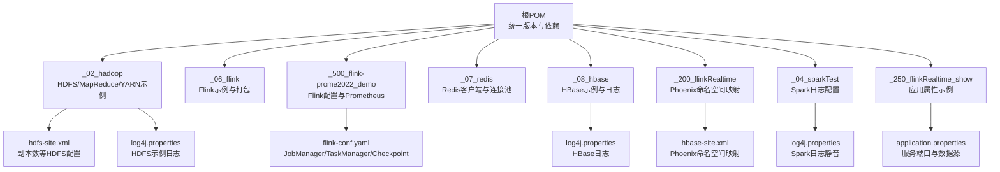
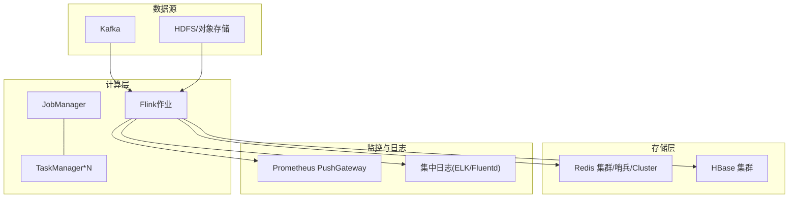
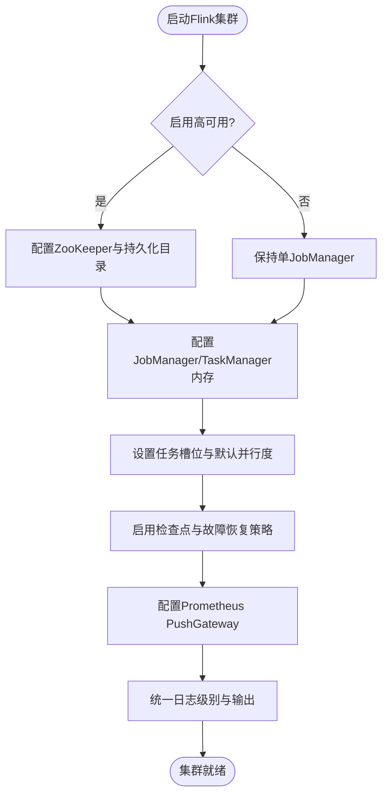
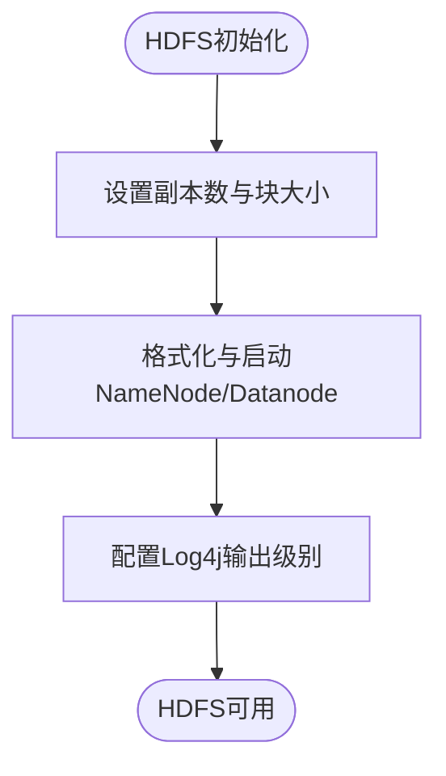
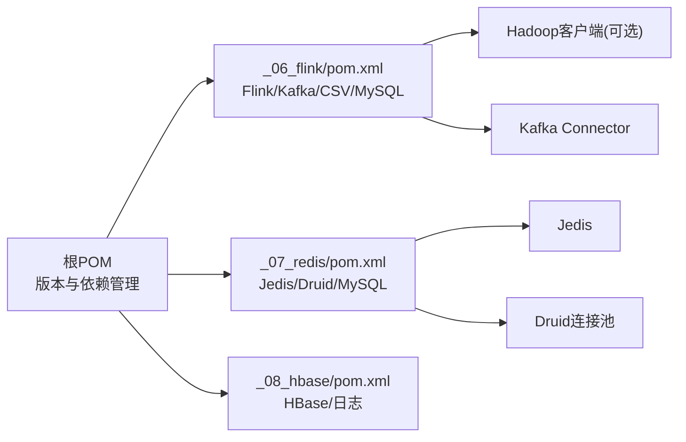

# 生产环境部署

<cite>
**本文引用的文件**
- [pom.xml](file://pom.xml)
- [_02_hadoop\HDFSClient\src\main\resources\hdfs-site.xml](file://_02_hadoop/HDFSClient/src/main/resources/hdfs-site.xml)
- [_02_hadoop\HDFSClient\src\main\resources\log4j.properties](file://_02_hadoop/HDFSClient/src/main/resources/log4j.properties)
- [_06_flink\pom.xml](file://_06_flink/pom.xml)
- [_500_flink-prome2022_demo\src\main\resources\flink-conf.yaml](file://_500_flink-prome2022_demo/src/main/resources/flink-conf.yaml)
- [_07_redis\pom.xml](file://_07_redis/pom.xml)
- [_08_hbase\src\main\resources\log4j.properties](file://_08_hbase/src/main/resources/log4j.properties)
- [_200_flinkRealtime/src/main/resources/hbase-site.xml](file://_200_flinkRealtime/src/main/resources/hbase-site.xml)
- [_04_sparkTest/src/main/resources/log4j.properties](file://_04_sparkTest/src/main/resources/log4j.properties)
- [_250_flinkRealtime_show\src\main\resources\application.properties](file://_250_flinkRealtime_show/src/main/resources/application.properties)
</cite>

## 目录
1. [引言](#引言)
2. [项目结构](#项目结构)
3. [核心组件](#核心组件)
4. [架构总览](#架构总览)
5. [详细组件分析](#详细组件分析)
6. [依赖分析](#依赖分析)
7. [性能考虑](#性能考虑)
8. [故障排查指南](#故障排查指南)
9. [结论](#结论)
10. [附录](#附录)

## 引言
本指南面向生产环境的大数据平台部署，覆盖从单机到分布式集群的完整路径，重点围绕以下组件：Flink 流式计算集群、Hadoop 分布式存储与资源调度、Redis 高可用缓存、HBase 分布式数据库，以及日志与监控集成。文档提供节点规划、网络配置、配置文件模板与参数调优建议，并结合仓库中现有的配置样例，帮助运维团队稳定高效地交付系统。

## 项目结构
该仓库采用多模块聚合工程组织，便于分层管理与复用依赖。根 POM 统一管理版本与通用依赖，各子模块聚焦具体技术栈（如 Hadoop、Flink、Redis、HBase 等）。下图给出与部署相关的关键模块与文件关系：

**图表来源**
- [pom.xml](file://pom.xml#L1-L143)
- [_02_hadoop\HDFSClient\src\main\resources\hdfs-site.xml](file://_02_hadoop/HDFSClient/src/main/resources/hdfs-site.xml#L1-L10)
- [_02_hadoop\HDFSClient\src\main\resources\log4j.properties](file://_02_hadoop/HDFSClient/src/main/resources/log4j.properties#L1-L9)
- [_500_flink-prome2022_demo\src\main\resources\flink-conf.yaml](file://_500_flink-prome2022_demo/src/main/resources/flink-conf.yaml#L1-L269)
- [_08_hbase\src\main\resources\log4j.properties](file://_08_hbase/src/main/resources/log4j.properties#L1-L23)
- [_200_flinkRealtime/src/main/resources/hbase-site.xml](file://_200_flinkRealtime/src/main/resources/hbase-site.xml#L1-L14)
- [_04_sparkTest/src/main/resources/log4j.properties](file://_04_sparkTest/src/main/resources/log4j.properties#L1-L22)
- [_250_flinkRealtime_show\src\main\resources\application.properties](file://_250_flinkRealtime_show/src/main/resources/application.properties#L1-L5)

**章节来源**
- [pom.xml](file://pom.xml#L1-L143)

## 核心组件
- Flink 集群：包含作业管理器与任务管理器内存、槽位、默认并行度、检查点与故障恢复策略等关键参数；可对接 Prometheus 推送网关进行指标采集。
- Hadoop 集群：提供 HDFS 副本策略与日志配置示例；可作为 Flink 检查点与状态后端的持久化存储。
- Redis：提供 Jedis 客户端与连接池依赖，适合构建高吞吐缓存层。
- HBase：提供 Phoenix 命名空间映射与日志配置示例，适合作为实时宽表存储。
- 日志体系：Log4j 配置贯穿 Hadoop、Spark、HBase 示例，便于统一日志级别与输出格式。

**章节来源**
- [_500_flink-prome2022_demo\src\main\resources\flink-conf.yaml](file://_500_flink-prome2022_demo/src/main/resources/flink-conf.yaml#L24-L64)
- [_500_flink-prome2022_demo\src\main\resources\flink-conf.yaml](file://_500_flink-prome2022_demo/src/main/resources/flink-conf.yaml#L109-L136)
- [_02_hadoop\HDFSClient\src\main\resources\hdfs-site.xml](file://_02_hadoop/HDFSClient/src/main/resources/hdfs-site.xml#L1-L10)
- [_07_redis\pom.xml](file://_07_redis/pom.xml#L1-L56)
- [_200_flinkRealtime/src/main/resources/hbase-site.xml](file://_200_flinkRealtime/src/main/resources/hbase-site.xml#L1-L14)
- [_08_hbase\src\main\resources\log4j.properties](file://_08_hbase/src/main/resources/log4j.properties#L1-L23)
- [_04_sparkTest/src/main/resources/log4j.properties](file://_04_sparkTest/src/main/resources/log4j.properties#L1-L22)

## 架构总览
下图展示生产环境典型部署拓扑：Flink 作为计算引擎，消费 Kafka 或文件源，写入 Redis 缓存与 HBase 实时表，同时将指标推送至 Prometheus PushGateway；HDFS 提供检查点与状态后端存储。

[本图为概念性架构示意，不直接映射具体源码文件，故无“图表来源”标注]

## 详细组件分析

### Flink 集群部署与配置
- 集群角色与资源
  - 作业管理器（JobManager）与任务管理器（TaskManager）进程内存、任务槽位数量、默认并行度需按作业规模与数据速率评估配置。
  - 建议在高可用模式下启用 ZooKeeper 并配置持久化目录，确保主备切换与元数据恢复。
- 故障恢复与检查点
  - 启用增量检查点（若后端支持），合理设置检查点间隔与超时，避免频繁阻塞。
  - 失败策略选择“按区域”可减少不必要的重启范围。
- 指标与监控
  - 使用 Prometheus PushGateway Reporter 将指标周期性推送，便于 Grafana 可视化。
- 日志与审计
  - 通过 flink-conf.yaml 设置日志级别与输出，结合外部日志系统实现统一收集。

**图表来源**
- [_500_flink-prome2022_demo\src\main\resources\flink-conf.yaml](file://_500_flink-prome2022_demo/src/main/resources/flink-conf.yaml#L24-L64)
- [_500_flink-prome2022_demo\src\main\resources\flink-conf.yaml](file://_500_flink-prome2022_demo/src/main/resources/flink-conf.yaml#L109-L136)
- [_500_flink-prome2022_demo\src\main\resources\flink-conf.yaml](file://_500_flink-prome2022_demo/src/main/resources/flink-conf.yaml#L258-L269)

**章节来源**
- [_500_flink-prome2022_demo\src\main\resources\flink-conf.yaml](file://_500_flink-prome2022_demo/src/main/resources/flink-conf.yaml#L24-L64)
- [_500_flink-prome2022_demo\src\main\resources\flink-conf.yaml](file://_500_flink-prome2022_demo/src/main/resources/flink-conf.yaml#L109-L136)
- [_500_flink-prome2022_demo\src\main\resources\flink-conf.yaml](file://_500_flink-prome2022_demo/src/main/resources/flink-conf.yaml#L258-L269)

### Hadoop 分布式集群配置
- HDFS 副本策略
  - 副本数应结合磁盘容量、网络带宽与容灾需求设定；仓库示例展示了副本数配置位置。
- 日志配置
  - HDFS 示例使用 Log4j 控制台与文件输出，便于定位问题。
- 作为后端
  - 可将 Flink 的检查点与状态后端指向 HDFS，提升可靠性与跨节点共享能力。

**图表来源**
- [_02_hadoop\HDFSClient\src\main\resources\hdfs-site.xml](file://_02_hadoop/HDFSClient/src/main/resources/hdfs-site.xml#L1-L10)
- [_02_hadoop\HDFSClient\src\main\resources\log4j.properties](file://_02_hadoop/HDFSClient/src/main/resources/log4j.properties#L1-L9)

**章节来源**
- [_02_hadoop\HDFSClient\src\main\resources\hdfs-site.xml](file://_02_hadoop/HDFSClient/src/main/resources/hdfs-site.xml#L1-L10)
- [_02_hadoop\HDFSClient\src\main\resources\log4j.properties](file://_02_hadoop/HDFSClient/src/main/resources/log4j.properties#L1-L9)

### Redis 高可用部署
- 客户端与连接池
  - 依赖 Jedis 与 Apache Commons Pool2，建议在生产中开启池化连接、设置合理的最大连接数与空闲连接阈值，避免连接抖动。
- 高可用形态
  - 支持单实例、Sentinel 哨兵与 Cluster 集群三种形态，按读写压力与可用性要求选择。
- 参数调优
  - 连接超时、命令超时、重试策略与序列化方式需结合业务延迟目标与吞吐需求优化。

**章节来源**
- [_07_redis\pom.xml](file://_07_redis/pom.xml#L1-L56)

### HBase 集群部署
- Phoenix 映射
  - 示例启用了命名空间映射与系统表命名空间映射，便于与 Phoenix SQL 无缝对接。
- 日志配置
  - 示例使用 Log4j 控制台输出，建议在生产中调整为文件输出并配合集中日志系统。
- 与 Flink 集成
  - 可通过 Flink CDC 或 JDBC 连接器将实时数据写入 HBase，支撑 OLAP/OLTP 场景。

**章节来源**
- [_200_flinkRealtime/src/main/resources/hbase-site.xml](file://_200_flinkRealtime/src/main/resources/hbase-site.xml#L1-L14)
- [_08_hbase\src\main\resources\log4j.properties](file://_08_hbase/src/main/resources/log4j.properties#L1-L23)

### 日志与监控配置
- Log4j 统一级别
  - Hadoop、Spark、HBase 示例均提供 Log4j 配置，建议在生产中将 root 级别设为 WARN/INFO，并对第三方组件静音，降低噪声。
- 应用属性示例
  - 示例应用属性包含服务端口与数据源 URL，便于快速验证连接链路。

**章节来源**
- [_04_sparkTest/src/main/resources/log4j.properties](file://_04_sparkTest/src/main/resources/log4j.properties#L1-L22)
- [_08_hbase\src\main\resources\log4j.properties](file://_08_hbase/src/main/resources/log4j.properties#L1-L23)
- [_250_flinkRealtime_show\src\main\resources\application.properties](file://_250_flinkRealtime_show/src/main/resources/application.properties#L1-L5)

## 依赖分析
- 版本与依赖管理
  - 根 POM 统一管理各组件版本（如 Flink、Hadoop、Spark、Redis、Elasticsearch 等），并在子模块中按需引入。
  - Flink 模块引入 Kafka 连接器、CSV 工具、MySQL 驱动与打包插件，便于本地与生产打包。
- 组件耦合
  - Flink 与 Hadoop：当检查点或状态后端位于 HDFS 时，需引入 Hadoop 客户端依赖。
  - Redis：Jedis 与 Druid 连接池用于高并发访问。
  - HBase：Phoenix 相关配置与日志依赖。

**图表来源**
- [pom.xml](file://pom.xml#L52-L113)
- [_06_flink\pom.xml](file://_06_flink/pom.xml#L22-L138)
- [_07_redis\pom.xml](file://_07_redis/pom.xml#L1-L56)

**章节来源**
- [pom.xml](file://pom.xml#L52-L113)
- [_06_flink\pom.xml](file://_06_flink/pom.xml#L22-L138)
- [_07_redis\pom.xml](file://_07_redis/pom.xml#L1-L56)

## 性能考虑
- 内存与槽位
  - 依据任务峰值内存与 CPU 核数，合理设置 TaskManager 进程内存与任务槽位，避免 OOM 与资源争抢。
- 检查点与背压
  - 合理的检查点间隔与增量检查点可降低对吞吐的影响；关注背压指标，优化 Source/算子并行度。
- 网络与 IO
  - 调整网络堆大小与 I/O 线程目录，满足高吞吐场景下的缓冲区与磁盘 IO 需求。
- 缓存与存储
  - Redis 连接池参数与 HBase 写入批大小需结合延迟目标与 QPS 进行压测校准。
- 日志开销
  - 生产环境建议降低日志级别与输出频率，避免 I/O 抖动影响计算。

[本节为通用指导，无需“章节来源”]

## 故障排查指南
- Flink
  - 检查 JobManager/TaskManager 内存是否充足，确认高可用配置与持久化目录可达。
  - 关注检查点失败与故障恢复策略，必要时降低并行度或扩大槽位。
- Hadoop
  - 校验 HDFS 副本数与磁盘空间，查看 NameNode/Datanode 日志定位异常。
- Redis
  - 观察连接池耗尽与超时，逐步增大最大连接数与空闲阈值，排查慢查询。
- HBase
  - 关注 RegionServer 压力与 WAL 写入，结合 Phoenix 查询计划优化热点写入。
- 日志
  - 统一调整 Log4j 级别，启用文件输出并接入集中日志系统，便于回溯。

**章节来源**
- [_500_flink-prome2022_demo\src\main\resources\flink-conf.yaml](file://_500_flink-prome2022_demo/src/main/resources/flink-conf.yaml#L24-L64)
- [_02_hadoop\HDFSClient\src\main\resources\log4j.properties](file://_02_hadoop/HDFSClient/src/main/resources/log4j.properties#L1-L9)
- [_08_hbase\src\main\resources\log4j.properties](file://_08_hbase/src/main/resources/log4j.properties#L1-L23)
- [_04_sparkTest/src/main/resources/log4j.properties](file://_04_sparkTest/src/main/resources/log4j.properties#L1-L22)

## 结论
通过根 POM 的统一版本管理与各子模块的配置样例，本仓库为生产环境部署提供了清晰的参考路径。建议以 Flink 为核心计算引擎，结合 HDFS、Redis、HBase 形成“计算-存储-缓存”的一体化架构，并配套完善的日志与监控体系，持续优化内存、并行度与 IO 参数，确保系统在高负载下稳定高效运行。

[本节为总结性内容，无需“章节来源”]

## 附录

### 配置文件模板与参数调优要点
- Flink flink-conf.yaml
  - 关键项：作业管理器/任务管理器进程内存、任务槽位、默认并行度、检查点后端与目录、故障恢复策略、Prometheus PushGateway。
  - 参考路径：[_500_flink-prome2022_demo\src\main\resources\flink-conf.yaml](file://_500_flink-prome2022_demo/src/main/resources/flink-conf.yaml#L24-L64)
- Hadoop hdfs-site.xml
  - 关键项：副本数、块大小等。
  - 参考路径：[_02_hadoop\HDFSClient\src\main\resources\hdfs-site.xml](file://_02_hadoop/HDFSClient/src/main/resources/hdfs-site.xml#L1-L10)
- HBase hbase-site.xml
  - 关键项：Phoenix 命名空间映射、系统表命名空间映射。
  - 参考路径：[_200_flinkRealtime/src/main/resources/hbase-site.xml](file://_200_flinkRealtime/src/main/resources/hbase-site.xml#L1-L14)
- 日志配置
  - HDFS/Spark/HBase 示例均提供 Log4j 配置，建议在生产中统一级别与输出。
  - 参考路径：
    - [_02_hadoop\HDFSClient\src\main\resources\log4j.properties](file://_02_hadoop/HDFSClient/src/main/resources/log4j.properties#L1-L9)
    - [_04_sparkTest/src/main/resources/log4j.properties](file://_04_sparkTest/src/main/resources/log4j.properties#L1-L22)
    - [_08_hbase\src\main\resources\log4j.properties](file://_08_hbase/src/main/resources/log4j.properties#L1-L23)
- 应用属性示例
  - 服务端口与数据源 URL。
  - 参考路径：[_250_flinkRealtime_show\src\main\resources\application.properties](file://_250_flinkRealtime_show/src/main/resources/application.properties#L1-L5)

**章节来源**
- [_500_flink-prome2022_demo\src\main\resources\flink-conf.yaml](file://_500_flink-prome2022_demo/src/main/resources/flink-conf.yaml#L24-L64)
- [_02_hadoop\HDFSClient\src\main\resources\hdfs-site.xml](file://_02_hadoop/HDFSClient/src/main/resources/hdfs-site.xml#L1-L10)
- [_200_flinkRealtime/src/main/resources/hbase-site.xml](file://_200_flinkRealtime/src/main/resources/hbase-site.xml#L1-L14)
- [_02_hadoop\HDFSClient\src\main\resources\log4j.properties](file://_02_hadoop/HDFSClient/src/main/resources/log4j.properties#L1-L9)
- [_04_sparkTest/src/main/resources/log4j.properties](file://_04_sparkTest/src/main/resources/log4j.properties#L1-L22)
- [_08_hbase\src\main\resources\log4j.properties](file://_08_hbase/src/main/resources/log4j.properties#L1-L23)
- [_250_flinkRealtime_show\src\main\resources\application.properties](file://_250_flinkRealtime_show/src/main/resources/application.properties#L1-L5)