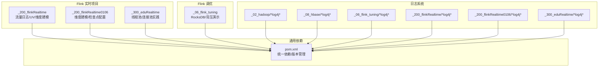
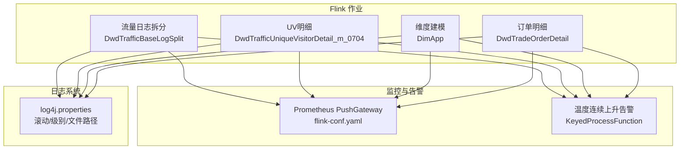
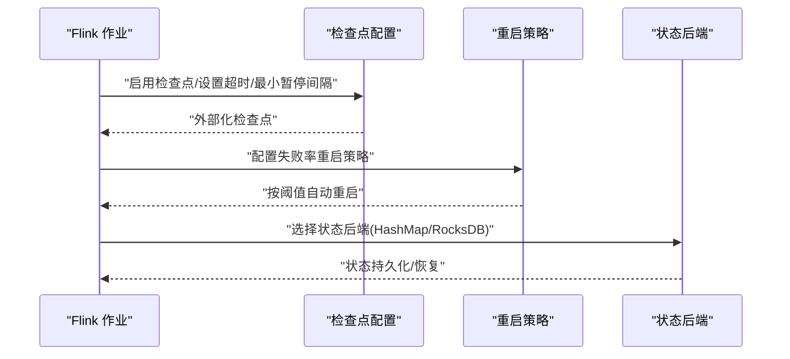
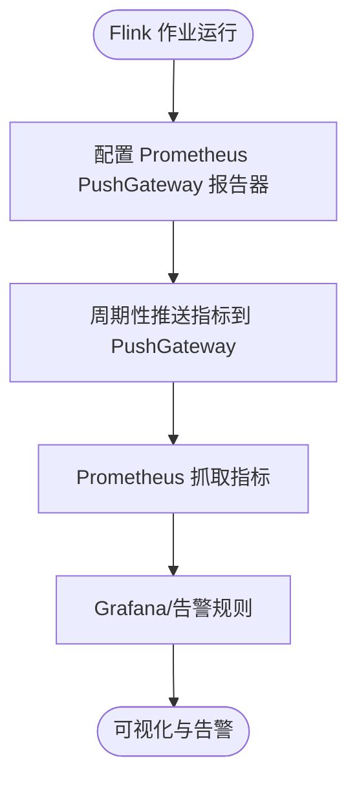
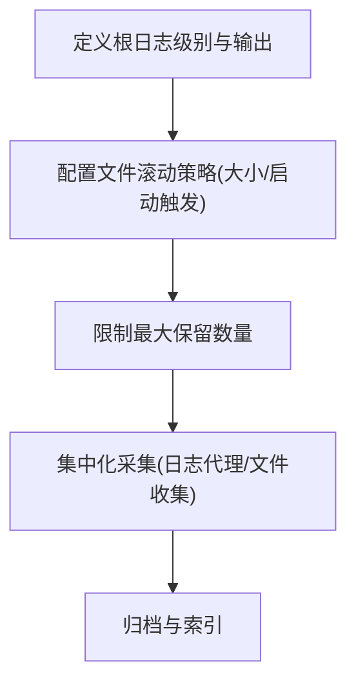
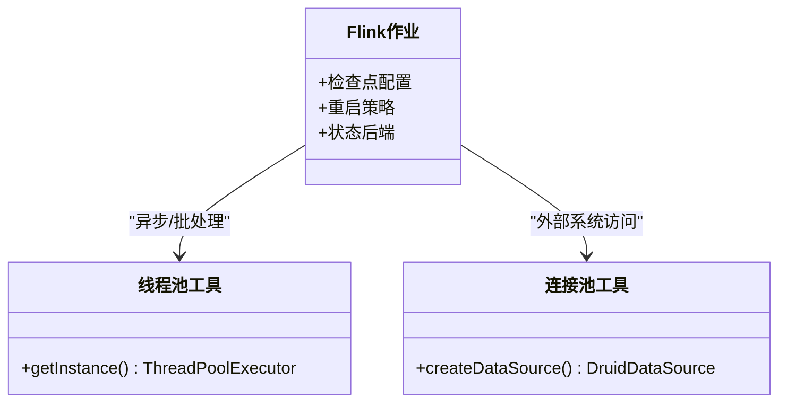
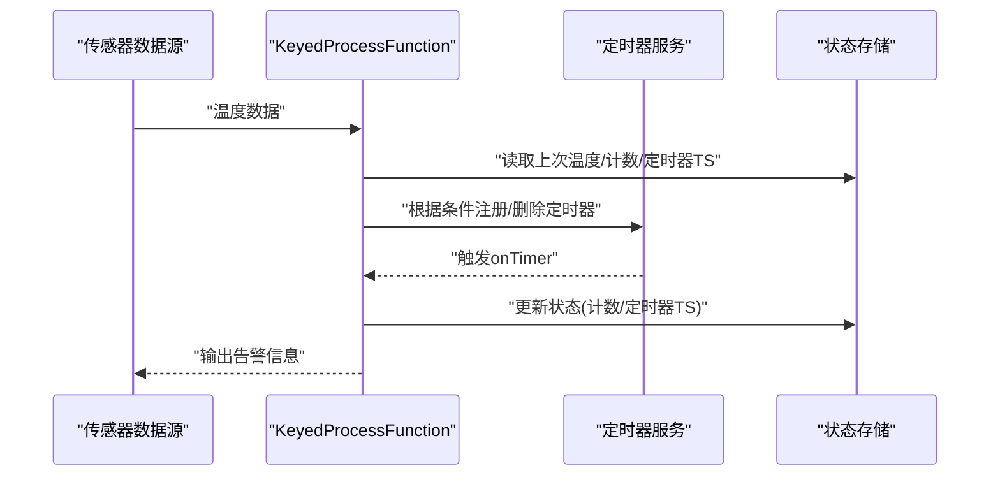
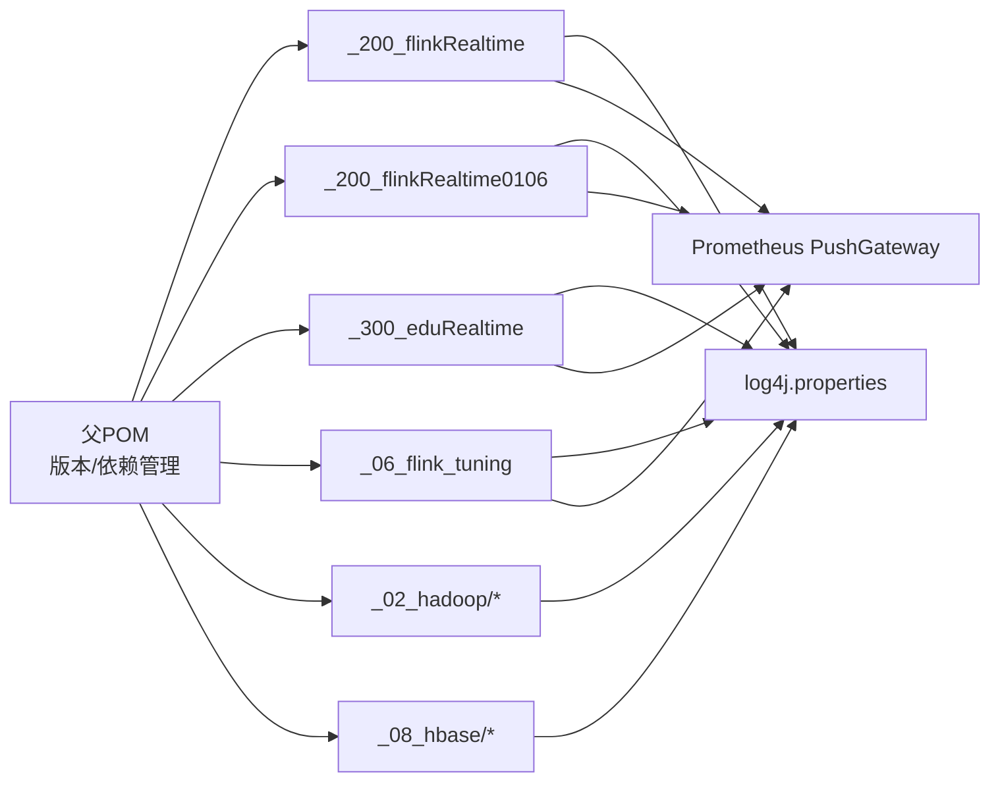

# 监控运维

<cite>
**本文引用的文件**
- [pom.xml](file://pom.xml)
- [flink-conf.yaml](file://_500_flink-prome2022_demo/src/main/resources/flink-conf.yaml)
- [log4j.properties](file://_500_flink-prome2022_demo/src/main/resources/log4j.properties)
- [DwdTrafficBaseLogSplit.java](file://_200_flinkRealtime/src/main/java/com/atguigu/gmall/realtime/app/dwd/log/DwdTrafficBaseLogSplit.java)
- [DwdTrafficUniqueVisitorDetail_m_0704.java](file://_200_flinkRealtime/src/main/java/com/atguigu/gmall/realtime/app/dwd/log/DwdTrafficUniqueVisitorDetail_m_0704.java)
- [DimApp.java](file://_200_flinkRealtime0106/src/main/java/com/atguigu/gmall/realtime/app/dim/DimApp.java)
- [DwdTradeOrderDetail.java](file://_200_flinkRealtime/src/main/java/com/atguigu/gmall/realtime/app/dwd/db/DwdTradeOrderDetail.java)
- [_06_flink_tuning_RocksdbTuning.java](file://_06_flink_tuning/src/main/java/com/atguigu/flink/tuning/RocksdbTuning.java)
- [_06_flink_tuning_BackpressureDemo.java](file://_06_flink_tuning/src/main/java/com/atguigu/flink/tuning/BackpressureDemo.java)
- [_08_richFunction_TempAlert.java](file://_06_flink/src/main/java/_08_richFunction/_10_Temperature_my_BOSS.java)
- [_08_richFunction_TempAlert_teacher.java](file://_06_flink/src/main/java/_08_richFunction/_10_Temperature_teacher.java)
- [DruidDSUtil_m.java](file://_200_flinkRealtime/src/main/java/com/atguigu/gmall/realtime/util/DruidDSUtil_m.java)
- [DruidDSUtil.java](file://_200_flinkRealtime/src/main/java/com/atguigu/gmall/realtime/util/DruidDSUtil.java)
- [MyDruidDSUtil.java](file://_300_eduRealtime/src/main/java/com/atguigu/gmall/realtime/util/MyDruidDSUtil.java)
- [ThreadPoolUtil_m_0716.java](file://_200_flinkRealtime/src/main/java/com/atguigu/gmall/realtime/util/ThreadPoolUtil_m_0716.java)
- [ThreadPoolUtil.java](file://_200_flinkRealtime/src/main/java/com/atguigu/gmall/realtime/util/ThreadPoolUtil.java)
- [MyThreadPoolUtil.java](file://_300_eduRealtime/src/main/java/com/atguigu/gmall/realtime/util/MyThreadPoolUtil.java)
- [ThreadPoolUtil.java (0106)](file://_200_flinkRealtime0106/src/main/java/com/atguigu/gmall/realtime/util/ThreadPoolUtil.java)
- [log4j.properties (HDFSClient)](file://_02_hadoop/HDFSClient/src/main/resources/log4j.properties)
- [log4j.properties (Hadoop)](file://_02_hadoop/src/main/resources/log4j.properties)
- [log4j.properties (MapReduceDemo)](file://_02_hadoop/MapReduceDemo/src/main/resources/log4j.properties)
- [log4j.properties (HBase)](file://_08_hbase/src/main/resources/log4j.properties)
- [log4j.properties (Flink调优)](file://_06_flink_tuning/src/main/resources/log4j.properties)
- [log4j.properties (Flink实时项目)](file://_200_flinkRealtime/src/main/resources/log4j.properties)
- [log4j.properties (Flink实时项目0106)](file://_200_flinkRealtime0106/src/main/resources/log4j.properties)
- [log4j.properties (edu实时项目)](file://_300_eduRealtime/src/main/resources/log4j.properties)
</cite>

## 目录
1. [引言](#引言)
2. [项目结构](#项目结构)
3. [核心组件](#核心组件)
4. [架构总览](#架构总览)
5. [详细组件分析](#详细组件分析)
6. [依赖关系分析](#依赖关系分析)
7. [性能考量](#性能考量)
8. [故障排查指南](#故障排查指南)
9. [结论](#结论)
10. [附录](#附录)

## 引言
本文件面向大数据平台运维工程师，围绕监控体系、日志系统、性能监控与分析、告警机制、运维自动化等方面，结合仓库中的 Flink 作业、日志配置与连接池/线程池实践，提供一套可落地的监控运维实践指南，帮助提升系统的可观测性与可维护性。

## 项目结构
该仓库为多模块 Maven 工程，涵盖 Java 基础、Hadoop 生态、Spark、Flink 及周边组件。与监控运维密切相关的模块主要集中在：
- Flink 实时项目：包含流量日志拆分、UV 统计、维度建模等作业，体现作业生命周期、检查点与重启策略等运维关键点。
- Flink 调优与压测：包含 RocksDB 状态后端、背压演示等，体现状态与性能监控实践。
- 日志系统：多处 log4j/logback 配置，体现日志级别、滚动策略与集中化采集思路。
- 连接池与线程池：Druid 连接池与自定义线程池工具，体现数据库与外部系统健康检查与资源治理。

图表来源
- [pom.xml](file://pom.xml#L1-L143)
- [DwdTrafficUniqueVisitorDetail_m_0704.java](file://_200_flinkRealtime/src/main/java/com/atguigu/gmall/realtime/app/dwd/log/DwdTrafficUniqueVisitorDetail_m_0704.java#L24-L51)
- [DimApp.java](file://_200_flinkRealtime0106/src/main/java/com/atguigu/gmall/realtime/app/dim/DimApp.java#L105-L134)
- [log4j.properties (HDFSClient)](file://_02_hadoop/HDFSClient/src/main/resources/log4j.properties#L1-L8)
- [log4j.properties (HBase)](file://_08_hbase/src/main/resources/log4j.properties#L1-L45)

章节来源
- [pom.xml](file://pom.xml#L1-L143)

## 核心组件
- Flink 作业监控
  - 检查点与重启策略：通过启用检查点、设置超时与最小暂停间隔、外部化检查点、失败率重启策略等，保障作业稳定性与可恢复性。
  - Prometheus 集成：配置 PushGateway 报告器，将 Flink 指标推送至 Prometheus，便于统一监控与告警。
- 日志系统
  - 多模块 log4j/logback 配置，统一根日志级别、滚动策略与文件路径，支持集中化采集与归档。
- 性能监控与分析
  - 状态后端与 RocksDB：通过状态后端与 RocksDB 优化，降低内存压力、提升状态持久化性能。
  - 背压检测：通过刻意构造背压场景，验证背压检测与定位能力。
  - JVM/GC/线程池/连接池：结合线程池与连接池工具，评估任务并发与外部依赖健康度。
- 告警机制
  - 温度连续上升告警：基于 KeyedProcessFunction 的定时器与状态，实现连续条件触发与去抖动。
- 运维自动化
  - 健康检查与自动重启：通过检查点与重启策略，实现故障自动恢复；结合日志滚动与归档，支撑离线巡检。

章节来源
- [DwdTrafficUniqueVisitorDetail_m_0704.java](file://_200_flinkRealtime/src/main/java/com/atguigu/gmall/realtime/app/dwd/log/DwdTrafficUniqueVisitorDetail_m_0704.java#L24-L51)
- [DimApp.java](file://_200_flinkRealtime0106/src/main/java/com/atguigu/gmall/realtime/app/dim/DimApp.java#L105-L134)
- [flink-conf.yaml](file://_500_flink-prome2022_demo/src/main/resources/flink-conf.yaml#L258-L268)
- [_06_flink_tuning_RocksdbTuning.java](file://_06_flink_tuning/src/main/java/com/atguigu/flink/tuning/RocksdbTuning.java#L1-L76)
- [_06_flink_tuning_BackpressureDemo.java](file://_06_flink_tuning/src/main/java/com/atguigu/flink/tuning/BackpressureDemo.java#L1-L66)
- [_08_richFunction_TempAlert.java](file://_06_flink/src/main/java/_08_richFunction/_10_Temperature_my_BOSS.java#L30-L124)
- [_08_richFunction_TempAlert_teacher.java](file://_06_flink/src/main/java/_08_richFunction/_10_Temperature_teacher.java#L34-L94)

## 架构总览
下图展示了 Flink 作业、日志系统与监控集成的整体关系，以及关键运维要素（检查点、重启策略、Prometheus PushGateway、日志滚动）如何协同工作。

图表来源
- [DwdTrafficBaseLogSplit.java](file://_200_flinkRealtime/src/main/java/com/atguigu/gmall/realtime/app/dwd/log/DwdTrafficBaseLogSplit.java#L171-L191)
- [DwdTrafficUniqueVisitorDetail_m_0704.java](file://_200_flinkRealtime/src/main/java/com/atguigu/gmall/realtime/app/dwd/log/DwdTrafficUniqueVisitorDetail_m_0704.java#L24-L51)
- [DimApp.java](file://_200_flinkRealtime0106/src/main/java/com/atguigu/gmall/realtime/app/dim/DimApp.java#L105-L134)
- [DwdTradeOrderDetail.java](file://_200_flinkRealtime/src/main/java/com/atguigu/gmall/realtime/app/dwd/db/DwdTradeOrderDetail.java#L25-L51)
- [flink-conf.yaml](file://_500_flink-prome2022_demo/src/main/resources/flink-conf.yaml#L258-L268)
- [log4j.properties](file://_500_flink-prome2022_demo/src/main/resources/log4j.properties#L1-L45)

## 详细组件分析

### Flink 作业监控与恢复
- 检查点配置要点
  - 启用检查点、设置超时与最小暂停间隔，避免频繁检查点导致吞吐下降。
  - 外部化检查点，便于取消或升级时保留状态。
- 重启策略
  - 使用失败率重启策略，限定单位时间内最大重启次数，防止雪崩。
- 状态后端
  - 结合 HashMap 与 RocksDB，平衡内存占用与 IO 性能。

图表来源
- [DwdTrafficUniqueVisitorDetail_m_0704.java](file://_200_flinkRealtime/src/main/java/com/atguigu/gmall/realtime/app/dwd/log/DwdTrafficUniqueVisitorDetail_m_0704.java#L24-L51)
- [DimApp.java](file://_200_flinkRealtime0106/src/main/java/com/atguigu/gmall/realtime/app/dim/DimApp.java#L105-L134)
- [_06_flink_tuning_RocksdbTuning.java](file://_06_flink_tuning/src/main/java/com/atguigu/flink/tuning/RocksdbTuning.java#L1-L76)

章节来源
- [DwdTrafficUniqueVisitorDetail_m_0704.java](file://_200_flinkRealtime/src/main/java/com/atguigu/gmall/realtime/app/dwd/log/DwdTrafficUniqueVisitorDetail_m_0704.java#L24-L51)
- [DimApp.java](file://_200_flinkRealtime0106/src/main/java/com/atguigu/gmall/realtime/app/dim/DimApp.java#L105-L134)
- [_06_flink_tuning_RocksdbTuning.java](file://_06_flink_tuning/src/main/java/com/atguigu/flink/tuning/RocksdbTuning.java#L1-L76)

### Prometheus 指标采集
- 通过配置 PushGateway 报告器，将 Flink 指标周期性推送至 Prometheus，便于统一展示与告警。

图表来源
- [flink-conf.yaml](file://_500_flink-prome2022_demo/src/main/resources/flink-conf.yaml#L258-L268)

章节来源
- [flink-conf.yaml](file://_500_flink-prome2022_demo/src/main/resources/flink-conf.yaml#L258-L268)

### 日志系统配置与管理
- 日志级别与输出
  - 根日志级别、控制台输出格式与文件滚动策略，确保生产环境可观测且可控。
- 滚动策略
  - 基于大小的滚动与启动时触发策略，限制最大保留数量，避免磁盘膨胀。
- 多模块一致性
  - Hadoop、HBase、Flink 实时项目等均提供 log4j 配置，建议统一规范并集中化采集。

图表来源
- [log4j.properties](file://_500_flink-prome2022_demo/src/main/resources/log4j.properties#L1-L45)
- [log4j.properties (HDFSClient)](file://_02_hadoop/HDFSClient/src/main/resources/log4j.properties#L1-L8)
- [log4j.properties (Hadoop)](file://_02_hadoop/src/main/resources/log4j.properties#L1-L8)
- [log4j.properties (MapReduceDemo)](file://_02_hadoop/MapReduceDemo/src/main/resources/log4j.properties#L1-L8)
- [log4j.properties (HBase)](file://_08_hbase/src/main/resources/log4j.properties#L1-L45)
- [log4j.properties (Flink调优)](file://_06_flink_tuning/src/main/resources/log4j.properties#L1-L5)
- [log4j.properties (Flink实时项目)](file://_200_flinkRealtime/src/main/resources/log4j.properties#L1-L6)
- [log4j.properties (Flink实时项目0106)](file://_200_flinkRealtime0106/src/main/resources/log4j.properties#L1-L6)
- [log4j.properties (edu实时项目)](file://_300_eduRealtime/src/main/resources/log4j.properties#L1-L6)

章节来源
- [log4j.properties](file://_500_flink-prome2022_demo/src/main/resources/log4j.properties#L1-L45)
- [log4j.properties (HDFSClient)](file://_02_hadoop/HDFSClient/src/main/resources/log4j.properties#L1-L8)
- [log4j.properties (HBase)](file://_08_hbase/src/main/resources/log4j.properties#L1-L45)

### 性能监控与分析
- 状态后端与 RocksDB
  - 通过状态后端与预定义选项，优化状态存储与 IO，降低内存峰值与 GC 压力。
- 背压检测
  - 通过构造 CPU 密集计算，模拟背压，验证背压检测与定位流程。
- JVM/GC/线程池/连接池
  - 结合线程池与连接池工具，评估并发与外部依赖健康度，辅助容量规划与性能优化。

图表来源
- [ThreadPoolUtil_m_0716.java](file://_200_flinkRealtime/src/main/java/com/atguigu/gmall/realtime/util/ThreadPoolUtil_m_0716.java#L1-L40)
- [ThreadPoolUtil.java](file://_200_flinkRealtime/src/main/java/com/atguigu/gmall/realtime/util/ThreadPoolUtil.java#L1-L30)
- [MyThreadPoolUtil.java](file://_300_eduRealtime/src/main/java/com/atguigu/gmall/realtime/util/MyThreadPoolUtil.java#L1-L30)
- [ThreadPoolUtil.java (0106)](file://_200_flinkRealtime0106/src/main/java/com/atguigu/gmall/realtime/util/ThreadPoolUtil.java#L1-L30)
- [DruidDSUtil_m.java](file://_200_flinkRealtime/src/main/java/com/atguigu/gmall/realtime/util/DruidDSUtil_m.java#L1-L30)
- [DruidDSUtil.java](file://_200_flinkRealtime/src/main/java/com/atguigu/gmall/realtime/util/DruidDSUtil.java#L1-L30)
- [MyDruidDSUtil.java](file://_300_eduRealtime/src/main/java/com/atguigu/gmall/realtime/util/MyDruidDSUtil.java#L1-L30)
- [_06_flink_tuning_RocksdbTuning.java](file://_06_flink_tuning/src/main/java/com/atguigu/flink/tuning/RocksdbTuning.java#L1-L76)

章节来源
- [_06_flink_tuning_RocksdbTuning.java](file://_06_flink_tuning/src/main/java/com/atguigu/flink/tuning/RocksdbTuning.java#L1-L76)
- [_06_flink_tuning_BackpressureDemo.java](file://_06_flink_tuning/src/main/java/com/atguigu/flink/tuning/BackpressureDemo.java#L1-L66)
- [ThreadPoolUtil_m_0716.java](file://_200_flinkRealtime/src/main/java/com/atguigu/gmall/realtime/util/ThreadPoolUtil_m_0716.java#L1-L40)
- [DruidDSUtil_m.java](file://_200_flinkRealtime/src/main/java/com/atguigu/gmall/realtime/util/DruidDSUtil_m.java#L1-L30)

### 告警机制配置与管理
- 温度连续上升告警
  - 基于 KeyedProcessFunction 的状态与定时器，实现连续条件触发与冷却期去抖动，避免重复告警。
- 规则建议
  - 设定连续次数阈值、冷却时间窗口、告警收敛策略，并与 Prometheus/Grafana/告警规则联动。

图表来源
- [_08_richFunction_TempAlert.java](file://_06_flink/src/main/java/_08_richFunction/_10_Temperature_my_BOSS.java#L30-L124)
- [_08_richFunction_TempAlert_teacher.java](file://_06_flink/src/main/java/_08_richFunction/_10_Temperature_teacher.java#L34-L94)

章节来源
- [_08_richFunction_TempAlert.java](file://_06_flink/src/main/java/_08_richFunction/_10_Temperature_my_BOSS.java#L30-L124)
- [_08_richFunction_TempAlert_teacher.java](file://_06_flink/src/main/java/_08_richFunction/_10_Temperature_teacher.java#L34-L94)

### 运维自动化与脚本
- 健康检查
  - 通过检查点与重启策略，实现故障自动恢复；结合日志滚动与归档，支撑离线巡检。
- 自动重启机制
  - 失败率重启策略与外部化检查点，确保作业在异常后尽快恢复。
- 备份与恢复
  - 外部化检查点目录与状态后端配置，便于升级、回滚与灾难恢复。

章节来源
- [DwdTrafficUniqueVisitorDetail_m_0704.java](file://_200_flinkRealtime/src/main/java/com/atguigu/gmall/realtime/app/dwd/log/DwdTrafficUniqueVisitorDetail_m_0704.java#L24-L51)
- [DimApp.java](file://_200_flinkRealtime0106/src/main/java/com/atguigu/gmall/realtime/app/dim/DimApp.java#L105-L134)
- [_06_flink_tuning_RocksdbTuning.java](file://_06_flink_tuning/src/main/java/com/atguigu/flink/tuning/RocksdbTuning.java#L1-L76)

## 依赖关系分析
- 版本与依赖管理
  - 通过 Maven 父 POM 统一管理依赖版本，确保各模块间兼容性与一致性。
- 日志与监控
  - 多模块共享日志配置，Prometheus PushGateway 报告器作为统一指标出口。

图表来源
- [pom.xml](file://pom.xml#L1-L143)
- [log4j.properties](file://_500_flink-prome2022_demo/src/main/resources/log4j.properties#L1-L45)
- [flink-conf.yaml](file://_500_flink-prome2022_demo/src/main/resources/flink-conf.yaml#L258-L268)

章节来源
- [pom.xml](file://pom.xml#L1-L143)

## 性能考量
- 状态与 IO
  - 使用 RocksDB 状态后端优化大状态场景，降低内存峰值与 GC 压力。
- 背压检测
  - 通过刻意构造背压场景，验证背压检测与定位流程，指导算子链路优化。
- 并发与资源
  - 线程池与连接池工具用于评估并发与外部依赖健康度，辅助容量规划与性能优化。

章节来源
- [_06_flink_tuning_RocksdbTuning.java](file://_06_flink_tuning/src/main/java/com/atguigu/flink/tuning/RocksdbTuning.java#L1-L76)
- [_06_flink_tuning_BackpressureDemo.java](file://_06_flink_tuning/src/main/java/com/atguigu/flink/tuning/BackpressureDemo.java#L1-L66)
- [ThreadPoolUtil_m_0716.java](file://_200_flinkRealtime/src/main/java/com/atguigu/gmall/realtime/util/ThreadPoolUtil_m_0716.java#L1-L40)
- [DruidDSUtil_m.java](file://_200_flinkRealtime/src/main/java/com/atguigu/gmall/realtime/util/DruidDSUtil_m.java#L1-L30)

## 故障排查指南
- 检查点与重启
  - 检查检查点超时、最小暂停间隔与外部化配置；确认失败率重启策略是否生效。
- 日志与滚动
  - 核对日志级别、滚动策略与文件路径；确保集中化采集正常。
- 告警与状态
  - 检查 KeyedProcessFunction 的状态与定时器，确认告警触发逻辑与冷却期设置。
- 背压与性能
  - 使用背压演示验证背压检测流程；结合状态后端与算子链路优化。

章节来源
- [DwdTrafficUniqueVisitorDetail_m_0704.java](file://_200_flinkRealtime/src/main/java/com/atguigu/gmall/realtime/app/dwd/log/DwdTrafficUniqueVisitorDetail_m_0704.java#L24-L51)
- [log4j.properties](file://_500_flink-prome2022_demo/src/main/resources/log4j.properties#L1-L45)
- [_08_richFunction_TempAlert.java](file://_06_flink/src/main/java/_08_richFunction/_10_Temperature_my_BOSS.java#L30-L124)
- [_06_flink_tuning_BackpressureDemo.java](file://_06_flink_tuning/src/main/java/com/atguigu/flink/tuning/BackpressureDemo.java#L1-L66)

## 结论
通过统一的日志与监控配置、完善的检查点与重启策略、Prometheus 指标采集、告警规则与自动化恢复机制，以及状态后端与性能优化手段，可以有效提升大数据系统的可观测性与可维护性。建议在生产环境中持续完善告警收敛、容量规划与变更演练，确保系统稳定高效运行。

## 附录
- 关键配置清单
  - Flink 指标推送：PushGateway 报告器配置。
  - 日志滚动：大小触发、启动触发与最大保留数量。
  - 检查点：超时、最小暂停间隔、外部化清理策略。
  - 重启策略：失败率重启阈值与时长。
- 建议的运维流程
  - 周期性巡检：检查点状态、日志滚动、指标趋势、告警收敛。
  - 变更演练：在测试环境验证检查点与重启策略、状态后端切换与性能影响。
  - 应急预案：快速回滚、外部化检查点恢复、日志与指标采集恢复。