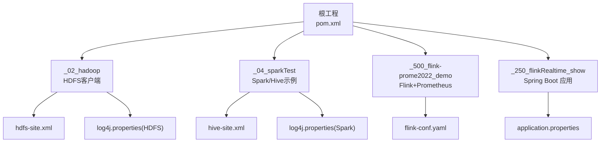
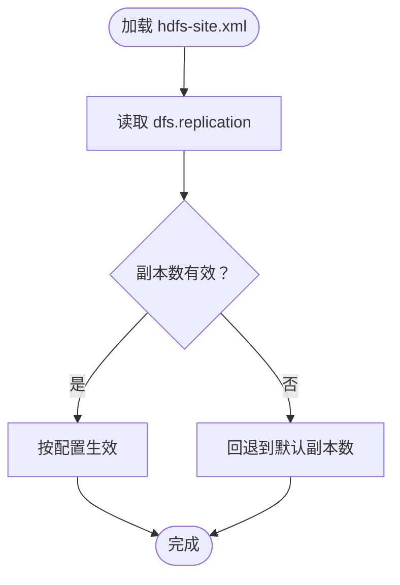
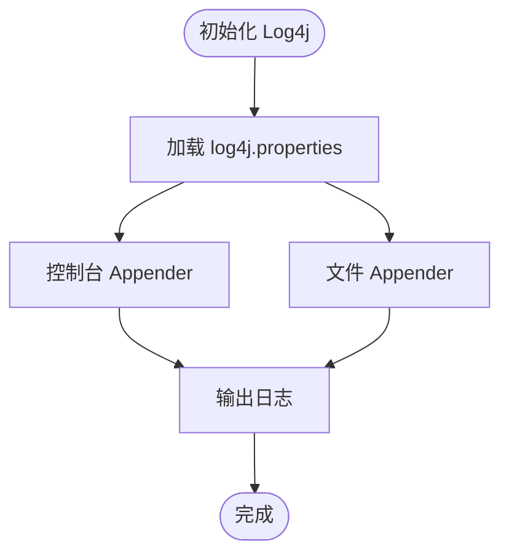
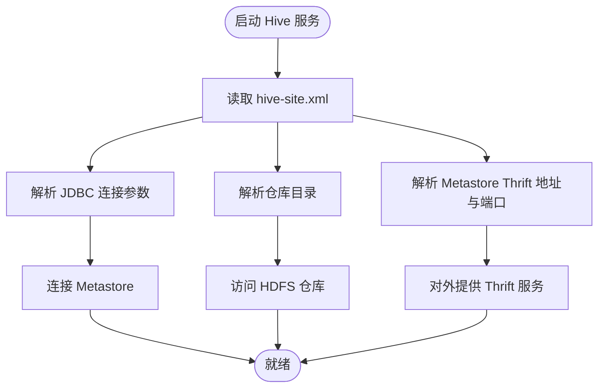
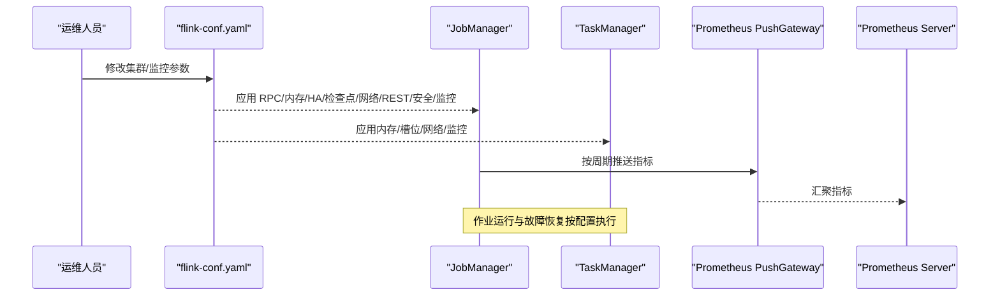
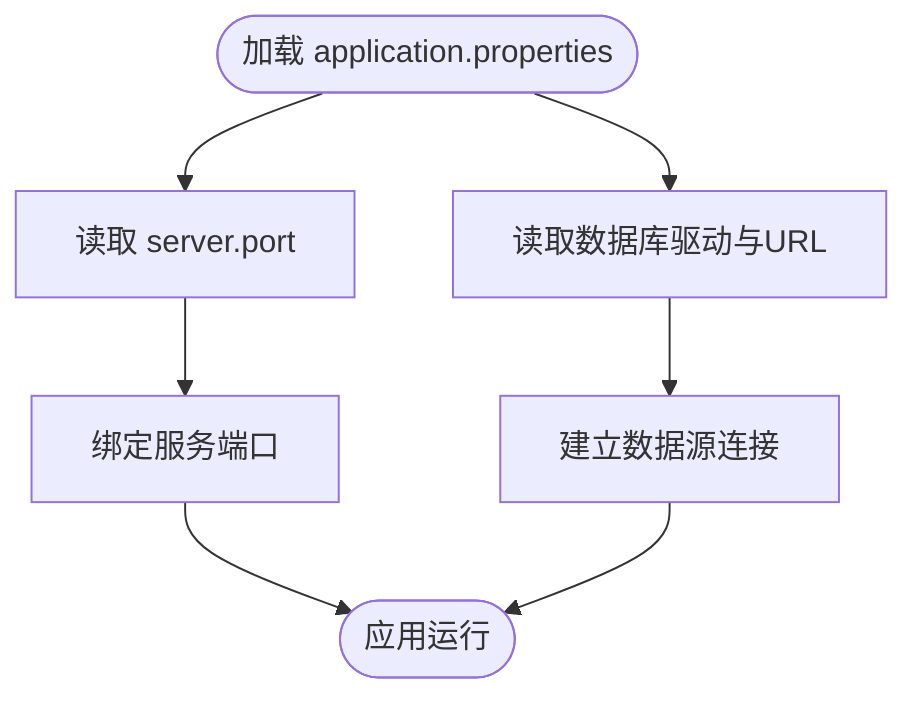
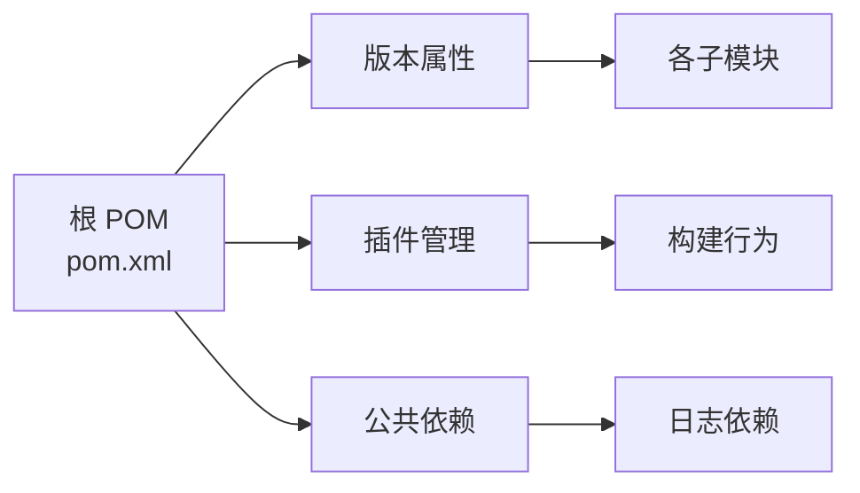

# 部署与运维

<cite>
**本文引用的文件**
- [pom.xml](file://pom.xml)
- [hdfs-site.xml](file://_02_hadoop/HDFSClient/src/main/resources/hdfs-site.xml)
- [log4j.properties (HDFSClient)](file://_02_hadoop/HDFSClient/src/main/resources/log4j.properties)
- [log4j.properties (SparkTest)](file://_04_sparkTest/src/main/resources/log4j.properties)
- [hive-site.xml](file://_04_sparkTest/src/main/resources/hive-site.xml)
- [flink-conf.yaml](file://_500_flink-prome2022_demo/src/main/resources/flink-conf.yaml)
- [application.properties](file://_250_flinkRealtime_show/src/main/resources/application.properties)
</cite>

## 目录
1. [引言](#引言)
2. [项目结构](#项目结构)
3. [核心组件](#核心组件)
4. [架构总览](#架构总览)
5. [详细组件分析](#详细组件分析)
6. [依赖分析](#依赖分析)
7. [性能考虑](#性能考虑)
8. [故障排查指南](#故障排查指南)
9. [结论](#结论)
10. [附录](#附录)

## 引言
本指南面向运维工程师与开发者，围绕仓库中的大数据相关模块，提供从开发到生产的部署与运维实践。内容涵盖：
- 开发环境搭建与测试环境配置
- 生产环境部署要点与关键配置项说明
- 日志系统、集群参数、连接池等关键组件配置
- 监控系统（Prometheus）集成与指标推送
- 故障排查与应急响应建议
- 容器化与自动化运维的落地思路

## 项目结构
该仓库为 Maven 多模块聚合工程，包含 Java 基础、算法与设计模式，以及大数据生态相关模块（Hadoop、Spark、Flink、数据库与搜索引擎等）。与部署运维直接相关的关键模块与资源如下：
- Hadoop HDFS 客户端：包含 HDFS 配置与日志配置
- Spark 示例：包含 Hive 元数据服务连接配置与日志配置
- Flink 示例：包含 Flink 集群配置与 Prometheus 报表器配置
- Spring Boot 展示模块：包含应用端口与数据库连接配置



图表来源
- [pom.xml](file://pom.xml#L1-L143)
- [hdfs-site.xml](file://_02_hadoop/HDFSClient/src/main/resources/hdfs-site.xml#L1-L10)
- [log4j.properties (HDFSClient)](file://_02_hadoop/HDFSClient/src/main/resources/log4j.properties#L1-L9)
- [log4j.properties (SparkTest)](file://_04_sparkTest/src/main/resources/log4j.properties#L1-L22)
- [hive-site.xml](file://_04_sparkTest/src/main/resources/hive-site.xml#L1-L96)
- [flink-conf.yaml](file://_500_flink-prome2022_demo/src/main/resources/flink-conf.yaml#L1-L269)
- [application.properties](file://_250_flinkRealtime_show/src/main/resources/application.properties#L1-L6)

章节来源
- [pom.xml](file://pom.xml#L1-L143)

## 核心组件
- HDFS 客户端配置：用于指定副本数等 HDFS 行为，便于在不同规模集群中调整可靠性与容量策略。
- Hive 元数据服务配置：定义 JDBC 连接、仓库目录、服务绑定地址与端口等，支撑 Spark SQL 与 Hive 查询。
- Flink 集群配置：包含 JobManager/TaskManager 内存、槽位、并行度、高可用、检查点、网络内存、REST/Web 端口、历史服务器、安全与 Prometheus 推送网关等。
- Spring Boot 应用配置：定义服务端口与数据库驱动及连接串，便于快速接入下游存储。

章节来源
- [hdfs-site.xml](file://_02_hadoop/HDFSClient/src/main/resources/hdfs-site.xml#L1-L10)
- [hive-site.xml](file://_04_sparkTest/src/main/resources/hive-site.xml#L1-L96)
- [flink-conf.yaml](file://_500_flink-prome2022_demo/src/main/resources/flink-conf.yaml#L1-L269)
- [application.properties](file://_250_flinkRealtime_show/src/main/resources/application.properties#L1-L6)

## 架构总览
下图展示了与部署运维密切相关的组件交互关系：Flink 作业提交至集群，通过 Hive 元数据服务进行查询，日志由 Log4j 输出，监控指标通过 Prometheus PushGateway 汇聚到 Prometheus Server。

```mermaid
graph TB
subgraph "计算层"
JM["JobManager"]
TM["TaskManager"]
FlinkApps["Flink 作业"]
end
subgraph "存储与元数据"
HiveMeta["Hive Metastore(thrift)"]
HDFS["HDFS NameNode/DataNodes"]
end
subgraph "监控"
PG["Prometheus PushGateway"]
Prom["Prometheus Server"]
end
subgraph "应用"
SpringBoot["Spring Boot 应用"]
DB["下游数据库(ClickHouse)"]
end
FlinkApps --> JM
JM <- --> TM
FlinkApps --> HiveMeta
FlinkApps --> HDFS
FlinkApps --> PG
PG --> Prom
SpringBoot --> DB
```

图表来源
- [flink-conf.yaml](file://_500_flink-prome2022_demo/src/main/resources/flink-conf.yaml#L1-L269)
- [hive-site.xml](file://_04_sparkTest/src/main/resources/hive-site.xml#L1-L96)
- [application.properties](file://_250_flinkRealtime_show/src/main/resources/application.properties#L1-L6)

## 详细组件分析

### HDFS 客户端配置（副本数）
- 作用：控制 HDFS 文件的默认副本数量，影响可靠性与存储开销。
- 关键项：dfs.replication
- 建议：小集群或测试环境可适当降低副本数；生产集群建议不低于 3。



图表来源
- [hdfs-site.xml](file://_02_hadoop/HDFSClient/src/main/resources/hdfs-site.xml#L1-L10)

章节来源
- [hdfs-site.xml](file://_02_hadoop/HDFSClient/src/main/resources/hdfs-site.xml#L1-L10)

### 日志系统（Log4j）
- HDFS 客户端日志：控制台与文件输出，适合开发调试与问题定位。
- Spark 示例日志：抑制第三方噪音日志，聚焦业务日志级别。
- 建议：生产环境统一采集到集中式日志平台（如 ELK/Fluentd），并设置合理的滚动与保留策略。



图表来源
- [log4j.properties (HDFSClient)](file://_02_hadoop/HDFSClient/src/main/resources/log4j.properties#L1-L9)
- [log4j.properties (SparkTest)](file://_04_sparkTest/src/main/resources/log4j.properties#L1-L22)

章节来源
- [log4j.properties (HDFSClient)](file://_02_hadoop/HDFSClient/src/main/resources/log4j.properties#L1-L9)
- [log4j.properties (SparkTest)](file://_04_sparkTest/src/main/resources/log4j.properties#L1-L22)

### Hive 元数据服务配置
- 作用：为 Spark/Hive 提供元数据查询能力，决定表结构、分区与仓库路径等。
- 关键项：JDBC URL、驱动、用户名、密码、仓库目录、Metastore 地址与端口、Server 绑定地址与端口等。
- 建议：生产环境启用 SSL 与鉴权，限制访问白名单，并定期备份元数据。



图表来源
- [hive-site.xml](file://_04_sparkTest/src/main/resources/hive-site.xml#L1-L96)

章节来源
- [hive-site.xml](file://_04_sparkTest/src/main/resources/hive-site.xml#L1-L96)

### Flink 集群配置与监控
- 集群参数：RPC 地址/端口、JobManager/TaskManager 内存、任务槽位、默认并行度、文件系统默认方案等。
- 高可用：可选 ZooKeeper 模式，需配置存储目录与仲裁节点列表。
- 故障恢复：失败策略（如按区域重启）与类加载顺序。
- 检查点与保存点：后端类型、检查点目录、增量检查点开关。
- 网络内存：网络缓冲比例与上下限，避免“缓冲不足”错误。
- REST/Web：端口范围与绑定地址，历史服务器目录与刷新间隔。
- 安全：Kerberos 登录、JAAS 上下文、ZooKeeper SASL 服务名与登录上下文。
- 监控：Prometheus PushGateway 报表器类、目标主机与端口、作业名称、随机后缀、关闭删除策略、上报周期。



图表来源
- [flink-conf.yaml](file://_500_flink-prome2022_demo/src/main/resources/flink-conf.yaml#L1-L269)

章节来源
- [flink-conf.yaml](file://_500_flink-prome2022_demo/src/main/resources/flink-conf.yaml#L1-L269)

### Spring Boot 应用配置（端口与数据库）
- 作用：定义服务监听端口与下游数据库驱动与连接串，便于快速接入 ClickHouse 等存储。
- 关键项：server.port、spring.datasource.driver-class-name、spring.datasource.url。
- 建议：生产环境使用只读账号、连接池参数优化、开启 TLS 与凭据管理。



图表来源
- [application.properties](file://_250_flinkRealtime_show/src/main/resources/application.properties#L1-L6)

章节来源
- [application.properties](file://_250_flinkRealtime_show/src/main/resources/application.properties#L1-L6)

## 依赖分析
- 版本管理：根 POM 统一管理各组件版本（如 Flink、Hadoop、Spark、Scala、MySQL、Elasticsearch 等），确保模块间兼容性。
- 插件管理：编译与资源处理插件版本集中配置，保证构建一致性。
- 日志依赖：统一引入 SLF4J 与 Logback，便于日志体系标准化。



图表来源
- [pom.xml](file://pom.xml#L1-L143)

章节来源
- [pom.xml](file://pom.xml#L1-L143)

## 性能考虑
- Flink 内存与槽位：根据 CPU 核数与内存总量合理分配 TaskManager 内存与 numberOfTaskSlots，避免资源争用。
- 并行度：默认并行度与作业并行度应匹配数据规模与算子复杂度，避免过度切分导致调度开销增大。
- 网络缓冲：在高吞吐场景适当提高网络缓冲比例与上限，减少“缓冲不足”引发的性能抖动。
- 检查点与状态：选择合适的后端与目录，启用增量检查点以降低开销；合理设置超时与重试。
- 日志级别：生产环境降低冗余日志级别，避免 IO 放大；对热点日志进行采样或降噪。
- 数据库连接：为下游存储配置连接池大小、超时与健康检查，避免连接泄漏与阻塞。

## 故障排查指南
- Flink 作业提交失败
  - 检查 REST/Web 端口与绑定地址是否可达
  - 查看 HA 配置与 ZooKeeper 可用性
  - 核对检查点目录权限与网络连通性
- 作业运行异常
  - 查看失败策略与类加载顺序配置
  - 检查网络缓冲与内存分配是否合理
- Hive 查询异常
  - 校验 Metastore 地址、端口与认证
  - 确认仓库目录存在且具备读写权限
- 日志问题
  - 检查 Log4j 配置是否正确加载
  - 确认日志滚动与落盘路径权限
- 监控缺失
  - 校验 Prometheus PushGateway 主机与端口
  - 确认上报周期与作业名称标签配置

章节来源
- [flink-conf.yaml](file://_500_flink-prome2022_demo/src/main/resources/flink-conf.yaml#L1-L269)
- [hive-site.xml](file://_04_sparkTest/src/main/resources/hive-site.xml#L1-L96)
- [log4j.properties (HDFSClient)](file://_02_hadoop/HDFSClient/src/main/resources/log4j.properties#L1-L9)
- [log4j.properties (SparkTest)](file://_04_sparkTest/src/main/resources/log4j.properties#L1-L22)

## 结论
本指南基于仓库中的实际配置文件，梳理了大数据应用在开发、测试与生产阶段的部署与运维要点。通过规范化的配置、完善的日志与监控体系，以及合理的性能与故障排查策略，可显著提升系统稳定性与可维护性。建议在生产环境中进一步完善容器化与自动化运维流程，实现配置即代码与一键部署。

## 附录
- 配置文件模板位置参考
  - HDFS 客户端配置：见 [hdfs-site.xml](file://_02_hadoop/HDFSClient/src/main/resources/hdfs-site.xml#L1-L10)
  - 日志配置（HDFS）：见 [log4j.properties (HDFSClient)](file://_02_hadoop/HDFSClient/src/main/resources/log4j.properties#L1-L9)
  - 日志配置（Spark）：见 [log4j.properties (SparkTest)](file://_04_sparkTest/src/main/resources/log4j.properties#L1-L22)
  - Hive 元数据配置：见 [hive-site.xml](file://_04_sparkTest/src/main/resources/hive-site.xml#L1-L96)
  - Flink 集群与监控配置：见 [flink-conf.yaml](file://_500_flink-prome2022_demo/src/main/resources/flink-conf.yaml#L1-L269)
  - Spring Boot 应用配置：见 [application.properties](file://_250_flinkRealtime_show/src/main/resources/application.properties#L1-L6)
- 版本与构建管理：见 [pom.xml](file://pom.xml#L1-L143)