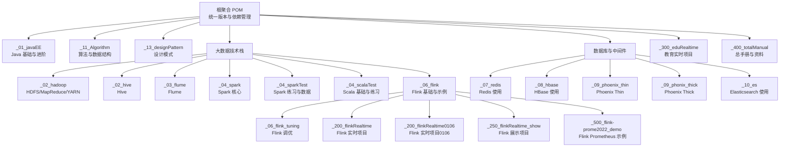
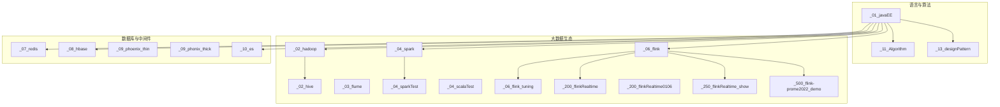
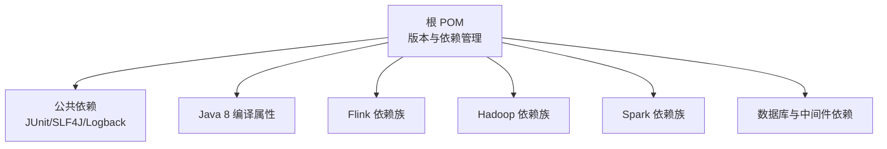

# 项目概述

<cite>
**本文引用的文件**
- [根聚合 POM](file://pom.xml)
- [Java 基础与进阶模块 POM](file://_01_javaEE/pom.xml)
- [Hadoop 模块 POM](file://_02_hadoop/pom.xml)
- [Hive 模块 POM](file://_02_hive/pom.xml)
- [Flume 模块 POM](file://_03_flume/pom.xml)
- [Spark 模块 POM](file://_04_spark/pom.xml)
- [Spark 测试模块 POM](file://_04_sparkTest/pom.xml)
- [Scala 测试模块 POM](file://_04_scalaTest/pom.xml)
- [Flink 模块 POM](file://_06_flink/pom.xml)
- [Flink 调优模块 POM](file://_06_flink_tuning/pom.xml)
- [Flink 实战模块 POM](file://_200_flinkRealtime/pom.xml)
- [Flink 实战模块0106 POM](file://_200_flinkRealtime0106/pom.xml)
- [Flink 展示模块 POM](file://_250_flinkRealtime_show/pom.xml)
- [Flink Prometheus 示例 POM](file://_500_flink-prome2022_demo/pom.xml)
- [Redis 模块 POM](file://_07_redis/pom.xml)
- [HBase 模块 POM](file://_08_hbase/pom.xml)
- [Phoenix Thin 模块 POM](file://_09_phoenix_thin/pom.xml)
- [Phoenix Thick 模块 POM](file://_09_phonix_thick/pom.xml)
- [Elasticsearch 模块 POM](file://_10_es/pom.xml)
- [算法模块 POM](file://_11_Algorithm/pom.xml)
- [设计模式模块 POM](file://_13_designPattern/pom.xml)
- [教育实时项目 POM](file://_300_eduRealtime/pom.xml)
- [总手册模块 POM](file://_400_totalManual/pom.xml)
- [Java 基础示例：OnlyCode](file://_01_javaEE/src/main/java/_01_基础语法/OnlyCode.java)
- [Hadoop MapReduce 示例：WCDriver](file://_02_hadoop/src/main/java/com/hanzhong/mrLocal/WCDriver.java)
- [Flink WordCount 示例：_01_WordCountNet](file://_06_flink/src/main/java/_01_HelloWorld/_01_WordCountNet.java)
- [Redis 示例：_0_TestJedis](file://_07_redis/src/main/java/_0_TestJedis.java)
- [HBase 示例：_0_Test](file://_08_hbase/src/main/java/_0_Test.java)
- [读我文档](file://readMe.md)
</cite>

## 目录
1. [引言](#引言)
2. [项目结构](#项目结构)
3. [核心组件](#核心组件)
4. [架构总览](#架构总览)
5. [详细组件分析](#详细组件分析)
6. [依赖分析](#依赖分析)
7. [性能考虑](#性能考虑)
8. [故障排查指南](#故障排查指南)
9. [结论](#结论)
10. [附录](#附录)

## 引言
本项目是一个系统化的 Java 学习与实践平台，采用多模块 Maven 聚合工程组织，覆盖从 Java 基础语法到大数据生态（Hadoop、Hive、Flume、Spark、Flink）再到数据库中间件与搜索引擎（Redis、HBase、Phoenix、Elasticsearch）的完整学习路径。项目通过“基础—进阶—实战—调优—展示”的层级化模块划分，帮助初学者循序渐进掌握核心技术栈，并为有经验的开发者提供深入的工程实践与优化参考。

适用人群与学习建议：
- 初学者：建议先完成 Java 基础与算法模块，再进入大数据入门模块，最后结合实战模块巩固。
- 有经验开发者：可直接从大数据模块入手，结合调优与实战模块快速定位工程问题并提升性能。

## 项目结构
项目采用“根聚合 POM + 多子模块”的组织方式，每个子模块聚焦特定技术领域或主题练习，便于独立构建与演进。模块划分遵循“技术域 + 学习阶段”的原则，既满足教学体系化，也利于团队协作与持续集成。

图表来源
- [根聚合 POM](file://pom.xml#L1-L143)
- [Java 基础与进阶模块 POM](file://_01_javaEE/pom.xml#L1-L60)
- [Hadoop 模块 POM](file://_02_hadoop/pom.xml#L1-L84)
- [Hive 模块 POM](file://_02_hive/pom.xml#L1-L50)
- [Flume 模块 POM](file://_03_flume/pom.xml#L1-L50)
- [Spark 模块 POM](file://_04_spark/pom.xml#L1-L50)
- [Spark 测试模块 POM](file://_04_sparkTest/pom.xml#L1-L73)
- [Scala 测试模块 POM](file://_04_scalaTest/pom.xml#L1-L60)
- [Flink 模块 POM](file://_06_flink/pom.xml#L1-L175)
- [Flink 调优模块 POM](file://_06_flink_tuning/pom.xml#L1-L60)
- [Flink 实战模块 POM](file://_200_flinkRealtime/pom.xml#L1-L60)
- [Flink 实战模块 POM](file://_200_flinkRealtime0106/pom.xml#L1-L60)
- [Flink 展示模块 POM](file://_250_flinkRealtime_show/pom.xml#L1-L60)
- [Flink Prometheus 示例 POM](file://_500_flink-prome2022_demo/pom.xml#L1-L60)
- [Redis 模块 POM](file://_07_redis/pom.xml#L1-L60)
- [HBase 模块 POM](file://_08_hbase/pom.xml#L1-L60)
- [Phoenix Thin 模块 POM](file://_09_phoenix_thin/pom.xml#L1-L50)
- [Phoenix Thick 模块 POM](file://_09_phonix_thick/pom.xml#L1-L50)
- [Elasticsearch 模块 POM](file://_10_es/pom.xml#L1-L60)
- [算法模块 POM](file://_11_Algorithm/pom.xml#L1-L60)
- [设计模式模块 POM](file://_13_designPattern/pom.xml#L1-L60)
- [教育实时项目 POM](file://_300_eduRealtime/pom.xml#L1-L60)
- [总手册模块 POM](file://_400_totalManual/pom.xml#L1-L60)

章节来源
- [根聚合 POM](file://pom.xml#L1-L143)

## 核心组件
- Java 基础与进阶：涵盖基础语法、流程控制、数组、面向对象、多态、常用 API、泛型、File/IO、反射、JDBC 等，为后续大数据与中间件学习打下坚实语言基础。
- 算法与数据结构：包含递归、排序等基础算法训练，强化编程思维与复杂度意识。
- 设计模式：提供单例等经典模式示例，帮助理解面向对象设计原则。
- 大数据技术栈：Hadoop（HDFS、MapReduce、YARN）、Hive、Flume、Spark（Core/SQL/Streaming/Yarn/Kafka）、Flink（基础示例、调优、实时项目、展示与 Prometheus 集成）。
- 数据库与中间件：Redis（连接池、键值操作、列表/集合/哈希等）、HBase（命名空间、表管理、写入单元格）、Phoenix（Thin/Thick）、Elasticsearch（基础使用）。
- 教育实时项目与总手册：提供真实业务场景的实时项目与综合资料，便于整合所学知识。

章节来源
- [Java 基础与进阶模块 POM](file://_01_javaEE/pom.xml#L1-L60)
- [算法模块 POM](file://_11_Algorithm/pom.xml#L1-L60)
- [设计模式模块 POM](file://_13_designPattern/pom.xml#L1-L60)
- [Hadoop 模块 POM](file://_02_hadoop/pom.xml#L1-L84)
- [Hive 模块 POM](file://_02_hive/pom.xml#L1-L50)
- [Flume 模块 POM](file://_03_flume/pom.xml#L1-L50)
- [Spark 模块 POM](file://_04_spark/pom.xml#L1-L50)
- [Spark 测试模块 POM](file://_04_sparkTest/pom.xml#L1-L73)
- [Scala 测试模块 POM](file://_04_scalaTest/pom.xml#L1-L60)
- [Flink 模块 POM](file://_06_flink/pom.xml#L1-L175)
- [Flink 调优模块 POM](file://_06_flink_tuning/pom.xml#L1-L60)
- [Flink 实战模块 POM](file://_200_flinkRealtime/pom.xml#L1-L60)
- [Flink 实战模块 POM](file://_200_flinkRealtime0106/pom.xml#L1-L60)
- [Flink 展示模块 POM](file://_250_flinkRealtime_show/pom.xml#L1-L60)
- [Flink Prometheus 示例 POM](file://_500_flink-prome2022_demo/pom.xml#L1-L60)
- [Redis 模块 POM](file://_07_redis/pom.xml#L1-L60)
- [HBase 模块 POM](file://_08_hbase/pom.xml#L1-L60)
- [Phoenix Thin 模块 POM](file://_09_phoenix_thin/pom.xml#L1-L50)
- [Phoenix Thick 模块 POM](file://_09_phonix_thick/pom.xml#L1-L50)
- [Elasticsearch 模块 POM](file://_10_es/pom.xml#L1-L60)
- [教育实时项目 POM](file://_300_eduRealtime/pom.xml#L1-L60)
- [总手册模块 POM](file://_400_totalManual/pom.xml#L1-L60)

## 架构总览
项目整体采用“分层模块 + 技术域划分”的架构理念：
- 分层模块：基础语法 → 进阶特性 → 实战练习 → 调优与展示 → 综合项目。
- 技术域划分：Java 基础与算法 → 大数据生态 → 数据库与中间件 → 实战与展示。
- 版本与依赖：根 POM 统一管理版本与公共依赖，子模块按需引入对应技术栈依赖。

图表来源
- [根聚合 POM](file://pom.xml#L1-L143)
- [Java 基础与进阶模块 POM](file://_01_javaEE/pom.xml#L1-L60)
- [算法模块 POM](file://_11_Algorithm/pom.xml#L1-L60)
- [设计模式模块 POM](file://_13_designPattern/pom.xml#L1-L60)
- [Hadoop 模块 POM](file://_02_hadoop/pom.xml#L1-L84)
- [Hive 模块 POM](file://_02_hive/pom.xml#L1-L50)
- [Flume 模块 POM](file://_03_flume/pom.xml#L1-L50)
- [Spark 模块 POM](file://_04_spark/pom.xml#L1-L50)
- [Spark 测试模块 POM](file://_04_sparkTest/pom.xml#L1-L73)
- [Scala 测试模块 POM](file://_04_scalaTest/pom.xml#L1-L60)
- [Flink 模块 POM](file://_06_flink/pom.xml#L1-L175)
- [Flink 调优模块 POM](file://_06_flink_tuning/pom.xml#L1-L60)
- [Flink 实战模块 POM](file://_200_flinkRealtime/pom.xml#L1-L60)
- [Flink 实战模块 POM](file://_200_flinkRealtime0106/pom.xml#L1-L60)
- [Flink 展示模块 POM](file://_250_flinkRealtime_show/pom.xml#L1-L60)
- [Flink Prometheus 示例 POM](file://_500_flink-prome2022_demo/pom.xml#L1-L60)
- [Redis 模块 POM](file://_07_redis/pom.xml#L1-L60)
- [HBase 模块 POM](file://_08_hbase/pom.xml#L1-L60)
- [Phoenix Thin 模块 POM](file://_09_phoenix_thin/pom.xml#L1-L50)
- [Phoenix Thick 模块 POM](file://_09_phonix_thick/pom.xml#L1-L50)
- [Elasticsearch 模块 POM](file://_10_es/pom.xml#L1-L60)

## 详细组件分析

### Java 基础与进阶模块（_01_javaEE）
- 功能定位：系统化讲解 Java 基础语法、流程控制、数组、面向对象、多态、常用 API、泛型、File/IO、反射、JDBC 等，配套大量示例与练习。
- 学习路径：从“OnlyCode”等示例开始，逐步过渡到数组与算法、面向对象与多态、IO 与反射、JDBC 实践。
- 典型示例路径：
  - [示例：OnlyCode](file://_01_javaEE/src/main/java/_01_基础语法/OnlyCode.java#L1-L116)

章节来源
- [Java 基础与进阶模块 POM](file://_01_javaEE/pom.xml#L1-L60)
- [Java 基础示例：OnlyCode](file://_01_javaEE/src/main/java/_01_基础语法/OnlyCode.java#L1-L116)

### Hadoop 模块（_02_hadoop）
- 功能定位：涵盖 HDFS 客户端、MapReduce 编程模型与本地运行、YARN 应用管理等，提供 WordCount 等经典示例。
- 学习路径：HDFS 文件操作 → MapReduce 编程模型 → 本地调试 → YARN 提交与监控。
- 典型示例路径：
  - [示例：WCDriver（MapReduce 本地驱动）](file://_02_hadoop/src/main/java/com/hanzhong/mrLocal/WCDriver.java#L1-L52)

章节来源
- [Hadoop 模块 POM](file://_02_hadoop/pom.xml#L1-L84)
- [Hadoop MapReduce 示例：WCDriver](file://_02_hadoop/src/main/java/com/hanzhong/mrLocal/WCDriver.java#L1-L52)

### Flink 模块（_06_flink）
- 功能定位：提供 Flink 基础示例，包括 Socket 文本流的单词统计、窗口与状态配置、水位线与延迟处理、CEP、SQL/Table API 等。
- 学习路径：环境搭建与本地执行 → 基础算子与数据流 → 状态与检查点 → 窗口与水位线 → CEP 与 SQL/Table API → 实战项目与调优。
- 典型示例路径：
  - [示例：_01_WordCountNet（Socket 单词统计）](file://_06_flink/src/main/java/_01_HelloWorld/_01_WordCountNet.java#L1-L57)

章节来源
- [Flink 模块 POM](file://_06_flink/pom.xml#L1-L175)
- [Flink WordCount 示例：_01_WordCountNet](file://_06_flink/src/main/java/_01_HelloWorld/_01_WordCountNet.java#L1-L57)

### Spark 模块（_04_spark 与 _04_sparkTest）
- 功能定位：Spark 核心、SQL、Streaming、Yarn、Kafka 连接器等，配合测试数据与练习场景。
- 学习路径：Spark Core 基础 → DataFrame/DS → SQL → Streaming → 与 Hive/Kafka 集成。
- 典型示例路径：
  - [示例：Spark 练习与数据（输入/输出/样例数据）](file://_04_sparkTest/data/word.txt)

章节来源
- [Spark 模块 POM](file://_04_spark/pom.xml#L1-L50)
- [Spark 测试模块 POM](file://_04_sparkTest/pom.xml#L1-L73)
- [Spark 测试数据：word.txt](file://_04_sparkTest/data/word.txt)

### 数据库与中间件模块
- Redis（_07_redis）：连接池、键值操作、列表/集合/哈希等常用命令演示。
- HBase（_08_hbase）：命名空间与表管理、写入单元格等基础操作。
- Elasticsearch（_10_es）：基础使用示例。
- Phoenix（_09_phoenix_thin / _09_phonix_thick）：Thin/Thick 客户端使用示例。

章节来源
- [Redis 模块 POM](file://_07_redis/pom.xml#L1-L60)
- [HBase 模块 POM](file://_08_hbase/pom.xml#L1-L60)
- [Phoenix Thin 模块 POM](file://_09_phoenix_thin/pom.xml#L1-L50)
- [Phoenix Thick 模块 POM](file://_09_phonix_thick/pom.xml#L1-L50)
- [Elasticsearch 模块 POM](file://_10_es/pom.xml#L1-L60)
- [Redis 示例：_0_TestJedis](file://_07_redis/src/main/java/_0_TestJedis.java#L1-L273)
- [HBase 示例：_0_Test](file://_08_hbase/src/main/java/_0_Test.java#L1-L44)

### 实战与展示模块
- Flink 实时项目（_200_flinkRealtime、_200_flinkRealtime0106、_250_flinkRealtime_show、_500_flink-prome2022_demo）：覆盖真实业务场景的数据采集、清洗、计算、存储与可视化。
- 教育实时项目（_300_eduRealtime）：结合教育领域的实时数据处理案例。
- 总手册（_400_totalManual）：汇总性文档与资料。

章节来源
- [Flink 实战模块 POM](file://_200_flinkRealtime/pom.xml#L1-L60)
- [Flink 实战模块 POM](file://_200_flinkRealtime0106/pom.xml#L1-L60)
- [Flink 展示模块 POM](file://_250_flinkRealtime_show/pom.xml#L1-L60)
- [Flink Prometheus 示例 POM](file://_500_flink-prome2022_demo/pom.xml#L1-L60)
- [教育实时项目 POM](file://_300_eduRealtime/pom.xml#L1-L60)
- [总手册模块 POM](file://_400_totalManual/pom.xml#L1-L60)

## 依赖分析
- 版本与依赖管理：根 POM 使用属性集中管理版本，统一依赖（JUnit、SLF4J、Logback），并在子模块中按需引入具体技术栈依赖。
- 技术栈选择：
  - Java 8：保持兼容性与稳定性。
  - Flink 1.15.4、Hadoop 3.3.4、Hive 3.1.3、Spark 3.3.2、Scala 2.12.17、MySQL/Redis/Elasticsearch 等。
- 模块间耦合：模块间通过根 POM 的统一管理降低版本冲突风险；各模块内部功能相对独立，便于按需构建与测试。

图表来源
- [根聚合 POM](file://pom.xml#L52-L141)

章节来源
- [根聚合 POM](file://pom.xml#L52-L141)

## 性能考虑
- 编译与打包：统一编码与编译目标，避免跨平台兼容性问题；部分模块启用“打包依赖”插件，便于在集群中运行。
- 日志与监控：统一使用 SLF4J+Logback，减少运行时日志开销；Flink 模块支持外部检查点存储与状态后端配置，便于生产级部署。
- I/O 与序列化：Spark/Hadoop/Flume 等模块涉及文件系统与网络 I/O，建议结合数据压缩与分区策略优化吞吐量。
- 资源隔离：Flink YARN/本地模式下合理设置并行度与内存参数，避免资源争用。

## 故障排查指南
- Flink 检查点与状态：
  - 若 Windows 下启用检查点报错，可参考示例注释与配置调整。
  - 状态后端与外部存储路径需与集群环境一致。
- Hadoop MapReduce 本地调试：
  - 确认输入输出路径与权限，确保本地文件系统路径正确。
- Redis 连接池：
  - 注意连接池生命周期与资源释放，避免连接泄漏。
- HBase 表与命名空间：
  - 创建/删除表与命名空间时注意命名规范与权限。

章节来源
- [Flink WordCount 示例：_01_WordCountNet](file://_06_flink/src/main/java/_01_HelloWorld/_01_WordCountNet.java#L1-L57)
- [Hadoop MapReduce 示例：WCDriver](file://_02_hadoop/src/main/java/com/hanzhong/mrLocal/WCDriver.java#L1-L52)
- [Redis 示例：_0_TestJedis](file://_07_redis/src/main/java/_0_TestJedis.java#L1-L273)
- [HBase 示例：_0_Test](file://_08_hbase/src/main/java/_0_Test.java#L1-L44)

## 结论
本项目以“基础—进阶—实战—调优—展示”为主线，系统覆盖 Java 语言与大数据生态的关键技术点，通过丰富的示例与模块化组织，既能满足初学者的入门需求，也能为有经验的开发者提供深入实践与优化参考。建议结合根 POM 的统一版本管理与模块化构建策略，按学习路径逐步推进，并在实战模块中整合所学知识，形成完整的工程能力闭环。

## 附录
- 项目背景与目标：围绕 Java 与大数据技术栈构建系统化学习路径，强调“做中学”，通过大量示例与实战项目提升工程实践能力。
- 适用人群：计算机相关专业学生、转行开发者、企业内训学员、技术面试备考者。
- 学习建议：先完成 Java 基础与算法，再进入大数据入门，随后结合实战与调优模块巩固，最后完成展示项目整合。